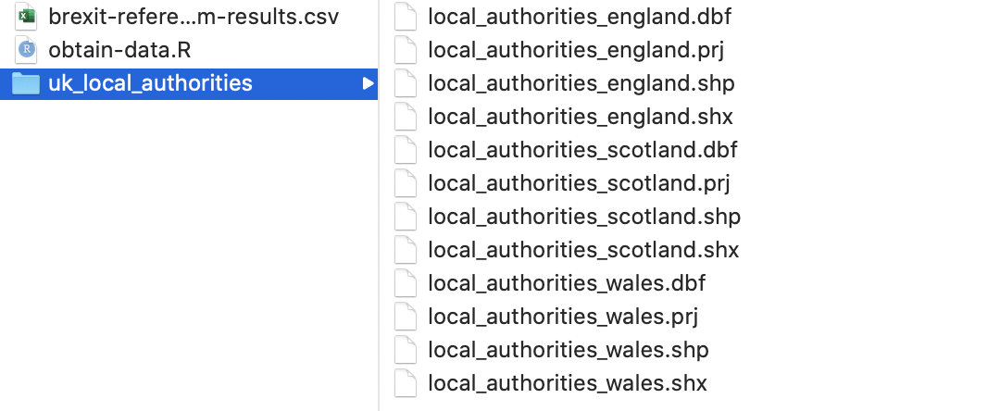

```{r child = "setup.Rmd"}
```

```{r, include=FALSE, eval=TRUE}
library("sf")
library("tidyverse")
library("rnaturalearthdata")
library("mapview")
library("patchwork")
library("leaflet")
library("leaflet.extras")
library("readxl")
library("janitor")
library("stars")
library("emo")
```

class: center, middle, dk-section-title
background-image:url("images/import-shipping-containers.jpeg")
background-size: 100%

# Importing shapefiles

???


---

## Shapefiles and choropleth

.pull-left[

The data that give choropleth (and other maps) their shapes come from **shapefiles**.

You can't start building a choropleth before you find appropriate shapefiles.

]

.pull-right[
```{r, eval=TRUE,echo=FALSE, out.height="400px"}
countries_sf <- countries110 %>%
  st_as_sf() %>%
  filter(!continent == "Antarctica")

pal_continents <- colorFactor("Set2", countries_sf$continent)

countries_sf %>%
  leaflet() %>%
  addPolygons(fillColor = ~pal_continents(continent),
              fillOpacity = 1,
              weight = 1,
              color = "black") %>%
  addLegend(pal = pal_continents,
            values = ~continent,
            opacity = 1)
```
]

???

---

## Shapefiles and {sf}

.pull-left[

We import shapefiles into R with `sf::read_sf()`

Shapefiles produce `{sf}` objects that contain MULTIPOLYGONs.

]

.pull-right[
```{r, eval=TRUE,echo=FALSE, out.height="400px"}
countries_sf <- countries110 %>%
  st_as_sf() %>%
  filter(!continent == "Antarctica")

pal_continents <- colorFactor("Set2", countries_sf$continent)

countries_sf %>%
  leaflet() %>%
  addPolygons(fillColor = ~pal_continents(continent),
              fillOpacity = 1,
              weight = 1,
              color = "black") %>%
  addLegend(pal = pal_continents,
            values = ~continent,
            opacity = 1)
```
]

???


---

## ESRI Shapefiles

ESRI shapefiles are the common format for shapefiles.

ESRI shapefiles are downloaded as .zip files that you must uncompress.

.pull-left[

ESRI shapefiles must contain at least these files: 

- .shp
- .shx
- .dbf

]


.pull-right[

]


???


---

## Worked Example

Please open the "brexit-maps" project in the worked-exercises folder.

```{yaml}
mapping-with-r
└── worked-exercises
  └── brexit-maps
      ├── abrexit-maps.Rproj
      └── data
```

???

Let's load up the brexit-maps.Rproj and start looking at importing shapefiles.

---

## (RStudio Code Slide)

???


---

## GeoJSON Shapefiles

GeoJSON is a more modern and streamlined format... but fairly rare.

The Republic of Ireland's Open Data platform has many GeoJSON data sources, including administrative boundaries: http://data-osi.opendata.arcgis.com/datasets/e0cfbed6a3cc432295fd3e2f57451cad_0.geojson


???


---

## (RStudio Coding Slide)

???

