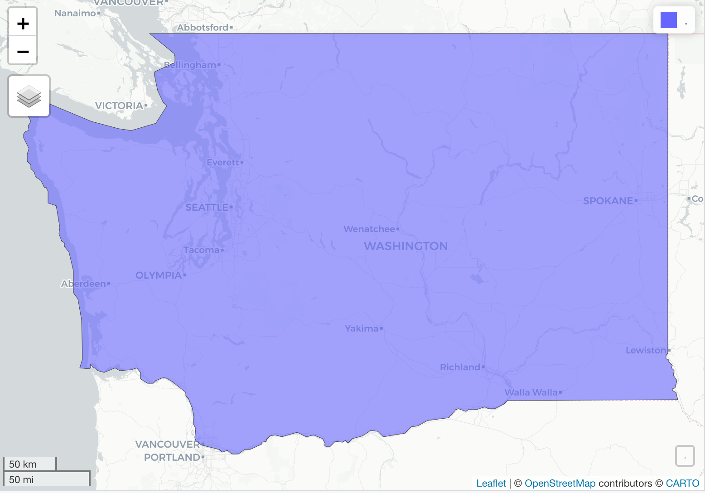
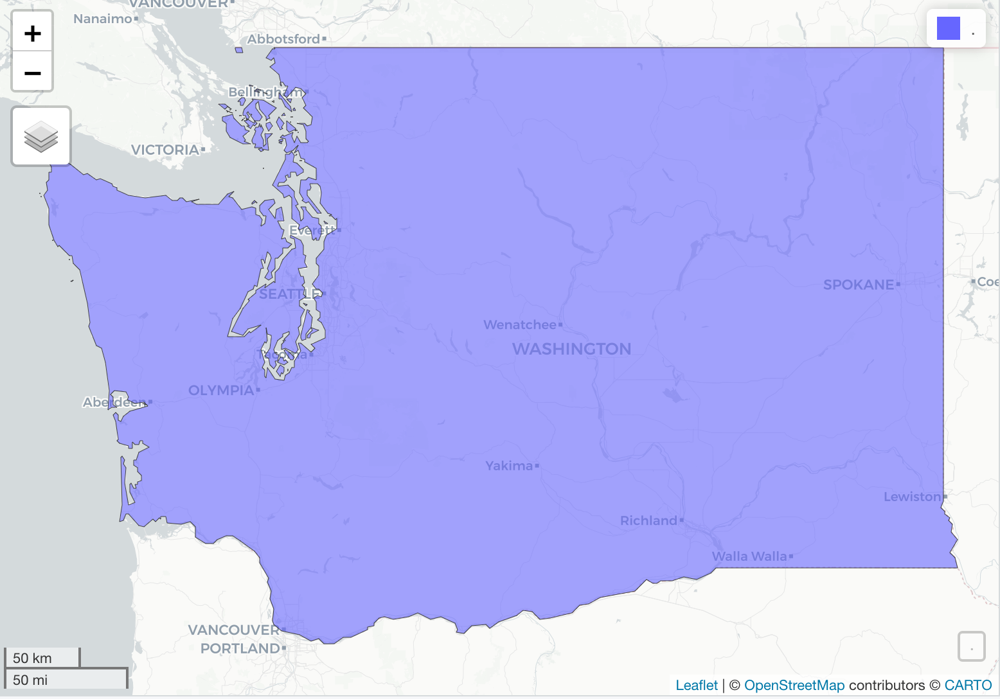

```{r child = "setup.Rmd"}
```

```{r, include=FALSE, eval=TRUE}
library("sf")
library("tidyverse")
library("rnaturalearthdata")
library("mapview")
library("patchwork")
library("leaflet")
library("leaflet.extras")
library("readxl")
library("janitor")
library("stars")
library("emo")
library("tigris")
library("tidycensus")
```

class: center, middle, dk-section-title
background-image:url("images/us-maps.jpg")
background-size: 100%

# US data: {tidycensus} and {tigris} packages

???


---

## TIGER & {tigris}

.pull-left[

The US Census Bureau is responsible for maintaining shapefiles and other geospatial datasets for contiguous US and its territories.

The collated dataset is called TIGER (Topologically Integrated Geographic Encoding and Referencing).

The `{tigris}` package provides programmatic access to **current and historic** components of TIGER.

]

.pull-right[
<br>
<center>

</center>

]

???


---

## {tigris}

.pull-left[

The `{tigris}` doesn't *contain* any datasets, they must be **downloaded** after the package is loaded.

Think carefully about how detailed a shapefile you require - for many functions the default `{sf}` objects are ***large***.

]

.pull-right[
<br>
<center>

</center>

]

???


---

## (RStudio Coding Slide)

???


  

---

### tigris::________________(cb = TRUE)

It's a common mistake to forget to set `cb = TRUE`

.pull-left[
```{r eval=FALSE, message=FALSE, warning=FALSE, out.height='250px'}
states(resolution = "500k") %>%
  filter(NAME == "Washington") %>%
  mapview()
```


]

.pull-right[
```{r, eval=FALSE, out.height='250px'}
states(resolution = "500k", cb = TRUE) %>%
  filter(NAME == "Washington") %>%
  mapview()
```

]


???


---

## (RStudio Coding Slide)

???


---

## {tidycensus}

{tidycensus} provides programmatic access to two data sources:

.pull-left[
The [Decennial US Census](https://www.census.gov/programs-surveys/decennial-census/data.html) which currently includes data for 1990, 2000 and 2010.

```{r}
get_decennial(geography = "county",
              variables = "P005004", 
              state = "VT")
```
]

--

.pull-right[

The [5-year American Community Survey](https://www.census.gov/programs-surveys/acs) (ACS) which currently includes data for 2009 through 2018.

```{r}
get_acs(geography = "county", 
        variables = "B19013_001", 
        state = "VT")
```

]

???


---

##  {tidycensus} API

Before we can use the `{tidycensus}` package we must register for a **free** API key from the census bureau by following this workflow:

--

1\. Obtain a key from the signup page: [api.census.gov/data/key_signup.html](http://api.census.gov/data/key_signup.html)

--

2\. Check your email and click on the **activate your key** link

> You've attempted to validate an unknown key. If it has been more than 48 hours since you submitted your request for this API key then the request has been removed from the system. Please request a new key and activate it within 48 hours.

--

3\. Add your Census API key to your `.Renviron` using `census_api_key()` 

```{r}
census_api_key("your-key", install = TRUE)
```


???

---

## Searching for census variables

`{tidycensus}` uses **variable codes** to access data from the API.

> Use `load_variable()` to find the variable code for the data you're interested in.

--

The process varies for the Census and ACS datasets:

.pull-left[

Use `dataset = "sf1"` for **Decennial Census** data.

```{r}
vars_census_2010 <- 
  load_variables(2010,
                 dataset = "sf1")
```


]

.pull-right[

Use `dataset = "acs5"` for **ACS** data.

```{r}
vars_acs_2010 <- 
  load_variables(2018,
                 dataset = "acs5")
```

]


???

---

## (RStudio Coding Slide)


---

class: my-turn

## My Turn

.pull-left[

I'm going to compare the fraction of rented properties across congressional districts by combining `{tidycensus}` and `{tigris}`.

]

.pull-right[

```{r, eval=TRUE, echo=FALSE, out.height="400px"}
us_cd_20m <- read_sf("data/us-congressional-districts")

tenure_cd_census_2010 <- read_csv("data/tenure_cd_census_2010.csv")

us_cd_20m %>%
  left_join(tenure_cd_census_2010) %>%
  filter(!STATEFP %in% c("02", "72", "15")) %>%
  mapview(zcol = "rented_fraction")
```

]

---

## (RStudio Coding Slide)

???


---

class: inverse

### Your Turn

.pull-left[
1. Use `load_variables()` to find the **Renter Occupied variables for each age bracket** in the 2010 Decennial Census.

1. Use `get_decennial()` to extract all of the 9 variables from above

1. Use `pivot_wider()` to prepare the data for joining with the congressional district shapefiles.

1. Join the Census and shapefiles datasets with `left_join()` and visualise with `mapview()`
]

.pull-right[

```{r, eval=TRUE, echo=FALSE, out.height="400px"}
age_cd_census_2010 <- read_csv("data/age_cd_census_2010.csv")

us_cd_20m %>%
  left_join(age_cd_census_2010) %>%
  filter(!STATEFP %in% c("02", "72", "15")) %>%
  mapview(zcol = "age_85_plus")
```

]

???


