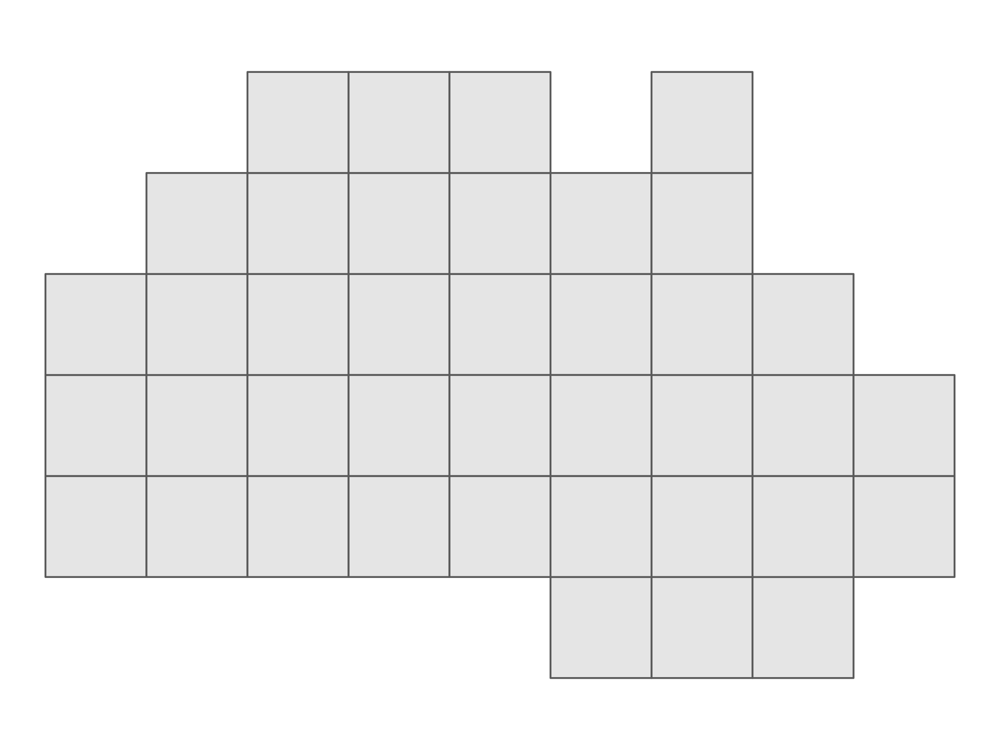
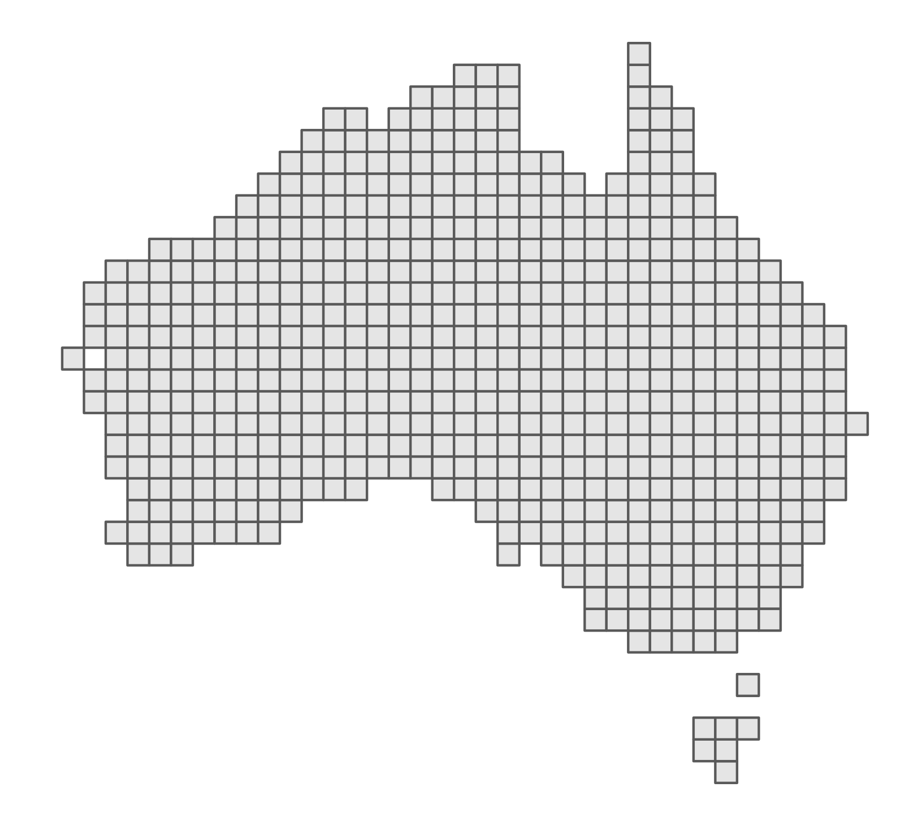
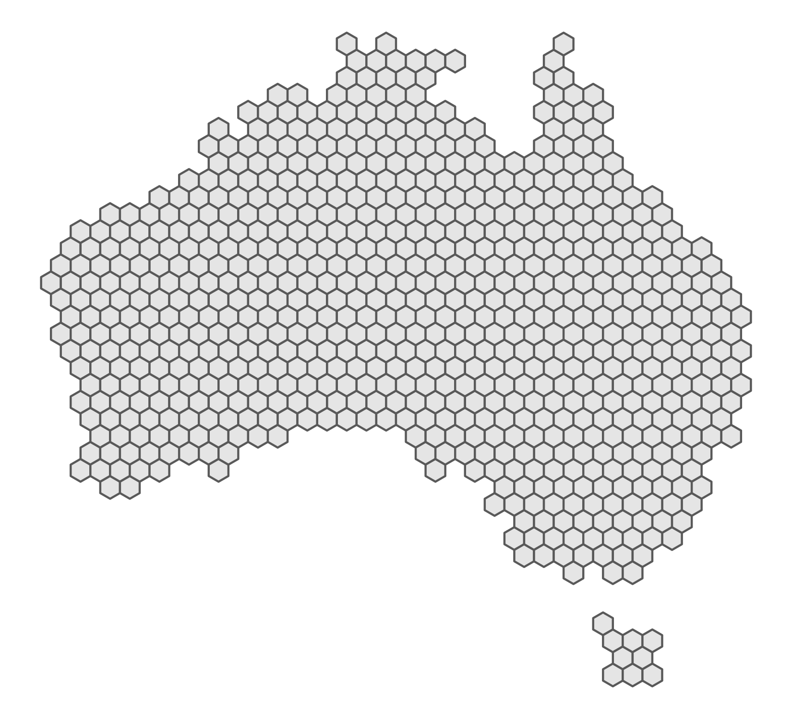
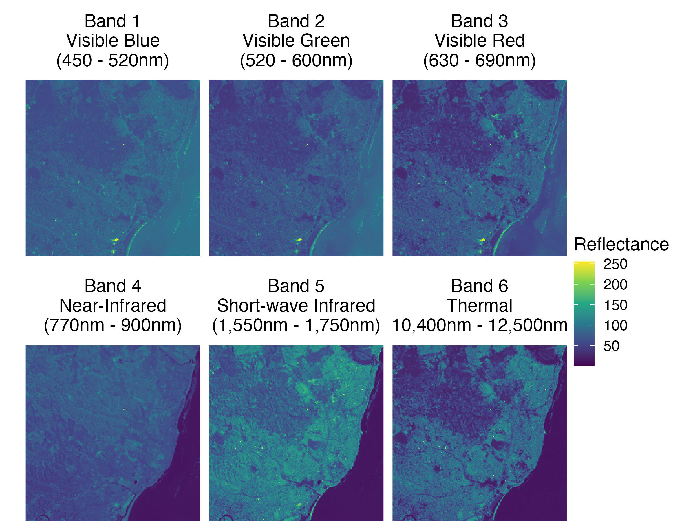

```{r child = "setup.Rmd"}
```

```{r, include=FALSE, eval=TRUE}
library("sf")
library("stars")
library("raster")
library("rnaturalearthdata")
library("mapview")
library("patchwork")
library("leaflet")
library("leaflet.extras")
library("readxl")
library("janitor")
library("emo")
library("tigris")
library("tidycensus")
library("rmapshaper")
library("patchwork")
library("tidyverse")
library("png")
library("grid")
library("here")
library("rgeoboundaries")
```

class: center, middle, dk-section-title
background-image:url("https://images.pexels.com/photos/347143/pexels-photo-347143.jpeg?auto=compress&cs=tinysrgb&dpr=2&h=750&w=1260")

# Introducing raster GIS with {raster} and {stars}

???


---

### Do I have vector or raster GIS data?

.pull-left[


]

.pull-right[

```{r, eval=FALSE, echo=FALSE, out.height="250px"}
# bands info https://developers.google.com/earth-engine/datasets/catalog/WORLDCLIM_V1_BIO#bands
# data actually comes from https://www.worldclim.org/data/v1.4/worldclim14.html
# rasters_world_clim <- getData('worldclim', var='bio', res=10)
# stars_world_clim <- rasters_world_clim %>%
#   st_as_stars()
# 
# write_stars(stars_world_clim,
#                    here("slides", "getting-map-data-into-r", "data", "stars_world_clim.tiff"))
# zip(zipfile = here("slides", "getting-map-data-into-r", "data", "stars_world_clim.zip"), files = here("slides", "getting-map-data-into-r", "data", "stars_world_clim.tiff"))

unzip(zipfile = here("slides", "getting-map-data-into-r", "data", "stars_world_clim.zip"),
      exdir = here("slides", "getting-map-data-into-r", "data"))

stars_world_clim <- read_stars(here("slides", "getting-map-data-into-r", "data", "stars_world_clim.tiff"))

unlink(here("slides", "getting-map-data-into-r", "data", "stars_world_clim.tiff"))

stars_world_clim_max_temp <- stars_world_clim %>% 
  filter(band == "bio5")

names(stars_world_clim_max_temp) <- "max_temp"

stars_world_clim_max_temp <- stars_world_clim_max_temp %>% 
  mutate(max_temp = max_temp / 10)

uk_sf <- countries50 %>%
  st_as_sf() %>% 
  filter(name == "United Kingdom") %>% 
  st_transform(27700)

stars_world_clim_max_temp <- stars_world_clim_max_temp %>% 
  st_transform(27700)

uk_mean_temp_stars <- stars_world_clim_max_temp[uk_sf]

gg_uk_max_temp <- ggplot() +
  geom_stars(data = uk_mean_temp_stars) +
  scale_fill_viridis_c(name = "",
                       labels = scales::number_format(suffix = "°C"))

gg_uk_max_temp <- gg_uk_max_temp +
  theme_void(base_size = 16) +
  labs(title = "Maximum temperature of warmest\nmonth between 1960 to 1990") +
  theme(legend.text = element_text(size = 10),
        legend.position = "right") +
  guides(fill = guide_colorbar(barheight = 10))

gg_uk_max_temp %>% 
  ggsave(here("slides", "getting-map-data-into-r", "images", "gg_uk_max_temp.png"),
         .)
```


]

???


---

## Why do we have two GIS formats?

.pull-left[

Vector GIS datasets usually contain sociopolitical data.

Vector formats make sense because human locations are vectors:

- Country, county and city borders

- Roads, airline routes and bike lanes

- Physical addresses

]

--

.pull-right[

Raster GIS datasets usually contain physical data.

Raster formats are a **consequence** of how the data is collected:

- Satellite imagery

- Weather stations

- Road side air quality measurements

]

???


---

### Raster grids

```{r, eval=TRUE, echo=FALSE}
australia_adm1 <- gb_adm1("Australia")
# stdg_gridpol taken  from https://rpubs.com/dieghernan/beautifulmaps_I
stdh_gridpol <- function(sf,
                         to = "fishnet",
                         gridsize = as.integer(
                           min(
                             diff(st_bbox(sf)[c(1, 3)]),
                             diff(st_bbox(sf)[c(2, 4)])
                           ) / 40
                         ),
                         sliver = 0.5) {
  if (!unique(st_geometry_type(sf)) %in% c("POLYGON", "MULTIPOLYGON")) {
    stop("Input should be  MULTIPOLYGON or POLYGON")
  }
  if (!to %in% c("fishnet", "puzzle", "honeycomb", "hexbin", "pixel")) {
    stop("'to' should be 'fishnet','puzzle','honeycomb','hexbin' or 'pixel'")
  }
  
  if (class(sf)[1] == "sf") {
    initial <- sf
    initial$index_target <- 1:nrow(initial)
  } else {
    initial <- st_sf(index_target = 1:length(sf), geom = sf)
  }
  
  target <- st_geometry(initial)
  
  if (to %in% c("fishnet", "puzzle")) {
    sq <- T
  } else {
    sq <- F
  }
  if (to == "pixel") {
    grid <- st_make_grid(target,
                         gridsize,
                         crs = st_crs(initial),
                         what = "centers"
    )
  } else {
    grid <- st_make_grid(
      target,
      gridsize,
      crs = st_crs(initial),
      what = "polygons",
      square = sq
    )
  }
  grid <- st_sf(index = 1:length(lengths(grid)), grid) # Add index
  if (to == "pixel") {
    cent_merge <- st_join(grid, initial["index_target"], left = F)
    grid_new <- st_buffer(cent_merge, gridsize / 2)
  } else {
    cent_grid <- st_centroid(grid)
    cent_merge <- st_join(cent_grid, initial["index_target"], left = F)
    grid_new <- inner_join(grid, st_drop_geometry(cent_merge))
  }
  if (to %in% c("fishnet", "honeycomb", "pixel")) {
    geom <- aggregate(
      grid_new,
      by = list(grid_new$index_target),
      FUN = min,
      do_union = FALSE
    )
  } else {
    geom <- aggregate(
      st_buffer(grid_new, sliver),
      by = list(grid_new$index_target),
      FUN = min,
      do_union = TRUE
    )
  }
  if (class(initial)[1] == "sf") {
    fin <- left_join(
      geom %>% select(index_target),
      st_drop_geometry(initial)
    ) %>%
      select(-index_target)
    fin <- st_cast(fin, "MULTIPOLYGON")
    return(fin)
  } else {
    fin <- st_cast(geom, "MULTIPOLYGON")
    return(st_geometry(fin))
  }
}
```

```{r, echo=FALSE, eval=TRUE}
australia_honeycomb_500_250 <- australia_adm1 %>%
  st_transform(3857) %>%
  stdh_gridpol(to = "honeycomb", gridsize = 500 * 250) 

australia_honeycomb_1000_500 <- australia_adm1 %>%
  st_transform(3857) %>%
  stdh_gridpol(to = "honeycomb", gridsize = 1000 * 500) 

australia_fishnet_500_250 <- australia_adm1 %>%
  st_transform(3857) %>%
  stdh_gridpol(to = "fishnet", gridsize = 500 * 250)

australia_fishnet_1000_500 <- australia_adm1 %>%
  st_transform(3857) %>%
  stdh_gridpol(to = "fishnet", gridsize = 1000 * 500)
```

.pull-left[
```{r, eval=TRUE, echo=FALSE, fig.dim=c(8,5)}
gg_australia_fishnet_1000_500 <- australia_fishnet_1000_500 %>% 
  ggplot() +
  geom_sf() +
  theme_void() +
  theme(plot.margin = unit(c(0, 0, 0, 0), "cm"))

ggsave(here("slides", "getting-map-data-into-r", "images", "gg_australia_fishnet_1000_500.png"),
       gg_australia_fishnet_1000_500,
       width = 8,
       height = 6)
```


]

--

.pull-right[
```{r, eval=TRUE, echo=FALSE}
gg_australia_fishnet_500_250 <- australia_fishnet_500_250 %>% 
  ggplot() +
  geom_sf() +
    annotate("path",
           x = 12707594 + 300000 * cos(seq(0, 2 * pi, length.out = 100)),
           y = -2985369 + 300000 * sin(seq(0, 2 * pi, length.out = 100)),
           colour = "red",
           alpha = 0
           ) +
  theme_void()

gg_australia_fishnet_500_250_annotated <- australia_fishnet_500_250 %>% 
  ggplot() +
  geom_sf() +
  annotate("path",
           x = 12707594 + 300000 * cos(seq(0, 2 * pi, length.out = 100)),
           y = -2985369 + 300000 * sin(seq(0, 2 * pi, length.out = 100)),
           colour = "red"
           ) +
  theme_void()

ggsave(here("slides", "getting-map-data-into-r", "images", "gg_australia_fishnet_500_250.png"),
       gg_australia_fishnet_500_250,
       width = 5.5,
       height = 5)

ggsave(here("slides", "getting-map-data-into-r", "images", "gg_australia_fishnet_500_250_annotated.png"),
       gg_australia_fishnet_500_250_annotated,
       width = 5.5,
       height = 5)
```

]

???


---

### Raster grids

.pull-left[

]

.pull-right[

]

???


---

### Raster grids

.pull-left[

]

.pull-right[

```{r, eval=TRUE, echo=FALSE}
gg_australia_honeycomb_500_250 <- australia_honeycomb_500_250 %>% 
  ggplot() +
  geom_sf() +
  theme_void()

ggsave(here("slides", "getting-map-data-into-r", "images", "gg_australia_honeycomb_500_250.png"),
       gg_australia_honeycomb_500_250,
       width = 5.5,
       height = 5)
```

]

???


---

### Raster grids

.pull-left[
<center>


</center>
]

.pull-right[
Most GIS datasets are collected and stored in rectangular or curvilinear grids as a consequence of the data collection equipment.

<br>
<br>
We can generate hexagonal grids for visualisation and analysis purposes.
]

???


---

## `{raster}` or/and `{stars}`

There are two **extremely** different packages for working with raster GIS datasets in common usage - and that we'll use in this course.

--

.pull-left[

 For **single** layer raster datasets use the `{raster}` package.
]

.pull-right[
 For raster datasets containing **multiple** layers use the `{stars}` package.
]

???


---

### Why would my data contain multiple layers?


 The Landsat program has been continuously studying observing Earth from space since 1972. We'll be using data from the Landsat 7 satellite multiple times in this course. 

--

All Landsat satellites collects raster data with multiple layers because:

--

- they survey the same areas **over time**.

--

- they're equipped with **multiple sensors**

--

- sensors typically collect data at **multiple wavelength bands**

???


---

### Raster data cubes

Data cubes are raster datasets with 3 dimensions.

.pull-left[

]

.pull-right[

All satellite data has at least 3 dimensions:

- longitude

- latitude

- time
]

???


---

### Raster data cubes

.pull-left[
```{r, eval=TRUE, echo=FALSE}
satellite_image <- read_stars(system.file("tif/L7_ETMs.tif", package = "stars"))

band_labels <- c(
  "1" = "Band 1\nVisible Blue\n(450 - 520nm)",
  "2" = "Band 2\nVisible Green\n(520 - 600nm)",
  "3" = "Band 3\nVisible Red\n(630 - 690nm)",
  "4" = "Band 4\nNear-Infrared\n(770nm - 900nm)",
  "5" = "Band 5\nShort-wave Infrared\n(1,550nm - 1,750nm)",
  "6" = "Band 6\nThermal\n(10,400nm - 12,500nm)"
)

gg_landsat7_explainer <- ggplot() + 
  geom_stars(data = satellite_image) +
  coord_equal() +
  facet_wrap( ~ band,
              labeller = as_labeller(band_labels)) +
  theme_void(base_size = 15) +
  theme(strip.text = element_text(size = 15,
                                  margin = margin(b = 10, t = 10))) +
  scale_fill_viridis_c(name = "Reflectance") +
  scale_x_discrete(expand = c(0, 0)) +
  scale_y_discrete(expand = c(0, 0))

ggsave(here("slides", "getting-map-data-into-r", "images", "gg_landsat7_explainer.png"),
       gg_landsat7_explainer,
       width = 8,
       height = 6)
```



]

.pull-right[
This is another view of a data cube from Landsat 7.

The dimensions of this data cube are:

- longitude

- latitude

- wavelength band
]

???

---

### Hypercubes and higher dimensional raster data

Hypercubes are 4-dimensional datasets... but often raster GIS datasets have even more dimensions.

.pull-left[


]

.pull-right[
This hypercube is from Landsat 7 and contains the following dimensions:

- longitude

- latiutude

- time

- wavelength band
]

???


---

### `{raster}` or/and `{stars}`

Why are there two packages?

> The `{raster}` package kind of supports multiple layer datasets, but it's not very flexible.
> <br>
> <br>
> The `{stars}` package is specifically designed for multiple layer GIS data with the intention that useRs will continue to use `{raster}` for single layer datasets.

???


---

### `{raster}` or/and `{stars}`

What are the packages like to use?

.pull-left[
`{raster}` predates the tidyverse and uses a bespoke data structure.

We can visualise `RasterLayer` objects with the `{ggspatial}` package.
]

.pull-right[
`{stars}` is designed to work with the tidyverse.

`{stars}` objects contain both attributes and dimensions.

`{stars}` comes with its own geom to use with `{ggplot2}` - `geom_stars()`
]


???


