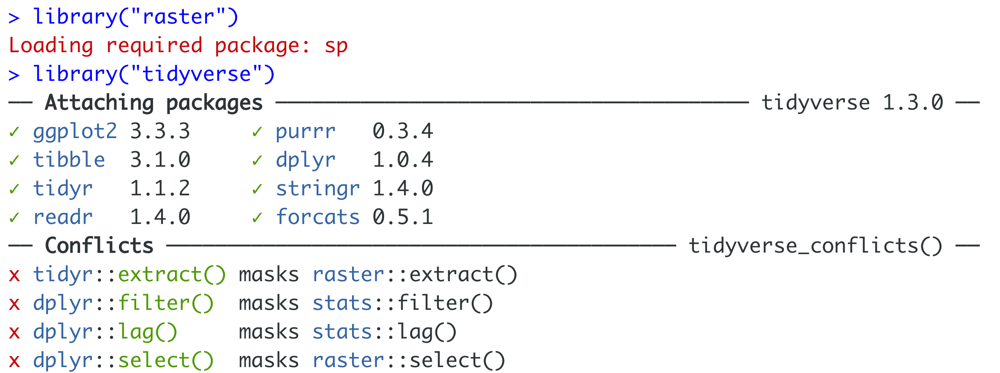
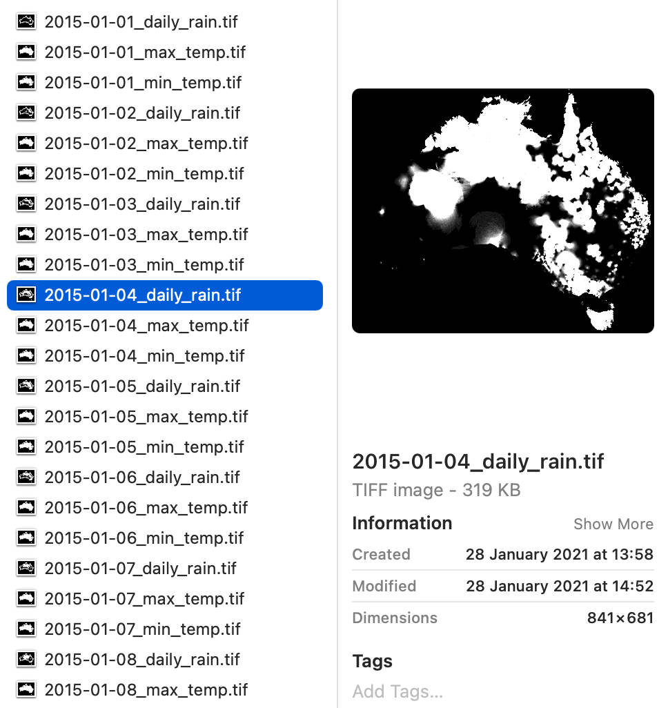

```{r child = "setup.Rmd"}
```

```{r, include=FALSE, eval=TRUE}
library("sf")
library("stars")
library("raster")
library("rnaturalearthdata")
library("mapview")
library("patchwork")
library("leaflet")
library("leaflet.extras")
library("readxl")
library("janitor")
library("emo")
library("tigris")
library("tidycensus")
library("rmapshaper")
library("patchwork")
library("tidyverse")
library("png")
library("grid")
library("here")
library("rgeoboundaries")
```

class: center, middle, dk-section-title
background-image:url("https://images.pexels.com/photos/347143/pexels-photo-347143.jpeg?auto=compress&cs=tinysrgb&dpr=2&h=750&w=1260")

# Basics of using the {raster} package

???


---

## The `{raster}` and tidyverse gotcha

.pull-left[
Remember to load `{raster}` **before** the `{tidyverse}` package.

If you load these packages in the opposite order you'll end up with a headache<sup>1</sup>.
]

.pull-right[

 

]

.footnote[
[1] Please see the learn more section for more details.
]

???


---

### What files am I looking for?

???


---

### <strike>What files am I looking for?</strike>

### Which formats are used for single layer GIS data?

???


---

### Which formats are used for single layer GIS data?

.pull-left[
Two of the most common formats are specially formatted image files:

- .img files (specifically, Erdas Imagine Images)

- .tif (known as GeoTIFF)


]

???


---

### Which formats are used for single layer GIS data?

.pull-left[
Two of the most common formats are specially formatted image files:

- .img files (specifically, Erdas Imagine Images)

- .tif (known as GeoTIFF)

Image previewers **won't help** you figure out if you've got correctly formatted image files.
]

.pull-right[

]

???


---

### Which formats are used for single layer GIS data?

.pull-left[
Two of the most common formats are specially formatted image files:

- .img files (specifically, Erdas Imagine Images)

- .tif (known as GeoTIFF)

]

.pull-right[
You might also find netCDF files

- .nc
]

???

You might also find netCDF files that have the extension .nc but these are much rarer.

---

### RStudio Coding slide

???

Let's get our teeth into the raster package. There's a folder I've setup in the worked-examples called raster-example ... I'd like us to open that folder and take a look at the data files first.

I warned you that image preview software won't help you figure out whether you have raster data or not - and that's particularly clear here! My operating system is very confused about the .img file and thinks maybe it's a virtual disk image and the .tiff file is previewed as a white square.

I've provided you the code for obtaining these files in the obtain-data.R script if you're interested in where they came from.

Let's open up the RStudio Project and then the raster-processing.R script.

Notice at the top I'm loading the raster package BEFORE the tidyverse to prevent the headaches I mentioned earlier.

The raster package uses the raster function for importing files, so let's try importing both data files.

The GeoTiff file is from the landsat 7 satellite I mentioned - so let's create an object called

landsat7_data 

and import the data

landsat7_data <- raster("data/L7_ETMS.tif")

There's a warning about projections which is coming from the PROJ software I mentioned earlier - that's definitely something we should addresss... but I want to look at the object first by printing it to the console:

It's a RasterLayer - exactly the kind of object we're looking for. BUT the dataset contains multiple bands. This means it's actually a data cube and more suitable for the stars package that we'll cover in the next video.

Let's import the Alaska landcover data in the same way

alaska_landcover <- raster("data/alaska_landcover.img")

There's no warning this time which is good news - and if we print the object to the console we can see it's a RasterLayer with only longitude and latitude dimensions... it's worthwhile mentioning that the raster package also includes objects called RasterStacks and RasterBricks, these are raster versions of data cubes and can be converted to stars objects with the st_as_stars() function.

Let's throw our landuse data into mapview to take a look at it... 

alaska_landcover %>% 
  mapview()
  
  
This is out first example of a curvilinear raster GIS dataset - which I can tell by the fan-like shape of the data area.

Now the legend for the map tells us that values can range from 0 - 12... but that information isn't clear when the object is printed to the console! In fact, the values part of the printed summary says that the minimum and maximum values range from 0 to 255... which is the same range as the rgb colour space.

So how can we extract the actual values for each cell?

We need to use the values() function... let's sanitise the output a little by asking for unique values:

unique(values(raster_landuse))

Now we get something that looks more sensible - we've values ranging from 0 to 13. These are UMD Land Cover Classification values which I've explained in more detail in the learn more section for this video.

I've codified these 14 land use types in the .csv file I've provided - so let's import that and take a look:

I've condensed these 14 land use codes into 6 groups.

I want to use these new categories to reclassify the values in our RasterLayer.

Because the raster package is not tidyverse friendly we need to use a two column matrix with each row specifying our new codings.

I've provided this code for you and we need to fill in the blanks

recoded_landuse_types <- matrix(
  c(original_landuse_codes, 
    new_landuse_codes), 
  ncol = 2)
  
firstly, our original_landuse_codes are extracted with unique and values

original_landuse_codes <- unique(values(alaska_landcover))

Now it's important for us to note that not all land use types are included here! So we need to be careful to make sure that this matches up completely with the new_landuse_codes. Let's sort this vector to simplify our job

original_landuse_codes <- sort(unique(values(alaska_land_use)))

Now let's work on creating our new codes vector by arranging the landuse_codes by the value column

landuse_codes %>% 
  arrange(value)

Next we want to filter this by values that appear in the original_landuse_codes

landuse_codes %>% 
  arrange(value) %>% 
  filter(value %in% original_landuse_codes)
  
Finally we use the pull function to extract the category_code column as a vector - remember that the select function would return a tibble, but we explicitly want a vector

landuse_codes %>% 
  arrange(value) %>% 
  filter(value %in% original_landuse_codes) %>% 
  pull(category_code)
  
That's perfect. Now let's store our new landuse codes 

new_landuse_codes <- landuse_codes %>% 
  arrange(value) %>% 
  filter(value %in% original_landuse_codes) %>% 
  pull(category_code)

And if we run the code to generate our matrix it'll work with no errors.

Now we use the reclassify function to update our codes:

alaska_land_use <- reclassify(alaska_land_use, rcl = recoded_landuse_types)

The code I've provided to make the chart takes a little bit of time so let's start it now...

We need to use the ggspatial package to visualise RasterLayers - it's bad practice to load packages anywhere other than the top of the script - I've done this one time because I wanted to focus on RasterLayers in this video but they don't really make sense without a chart.

So the chart should be coming in any minute... and how we can the distribution of land types across Alaska!

It's pretty impossible to see any Urban areas at this magnification... because Alaska doesn't really have many large Urban areas... I'll show you in a few videos how we could crop this map to focus on Anchorage where we would be able to detect urban areas.


