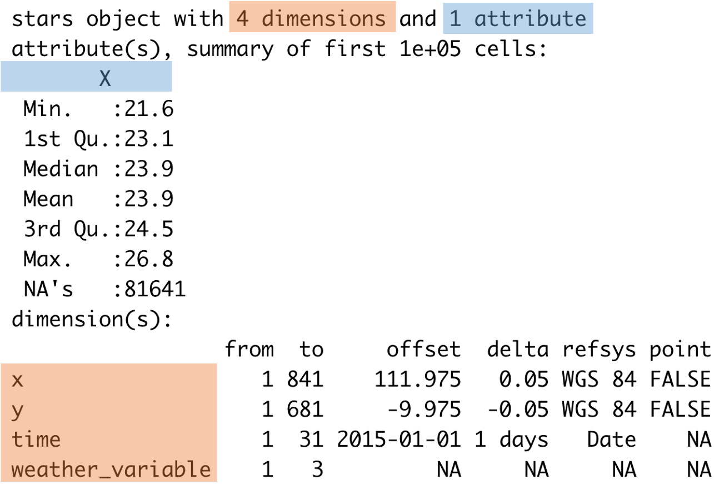
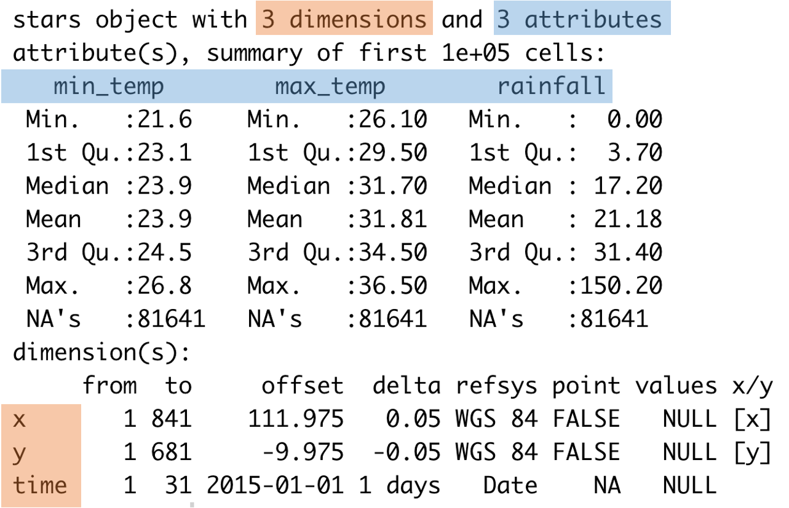
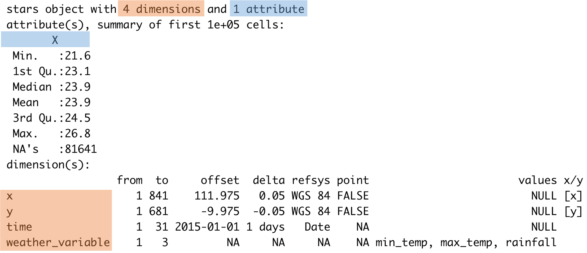
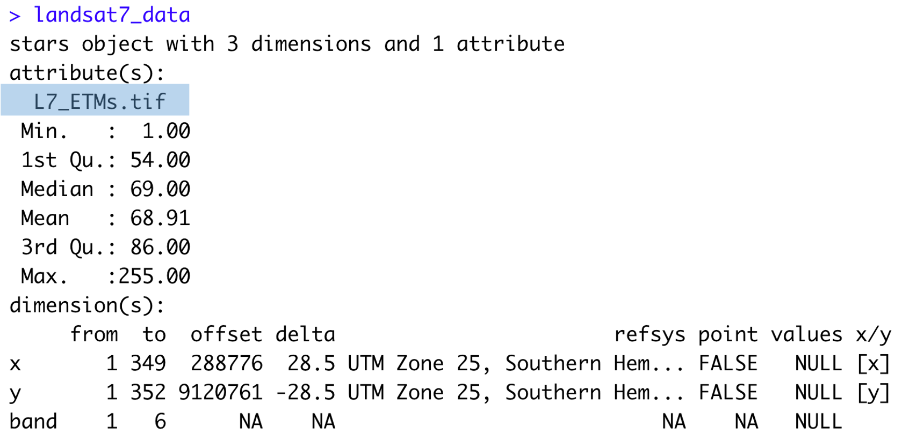
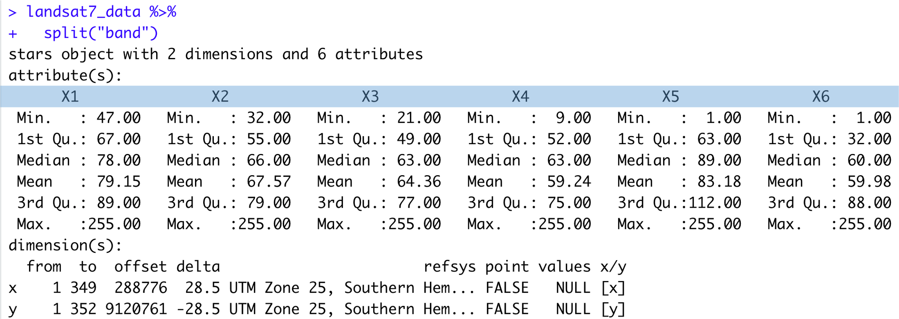

```{r child = "setup.Rmd"}
```

```{r, include=FALSE, eval=TRUE}
library("sf")
library("stars")
library("raster")
library("rnaturalearthdata")
library("mapview")
library("patchwork")
library("leaflet")
library("leaflet.extras")
library("readxl")
library("janitor")
library("emo")
library("tigris")
library("tidycensus")
library("rmapshaper")
library("patchwork")
library("tidyverse")
library("png")
library("grid")
library("here")
library("rgeoboundaries")
library("DT")
```

class: center, middle, dk-section-title
background-image:url("https://images.pexels.com/photos/347143/pexels-photo-347143.jpeg?auto=compress&cs=tinysrgb&dpr=2&h=750&w=1260")

# Basics of using the {stars} package

---

## What files am I looking for?

There are **many** raster GIS formats for data cubes (and higher dimensional data).

The most common formats are:

- .tif (known as GeoTIFF)

- .nc (netCDF)

---

### `{stars}` objects: <span style="color:#E76826">dimensions</span> vs <span style='color:#4B88CB'>attributes</span>

- `{stars}` objects are very different from `data.frame` and `tibble`. 

- `{stars}` objects have <span style="color:#E76826">dimensions</span> and <span style='color:#4B88CB'>attributes</span> which have different roles in tidyverse data wrangling tasks.

---

### `{stars}` objects: <span style="color:#E76826">dimensions</span> vs <span style='color:#4B88CB'>attributes</span>

- Sometimes it's useful to store variables as <span style="color:#E76826">dimensions</span> whereas other times <span style='color:#4B88CB'>attributes</span> make more sense.

.pull-left[

]

.pull-right[

]

---

### `{stars}` objects: <span style="color:#E76826">dimensions</span> vs <span style='color:#4B88CB'>attributes</span>

.pull-left[
We use <span style="color:#E76826">dimensions</span> to `filter()` a `{stars}` object:

- Filtering **x** and **y** to a sub-region of the dataset

- Filtering **time** (i.e. observations on 2015-01-01)

- Filtering a specific **weather_variable**

- Filtering a specific **band**
]

.pull-right[

]

---

### `{stars}` objects: <span style="color:#E76826">dimensions</span> vs <span style='color:#4B88CB'>attributes</span>

.pull-left[
We can calculate new values from <span style='color:#4B88CB'>attributes</span> using `mutute()`:

```{r}
australia_weather_data %>% 
  mutate(temp_range = max_temp - min_temp)
```

]

.pull-right[

]

---

### `{stars}` objects: <span style="color:#E76826">dimensions</span> vs <span style='color:#4B88CB'>attributes</span>

.pull-left[
Convert dimensions to attributes with `split()`

```{r}
australia_weather_data %>% 
  split("weather_variable")
```

]

.pull-right[
Convert attributes to dimemnsions with `merge()`

```{r}
manipulated_aus_data %>% 
  merge()
```

]

---

### `{stars}` objects: <span style="color:#E76826">dimensions</span> vs <span style='color:#4B88CB'>attributes</span>

.pull-left[
Unfortunately, <span style='color:#4B88CB'>attribute</span> names are often meaningless.

- <span style='color:#4B88CB'>Attributes</span> might be named after your data file(s)

- `split()` will automagically name <span style='color:#4B88CB'>attributes</span> `X1` through `XN`

**Store the meaning of <span style="color:#E76826">dimensions</span> in a separate file or in plain text.**
]

.pull-right[



]
