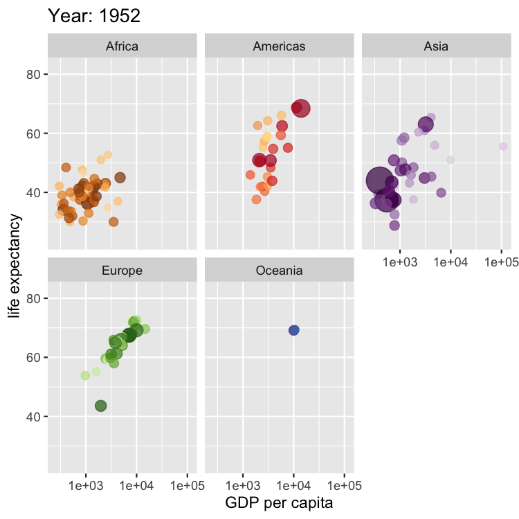

```{r child = "setup.Rmd"}
```

```{r, include=FALSE, eval=TRUE}
library("sf")
library("tidyverse")
library("rnaturalearthdata")
library("mapview")
library("patchwork")
library("leaflet")
library("leaflet.extras")
library("readxl")
library("janitor")
library("stars")
library("emo")
library("DT")
library("countrycode")
```

class: center, middle, dk-section-title
background-image:url("images/translations.jpg")
background-size: 100%

# Disambiguating country names with {countrycode}

???

In the beginning of the course I introduced the complexities of building maps, and a large component of this is figuring out how to label countries and regions.

Fortunately, there's a package called {countrycode} which simplifies the disambiguation of country names... and in this video I'll introduce how to use this package to standardise your datasets.

---

## Why are country names complicated?

There are 3 reasons that country names might vary between datasets:

- Abbreviations

  - UK/United Kingdom, US/USA/United States, N. Cyprus/Northern Cyprus
  
- Alternative (not disputed) names, i.e. formal vs informal

  - Netherlands/Holland, Kingdom of Bahrain/Bahrain, People's Republic of China/China
  
- Disputed territories

???

But let's breakdown the 3 reasons why country names might vary between datasets:

- Firstly, country names are more than often abbreviated.. you're probably familiar with the United Kingdom and United States being appreviatedto the UK and US (or USA)  but you might not be familiar with Northern Cyprus being abbreviated as N. Cyprus

- Secondly, and most confusingly countries often have multiple alternative - but not disputed - names. An example that often trips me up is that the Netherlands and Holland are the same place, Holland is the informal name. More common examples include Bahrain as the contractionj of Kingdom of Bahrain and China instead of the much longer (but official) 

- Finally, as I've mentioned a few times some country borders - and their names - are disputed territories. Fortunately, the {countrycode} package handles many of these well. But we're going to skip over any material examples... I keep politics to my Twitter account and not my recorded courses.

---

### Country codes are better than country names

The only true way to disambiguate is to use country codes.

```{r, eval=TRUE, echo=FALSE}
set.seed(5)
countrycode::codelist %>%
  select(country.name.en, iso3c, iso3n, eurostat, ioc) %>%
  filter(complete.cases(.)) %>%
  sample_n(5) %>%
  datatable(options = list(dom = "T",
                           columnDefs = list(
                             list(className = 'dt-center', targets = 1:4)
                           )),
            colnames = c("ISO-3 character",
                         "ISO-3 number",
                         "Eurostat",
                         "International Olympic Committee"
                         ),
            rownames = FALSE) %>%
  formatStyle('iso3c',
              backgroundColor = 'yellow')
```

???

While we can try and make our country names consistent through the countrycode package, really the only true way to disambiguate geographic regions is with internationally recognised codes.

However, there are LOTS of different international codes in us. Here I've chosen a random selection of countries and I'm showing their ISO-3, eurostat and Internatrional Olympic Committee codes.

The correct choice depends on your particular use case. But some of these codes have a narrow field of scope, for instance the Olympic Committee codes don't make sense for countries that don't compete in the Olympics.

I recommend the ISO-3 Character codes as the best choice for regional codes. They're very widely used and once you've used them for a while you'll likely remember which code is used for which country.

---

## Worked Example

Please create a new project called "gapminder-choropleth"

<br>
<center>

</center>

???

Let's create a new project called "gapminder-choropleth". We'll use this project later in the ggplot2 and leaflet sections of the course.

---

class: my-turn

## My Turn

I'm going to use `{countrycode}` to disambiguate country names in a toy dataset and then use that to create a choropleth.

???

For my turn I'm going to demonstrate how the countrycode package works and use it to disambiguate the countries in a toy dataset and then create a choropleth using the rnaturalearthdata package.

For your turn I'd like you to do the same but for the gapminder dataset.

---

## (RStudio Coding Slide)

???

[[ALREADY HAVE THIS SETUP:

library("tidyverse")
library("sf")
library("countrycode")
library("rnaturalearthdata")
library("mapview")

countries_sf <- countries110 %>%
  st_as_sf()

countries_data <- tribble(
  ~country_name, ~spurious_number,
  "United Kingdom", 23,
  "USA", 30,
  "Peru", 26,
  "South Africa", 31,
  "Holland", 20
)

]]

Okay! I've got some coee already setup here.

I'm loading the tidyverse and sf package as I need those for manipulating geospatial datasets. We'll use the countrycode package to convert country names and we'll use the rnaturalearthdata package to make a choropleth.

Our toy dataset only has four countries in it, and I've added a column that contains random numbers called "spurious_number"... when it comes to your turn you'll be using gapminder which contains useful information. For this toy example I think it's fine to use meaningless data.

We're going to use the countryname() function as it converts a country name to any of the 700+ formats contained within the countrycode package.

Let's convert Holland into the iso3c format I mentioned just before:

countryname("Holland", "iso3c")

Great! That's worked!

But where do we find the codes used by countrycode?

The codelist tibble contains the codes for all the regions countrycode knows about.

If we bring up the documentation page for the object you'll find a plain English description of what each code is used for.

Now I want to add a column to the countries_data that contains the iso3c code, so need to use the mutate() function

countries_data %>%
  mutate(iso3c = countryname(name, "iso3c"))
  
Great! Let's update our countries_data dataset

Now we'll join this with the countries_sf object. But first we need to find the correct column name

colnames(countries_sf)

In this dataset the iso3c column is called "iso_a3".

Remember when joining sf object we need to place them in the first argument of the join, otherwise we'll lose the geometry component!

countries_sf %>%
  left_join(countries_data,
            by = c("iso_a3" = "iso3c"))
            
            
There are mostly NAs in our dataset because there are only five countries in the toy dataset.

Let's visualise this with mapview!

countries_sf %>%
  left_join(countries_data,
            by = c("iso_a3" = "iso3c")) %>%
  mapview(zcol = "spurious_number")
  
I'm going to recommend that you save this script file as "countrycode-toy-example.R" and we'll create a new script for you're turn.

Let's load the packages we'll need again

library("tidyverse")
library("sf")
library("rnaturalearthdata")
library("countrycode")
library("gapminder")

I want to make a quick comment about gapminder first!
---

## Gapminder

.pull-left[
The Gapminder Foundation is a non-profit that promotes sustainable development.

It was founded by Hans Rosling in 2005.

It's most famous chart pulls together **population**, **life expectancy** and **GDP per capita** to compare global economies over the 20th century. Learn more from [Hans Rosling's TED Talk](https://www.ted.com/talks/hans_rosling_global_population_growth_box_by_box?language=en#t-432699).
]

.pull-right[

]

???

The Gapminder Foundation is a non-profit founded by Hans Rosling and focuses on promoting sustainable international development.

The chart I've included here is very similar to a chart created by the foundation that compares how global economies grew over the 20th Century - it featured heavily in Hans Rosling's TED Talk which I highly recommend you watch. Note that my animated version of the chart is built using {ggplot2} and {gganimate}.

It's this dataset that's made available to us by the gapminder package!

---

## (RStudio Coding Slide)

???

Let's print gapminder to the console

and we can see the global development indicators for each country from 1952 through to 2007.

For our purposes let's work with the 2007 data:

gapminder_2007 <- gapminder %>% 
  filter(year == 2007)
  
That's going to be as far as I go - though!
  
---

class: inverse

## Your Turn

Combine the `rnaturalearthdata::countries110` dataset with `gapminder_2007` and create a choropleth comparing country populations.

.pull-left[
- Use `countryname()` to add a column to `gapminder_2007` that contains the ISO3C country codes

- Join together the `countries110` and `gapminder_2007` dataset using your new column

- Use `mapview()` to visualise the `lifeExp` column
]

.pull-right[
```{r, eval=TRUE, echo=FALSE}
gapminder_2007 <- gapminder %>% 
  filter(year == 2007) %>%
  mutate(iso3c = countryname(country, "iso3c"))

countries_sf <- countries110 %>%
  st_as_sf()

countries_sf %>%
  filter(!name == "Antarctica") %>%
  left_join(gapminder_2007,
            by = c("iso_a3" = "iso3c")) %>%
  mapview(zcol = "lifeExp")
```

]

???

For your turn I'd like you to combine the rnaturalearthdata shapefiles with the gapminder_2007 dataset and then produce the mapview() map you can see in my slide


