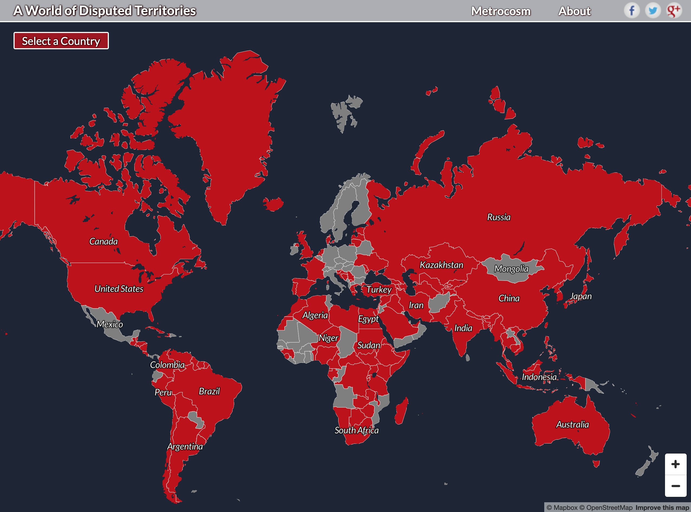

```{r child = "setup.Rmd"}
```

```{r, include=FALSE, eval=TRUE}
library("sf")
library("tidyverse")
library("rnaturalearthdata")
library("mapview")
library("patchwork")
library("leaflet")
library("leaflet.extras")
library("albersusa")
library("rayshader")
countries_sf <- countries110 %>%
  st_as_sf()

theme_cjh_map <- function(){
  theme_void() +
  theme(panel.background = element_rect(fill = "#98d7ef"), panel.border = element_blank())
}

gg_save_nicely <- function(gg_plot, file_name, width = 10, units = "in"){
  
  gg_internals <- ggplot_build(gg_plot)
  
  x_range <- diff(gg_internals$layout$panel_params[[1]]$x_range)
  y_range <- diff(gg_internals$layout$panel_params[[1]]$y_range)
  
  aspect_ratio <- x_range / y_range
  
  ggsave(file_name,
         gg_plot,
         width = width,
         height = width / aspect_ratio,
         units = units)
  
}
```


class: center, middle, dk-section-title
background-image:url("images/globe-background.jpg")
background-size: contain

# Making maps is complex

???

Welcome to mapping with R. In this course we're going to cover how to build both static and interactive maps in R, but before we can start making these visualisations we need to understand what data we need to create maps - and how to get that data into R. We'll also cover a little bit of geographic computation with the sf package.

It's important to acknowledge from the beginning that making maps is complex - there are multiple steps we need to go through before we can get from the idea of a map to the actual output chart that we want. 

---

## R for maps

R has packages for every part of the mapping workflow:

.pull-left[
- importing map data
- wrangling and cleaning map data
- computing geographic distances, areas, intersections and more..
- visualising map data
]

.pull-right[


]

???

But that definitely shouldn't put us of using R to make maps - the community has made excellent packages that acknowledge the complexity of the problem and work together to provide us with an awesome tidyverse friendly workflow for the whole process:

from importing and manipulating map data right through to creating visualisations.

The vast majority of this work is shouldered by these two packages - sf and mapview. We'll be using these packages throughout the entire course. 

I'm starting off with an explanation of how complex maps are because I think it's important, and you'll need to understand some things before you can create good and meaningful maps. But in a few minutes, after talking about all the complexity of maps I'll show how in a few lines of code these packages allow us to get usable maps.

---
background-image:url("images/3d-to-2d.png")
background-size: contain

## Maps flatten a complex world (I)

```{r eval=FALSE, include=FALSE}
## This code was used to generate the ggplot2 charts that were then shoved
## into PowerPoint and set at the background image
gg_web_mercator <- countries_sf %>%
  ggplot() +
  geom_sf(fill = "#D2B48C") +
  coord_sf(crs = 3857, expand = FALSE) +
  theme_cjh_map()

gg_robinson <- countries_sf %>%
  ggplot() +
  geom_sf(fill = "#D2B48C") +
  coord_sf(crs = "+proj=robin") +
  theme_cjh_map()

gg_pall_peters <- countries_sf %>%
  ggplot() +
  geom_sf(fill = "#D2B48C") +
  coord_sf(crs = "+proj=cea", expand = FALSE) +
  theme_cjh_map()

gg_web_mercator %>%
  gg_save_nicely("images/gg_web_mercator.png")

gg_robinson %>%
  gg_save_nicely("images/gg_robinson.png")

gg_pall_peters %>%
  gg_save_nicely("images/gg_pall_peters.png")
```

???

Maps are complex because they flatten a complex world. Our planet is an approximate sphere and maps attempt to project the surface of the Earth onto a 2D surface.

There are multiple choices we can make about the mathematics we use to project our maps, and each of those result in very different lookings maps. This slide contains 3 of the most popular projections you'll see out in the wild... the easiest way to see the differences between the maps is to compare the relative size of Africa to the United States of America.

---

.pull-left[
<blockquote class="twitter-tweet"><p lang="en" dir="ltr">Animating the Mercator projection to the true size of each country in relation to all the others.<br><br>Focusing on a single country helps to see effect best.<a href="https://twitter.com/hashtag/dataviz?src=hash&amp;ref_src=twsrc%5Etfw">#dataviz</a> <a href="https://twitter.com/hashtag/maps?src=hash&amp;ref_src=twsrc%5Etfw">#maps</a> <a href="https://twitter.com/hashtag/GIS?src=hash&amp;ref_src=twsrc%5Etfw">#GIS</a> <a href="https://twitter.com/hashtag/projectionmapping?src=hash&amp;ref_src=twsrc%5Etfw">#projectionmapping</a> <a href="https://twitter.com/hashtag/mapping?src=hash&amp;ref_src=twsrc%5Etfw">#mapping</a> <a href="https://t.co/clpCiluS1z">pic.twitter.com/clpCiluS1z</a></p>&mdash; Neil Kaye (@neilrkaye) <a href="https://twitter.com/neilrkaye/status/1050740679008296967?ref_src=twsrc%5Etfw">October 12, 2018</a></blockquote> <script async src="https://platform.twitter.com/widgets.js" charset="utf-8"></script>
]

.pull-right[

Jakub Nowosad replicated this GIF in `{ggplot2}` on their blog: [nowosad.github.io/post/maps-distortion](http://nowosad.github.io/post/maps-distortion)

]

???

This tweet from Neil Kayye beautifully highlights how the Mercator projection distorts true country sizes, which is very important as this is the projection used by Google Maps - so it's probably the most commonly seen projection in day to day usage.

You might enjoy Jakub's blogpost where they replicate this GIF using {ggplot2}.

---

## All maps are wrong...

.pull-left[
<iframe width="675" height="406" src="https://www.youtube.com/embed/kIID5FDi2JQ" frameborder="0" allow="accelerometer; autoplay; encrypted-media; gyroscope; picture-in-picture" allowfullscreen></iframe>
]

.pull-right[
All map projections distort the surface of the Earth to some extent.

Some regions or countries may be better represented with specific projections.
]

???

It's actually kind of interesting to understand why map projections distort the surface of the Earth... and I highly recommend watching Vox media's interesting breakdown of this problem - which has the very attention grabbing title: "All maps are wrong" 

And it's definitely true that some regions or countries may be better represented with specific projections.

---

### ... but CRS 4326 is a good default

The Coordinate Reference System (CRS) of a geospatial dataset specifies the projection of the dataset.

???

... we're going to cover the technical (and code side of) projections in the geographic computations section of the course, but before we can create ANY maps or work with any geospatial dataset we need to establish a default coordinate reference system - or CRS.

---

### ... but CRS 4326 is a good default

The Coordinate Reference System (CRS) of a geospatial dataset specifies the projection of the dataset.

- WGS84 is the most common CRS used in the world.

- It's more usually referred to by the EPSG code 4326

- This "magic number" will appear often in our code

```{r}
quakes %>%
  st_as_sf(coords = c("long", "lat"), crs = 4326) %>%
  mapview()
```


???

... the world's most commonly used projection is called WGS84, but in our code we'll be referring to it by its EPSG code: 4326... 

... you'll see this magic number pop up all of the time throughout the course, and I'll give a detailed explanation of it in the geographic computations section.

---

## Maps flatten a complex world (II)

.pull-left[
<center>

</center>
]

.pull-right[
- There are more than 100 territorial disputes.

- There are more than 30 naming disputes, including seas and other bodies of water.

- Making maps is political, consider your audience and intent.
]
<br>
<br>
Interactive dispute map: [metrocosm.com/disputed-territories-map](http://metrocosm.com/disputed-territories-map.html)

???

Maps not only flatten the 3D surface of our world, they also flatten the complexity of our sociopolitical borders, country names, and claims of sovereignty.

Making maps is unavoidably political, it's important that you consider both your audience and intent when ultimately publishing your maps.

I've linked to an interactive map that allows you to explore most (but not all) of the territorial disputes, this might be a useful resource to use when planning how to map a particular region.

---

## Maps flatten a complex world (III)

Base maps (or map tiles) live behind the data we add to our maps and add flavour to the map.

.pull-left[
<center>
```{r, eval=TRUE, echo=FALSE,out.height="200px", out.width="300px"}
leaflet() %>%
  addProviderTiles(providers$HERE.satelliteDay)
```
</center>
]

.pull-right[
<center>
```{r, eval=TRUE, echo=FALSE,out.height="200px", out.width="300px"}
countries_sf %>%
  filter(!name == "Antarctica") %>%
  leaflet() %>%
  addPolygons(fillColor = "white",
              weight = 1,
              fillOpacity = 1,
              color = "black") %>%
  setMapWidgetStyle(list(background= "lightblue"))
```
</center>
]

???

These two maps help me highlight one last way that maps are complex. The first image is a map of the world constructed from satellite imagery - it's a beautiful map, but it would be hard to overlay most types of geospatial data onto this visualisation in a meaningful way.

The second image discards these "base maps" or "map tiles" and shows only country borders from a shapefile dataset. It's often convenient not to use base maps when constructing choropleth.

I like to think of base maps as adding flavour to a map, they help us make sense of where our data is on the globe. It's important to understand there are hundreds of different map tiles available.

---

## Maps flatten a complex world (III)

.pull-left[
<center>
```{r, eval=TRUE, echo=FALSE,out.height="200px", out.width="300px"}
leaflet() %>%
  addProviderTiles(providers$HERE.satelliteDay)
```

```{r, eval=TRUE, echo=FALSE,out.height="200px", out.width="300px"}
leaflet() %>%
  addProviderTiles(providers$Esri.WorldShadedRelief) %>%
  addMarkers(86.925278, 27.988056, label = "Mount Everest") %>%
  setView(86.925278, 27.988056, zoom = 10)
```
</center>
]

.pull-right[

```{r, eval=TRUE, echo=FALSE,out.height="200px", out.width="300px"}
countries_sf %>%
  filter(!name == "Antarctica") %>%
  leaflet() %>%
  addPolygons(fillColor = "white",
              weight = 1,
              fillOpacity = 1,
              color = "black") %>%
  setMapWidgetStyle(list(background= "lightblue"))
```

```{r, eval=TRUE, echo=FALSE,out.height="200px", out.width="300px"}
leaflet() %>%
  addProviderTiles(providers$OpenStreetMap) %>%
  # addMarkers(31.233333, 30.033333, label = "Samosir") %>%
  setView(31.233333, 30.033333, zoom = 12)
```

]

???

... I've constructed two more contrasting maps using different map tiles.

The first is a relief map of Mount everest and highlights the contours of the surrounding land.

The second is a street map of Cairo, notice that the labels of the map are in the localised language. This is an important feature and benefit of using base maps instead of plain polygons... but remember what I said before about considering the audience of your maps when choosing how to label your geospatial visualisations.

---

## Maps flatten a complex world (IV)

Sometimes the maps we want to build require us to manipulate the relative positions of regions.

.pull-left[
<center>
```{r, eval=TRUE, echo=FALSE, out.width="350px"}
countries_sf %>%
  filter(name == "United States") %>%
  ggplot() +
  geom_sf() +
  theme_cjh_map()
```
</center>
]

.pull-right[
<center>
```{r, eval=TRUE, echo=FALSE, out.width="350px"}
usa_sf() %>%
  st_union() %>%
  ggplot() +
  geom_sf() +
  theme_cjh_map()
```
</center>
]

???

This is the fourth and final point I want to make about maps flattening a complex world.

The USA is a perfect - and extremely common - example of this complexity. The positions of Alaska and Hawaii are not conducive to making neat and tidy square charts. So what we typically do is relocate these two regions below the contiguous states.

We're fortunate that the R ecosystem contains R packages that contain pre-manipulated shapefiles for many of these situations.

---

## R is a complete GIS system

.pull-left[
Software designed to work with geospatial data is called GIS software. Most dedicated GIS tools are expensive and extremely technical to use.

R is without doubt a complete and powerful GIS system. We can use it to map or manipulate any and all geospatial datasets.
]

```{r eval=FALSE, include=FALSE, echo=FALSE, message=FALSE, warning=FALSE}
montereybay %>%
  sphere_shade(texture="desert") %>%
  plot_3d(montereybay,zscale=50)
render_snapshot("images/rayshader-montereybay.png")
```
.pull-right[
<br>
<br>
<center>


</center>
]

???

Now I've taken you through the complexities of making maps I want to conclude by saying that are is a complete and very powerful GIS system. We can use it to map or manipulate any and all geospatial datasets.

---

class: center, middle, dk-section-title
background-image:url("images/mapview-logo.gif")
background-size: 400px

# {mapview} for quick maps

???

Geospatial data is very different from rectangular datasets you might find in Excel files, it's often impossible to really understand your geospatial datasets before you've taken a look at them.

That's why I'm going to introduce you to the mapview package before we get bogged down with anything else.

---

## {mapview} is built for quick dataviz

With {ggplot2} we can build print quality static maps.

With {leaflet} we can build rich, interactive maps.

With {mapview} we can check if our data makes sense.

???

The mapview package is designed exclusively for quick and dirty visualisations to check that our data makes sense. We would never use it for creating maps that we wanted others to see, that's what {ggplot2} and {leaflet} are for which have their own dedicated chapters in this coure.

Let's go into RStudio and demonstrate how the package works.

---

## (RStudio Coding Slide)

???

[Switch to RStudio with the following packages loaded] 

library("mapview")
library("rnaturalearthdata")
library("albersusa")
library("stars")

satellite_image <- system.file("tif/L7_ETMs.tif", package = "stars")

I've loaded the mapview package so we can show it works and I've also loaded two packages that contain geospatial datasets:

- rnaturalearthdata is my favourite source of country shapefiles for the whole world, and we'll be using it often during the course.

- alberusa contains the same manipulated map of the USA that I showed in the previous section, where Alaska and Hawaii are tucked below the contiguous states.

- the final package I've loaded is called stars, which is used for working with raster geospatial data. There's also one pre-written line of code to correctly load in a stars compatible dataset.

Let's load these packages and load in our satellite_image dataset.

I want to get the country shapefiles first, so let's do that... 

countries110

if I print the object to the console we can see it's something called a SpatialPolygonsDataFrame... we don't really need to care about that means right now, we know it's a spatial dataset - so let's throw it into mapview()

mapview(countries110)

And immediately we get an interactive map that verifies we're looking at country borders! If I click on, say Russia the mapview chart will show me all of the information about that country (or more technically, the polygon).

Okay! Now let's look at a different dataset from the same rnaturaldata package:

tiny_countries110

This is a different kind of thing called a SpatialPointsDataFrame... but we can give it to mapview all the same:

mapview(tiny_countries110)

Mapview knows exactly what to do, we get points! Again I can click on one, for instance "Comoros"... a good question is - why are these points instead of polygons? Well, they're smaller than the highest resolution of shapefiles available from rnaturalearthdata - so the best they can do is place a circle at the centre of the shape.

... now most of the time that we'll use mapview in the course we'll be using the pipe, let's demonstrate that with the usa_sf() object [see it's a different kind of dataset]

usa_sf() %>% mapview()

But, unfortunately the {mapview} package doesn't include a definition of the pipe. There's lots of packages that do load in the pipe, but I'm going to choose to load the tidyverse as that's where we'll usually get the pipe later in the course.

library("tidyverse")

Okay! Before we re-run our pipe, let's show that we can make mapview more useful by colouring our choropleth by a variable:

usa_sf() %>% 
  mapview(zcol = "pop_2014", legend = TRUE)
  
Great! We've seen that mapview can be used to quickly visualise polygons and points, but it's also clever enough to work with raster datasets.

We need to load in the dataset and provide it to mapview()

satellite_image %>%
  read_stars() %>%
  mapview()
  
And we get back a satellite map!

---

## mapview features

.pull-left[
- Designed to be fast

- Works with all geospatial data packages

  - `{sp}`
  - `{sf}`
  - `{stars}`
  
- Can be further customised, see package website for more details: <br>[r-spatial.github.io/mapview](http://r-spatial.github.io/mapview)
]

.pull-right[
```{r, eval=TRUE, echo=FALSE, out.width="450px", out.height="450px"}
mapview(franconia, color = "cyan", col.regions = "white", lwd = 3)
```

]

???

... and that's the mapview package in a nutshell. It's extremely useful because it's designed to be fast, and it works with all of the geospatial data packages that we're going to use in the course.

This covers absolutely everything that I do with the mapview package, if you're interested in customising its maps a little more then check out the package website for examples and resources.


---

class: inverse, my-turn

### My turn

I'll do a thing

```{r echo=TRUE, eval = TRUE}
ggplot()
```

---

class: inverse

### Your turn

You do a thing