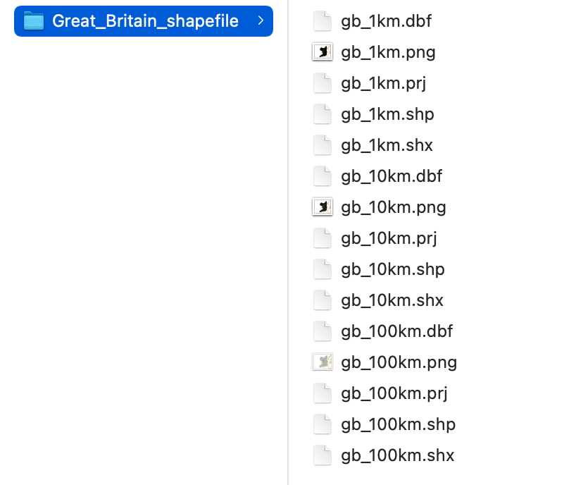

```{r child = "setup.Rmd"}
```

```{r, include=FALSE, eval=TRUE}
library("sf")
library("tidyverse")
library("rnaturalearthdata")
library("mapview")
library("patchwork")
library("leaflet")
library("leaflet.extras")
library("readxl")
library("janitor")
library("stars")
library("emo")
```

class: center, middle, dk-section-title
background-image:url("images/import-shipping-containers.jpeg")
background-size: 100%

# Importing shapefiles

???

In this video we're going introduce shapefiles and how we can import them into R.

---

## Shapefiles and choropleth

.pull-left[

The data that give choropleth (and other maps) their shapes come from **shapefiles**.

You can't start building a choropleth before you find appropriate shapefiles.

]

.pull-right[
```{r, eval=TRUE,echo=FALSE, out.height="400px"}
countries_sf <- countries110 %>%
  st_as_sf() %>%
  filter(!continent == "Antarctica")

pal_continents <- colorFactor("Set2", countries_sf$continent)

countries_sf %>%
  leaflet() %>%
  addPolygons(fillColor = ~pal_continents(continent),
              fillOpacity = 1,
              weight = 1,
              color = "black") %>%
  addLegend(pal = pal_continents,
            values = ~continent,
            opacity = 1)
```
]

???

But, what are shapefiles?

Shapefiles are datasets that contain the shapees of polygons that we then use to create choropleth - and other maps where we need to visualise shapes.

Choropleth are hugely useful and informative data visualisations, but they can often be difficult to produce because we need to find appropriate shapefiles for the geographic regions we care about.

---

## Shapefiles and {sf}

.pull-left[

We import shapefiles into R with `sf::read_sf()`

Shapefiles produce `{sf}` objects that contain MULTIPOLYGONs.

]

.pull-right[
```{r, eval=TRUE,echo=FALSE, out.height="400px"}
countries_sf <- countries110 %>%
  st_as_sf() %>%
  filter(!continent == "Antarctica")

pal_continents <- colorFactor("Set2", countries_sf$continent)

countries_sf %>%
  leaflet() %>%
  addPolygons(fillColor = ~pal_continents(continent),
              fillOpacity = 1,
              weight = 1,
              color = "black") %>%
  addLegend(pal = pal_continents,
            values = ~continent,
            opacity = 1)
```
]

???

The {sf} package is responsible for importing shapefiles because geospatial polygons are one of the simple features data types.

There's a special function called read_sf() designed to import these geospatial datasets and this will produce {sf} objects that contain MULTIPOLYGONs, just like you've seen in the past few videos.

---

## ESRI Shapefiles

ESRI shapefiles are the common format for shapefiles.

ESRI shapefiles are downloaded as .zip files that you must uncompress.

.pull-left[

ESRI shapefiles must contain at least these files: 

- .shp
- .shx
- .dbf

]


.pull-right[

]


???

ESRI shapefiles are the most common and versatile shapefile format that you'll come across. We're therefore going to concentrate on how to recognise this data format and how to import it into R.

Firstly, when you download an ESRI shapefile you'll be download a .zip which you'll need to uncompress

To check if you have downloaded ESRI shapefiles you need to look for at least the following files in the folder

- .shp
- .shx

and .dbf

There might well be other files as well, the slide contains a screenshot of the RStudio project we're about to work on.

---

## Worked Example

Please open the "brexit-maps" project in the worked-exercises folder.

```{yaml}
mapping-with-r
└── worked-exercises
  └── brexit-maps
      ├── abrexit-maps.Rproj
      └── data
```

???

Let's load up the brexit-maps.Rproj and start looking at importing shapefiles.

---

## (RStudio Code Slide)

???

So, the data folder already contains ESRI shapefiles for Wales, Scotland and England but not for Northern Ireland.

Let's go and download shapefiles for Northern Ireland from here: https://data.nicva.org/dataset/administrative-land-boundaries/resource/15ef7156-d7e5-48cb-bc08-b0fe6f3e843d

The page tells us that we're about to download a .zip and also helpfully tells us the files inside: and we've got the 3 files I said we needed.

I'm going to download this and then relocate the folder into the /data folder of our project.

Now our data has been located properly we need ourselves an R script.

New -> R Script

Once again we'll load our GIS packages:

library("tidyverse")
library("sf")
library("mapview")

Now let's create a variable for the NI shapefiles:

ni_sf <- read_sf("")

Now we use the autocompletion with TAB to find the folder we just moved in. 

It's really important you keep an eye on the trailing / here - this code will not run on Windows machines so I highly recommend you delete the / to make the code reproducible and transportable.

Okay! Now we're finished!

ni_sf <- read_sf("data/fefew")

Let's pipe this straight into mapview and this has all worked nicely.

How about the shapefiles that I've already saved ready for you?

This folder contains multiple layers - see we have a set of files with England, Scotland and Wales in them? This is very common, ESRI shapefiles often contain multiple layers.

We need to tell the read_sf() function which layer we want with the layer argument:

england_sf <- read_sf("data/uk_local_authorities",
                      layer = "local_authorities_england")

That's pretty much everything we you need to know about importing ESRI shapefiles!

---

## GeoJSON Shapefiles

GeoJSON is a more modern and streamlined format... but fairly rare.

The Republic of Ireland's Open Data platform has many GeoJSON data sources, including administrative boundaries: http://data-osi.opendata.arcgis.com/datasets/e0cfbed6a3cc432295fd3e2f57451cad_0.geojson


???

The only other shapefile format you need to know about is GeoJSON. This is a more modern and streamlines format than ESRI shapefiles, but they're much rarer because the ESRI file type has been around for so long.

---

## (RStudio Coding Slide)

???

Let's visit the website and grab the download file link and store it in our clipboard.

Now in our script file all we need to do is point `read_sf()` at the data file:

republic_of_ireland_sf <- read_sf("http://data-osi.opendata.arcgis.com/datasets/e0cfbed6a3cc432295fd3e2f57451cad_0.geojson")

republic_of_ireland_sf %>%
  mapview()

That's the basics of importing shapefiles with {sf}. I wanted to point out that I've actually provided you with the code that I wrote to assemble these datasets together.

