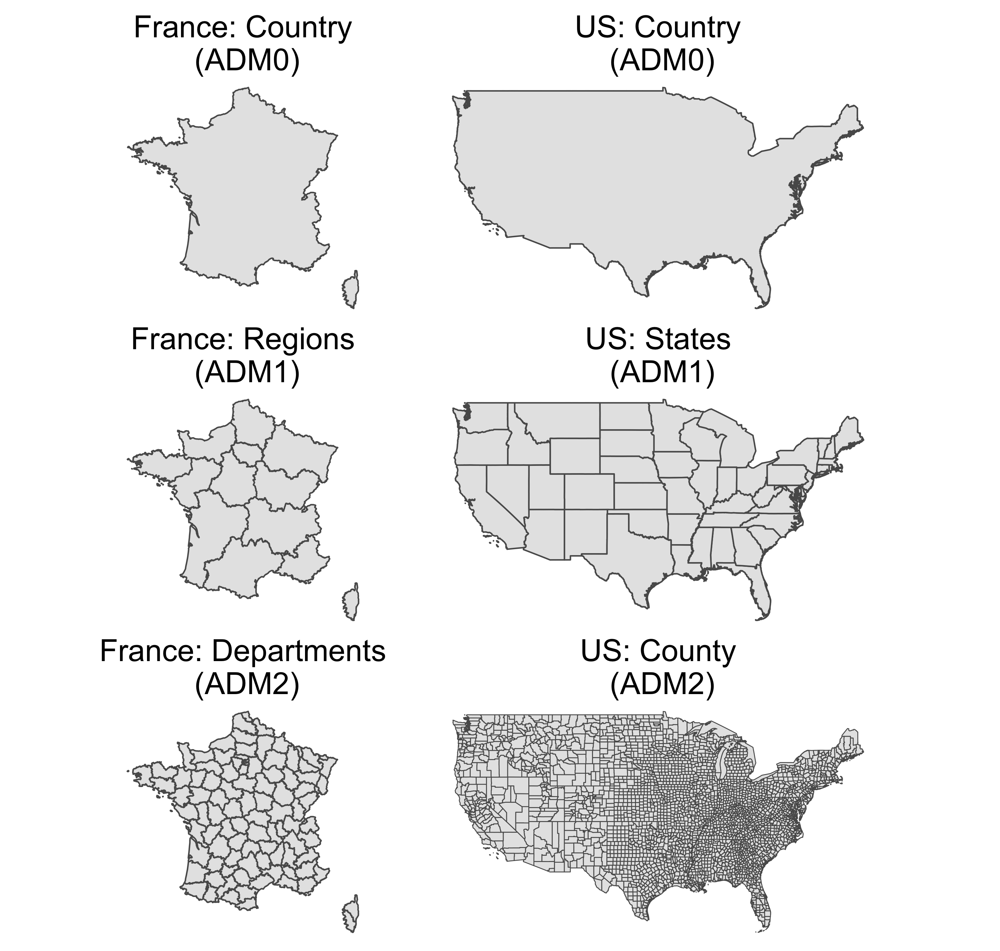
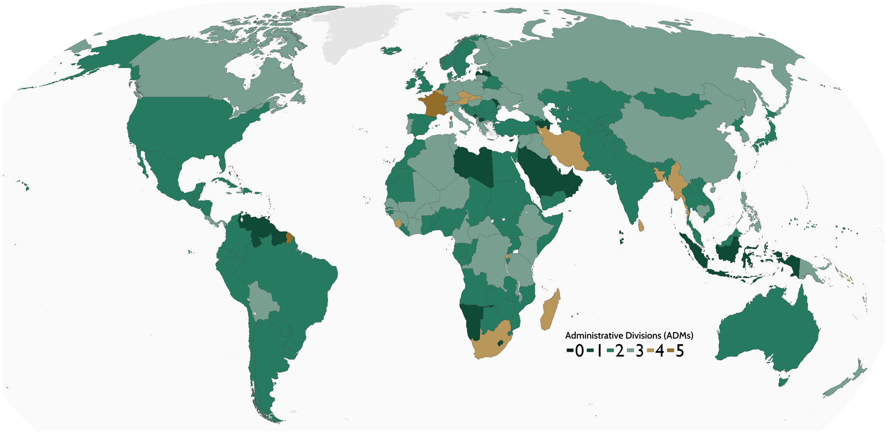

```{r child = "setup.Rmd"}
```

```{r, include=FALSE, eval=TRUE}
library("sf")
library("tidyverse")
library("rnaturalearthdata")
library("mapview")
library("patchwork")
library("leaflet")
library("leaflet.extras")
library("readxl")
library("janitor")
library("stars")
library("emo")
library("tigris")
library("tidycensus")
library("raster")
library("rmapshaper")
library("patchwork")
```

class: center, middle, dk-section-title
background-image:url("images/united-nations.jpeg")
background-size: 100%

# International data: raster and rgeoboundaries

???

In the previous video we focused exclusively on obtaining shapefiles for the United States, now I want to think about how we can generally obtain shapefiles for administrative regions for any given country.

---

## #rstats is your friend

.pull-left[
<center>
<blockquote class="twitter-tweet"><p lang="en" dir="ltr">Other than {tidycensus}, {rnaturalearth} and {rnaturalearthdata} what are some <a href="https://twitter.com/hashtag/rstats?src=hash&amp;ref_src=twsrc%5Etfw">#rstats</a> <a href="https://twitter.com/hashtag/rspatial?src=hash&amp;ref_src=twsrc%5Etfw">#rspatial</a> packages that contain (or access via API) nicely formatted administrative regions?<br><br>I&#39;m particularly interested in non USA examples.</p>&mdash; Charlie 🧑‍🎤 (@charliejhadley) <a href="https://twitter.com/charliejhadley/status/1293924397741465603?ref_src=twsrc%5Etfw">August 13, 2020</a></blockquote> <script async src="https://platform.twitter.com/widgets.js" charset="utf-8"></script>
</center>
]

--

.pull-right[

Lot's of folks describe themselves as *self taught* where it's usually more accurate to say **community taught**.

]
???

When I was putting this course together I was actually finding it hard to find a package that supplied international shapefiles and so I turned to Twitter because there's a very active (and friendly) R community who gather around the #rstats hashtag... if you're specifically looking at GIS with R then the rspatial hashtag is another good resource... I highly recommend joining the community as a way to improve your R knowledge, particularly if you're not directly working/learning with other R users.

It's worthwhile pointing out that many folks describe themselves as self taught R users... but more often than not it's more accurate to say community taught. I'm definitely community taught and in debted to resources I've discovered on Twitter - including R for the Rest of Us that I'm now extremely proud to be recording for.

Okay! But let's get back to international administrative regions.

---

## What are administrative regions?

.pull-left[

Countries are large<sup>1</sup> and need to be broken down into subnational units for provision of utilities, resources and socio-political analysis.

Names for these subdivisions vary greatly, Wikipedia lists [30+ potential subdivision names](https://en.wikipedia.org/wiki/Administrative_division#Examples_of_administrative_divisions).

For internationalisation we therefore call subunits **administrative regions**.

]

.pull-right[
```{r, eval=FALSE, echo=FALSE}
# france_adm0 <- getData(country = "FRA", level = 0) %>%
#   st_as_sf() %>%
#   ms_simplify() 
# france_adm1 <- getData(country = "FRA", level = 1) %>%
#   st_as_sf() %>% 
#   ms_simplify()
# france_adm2 <- getData(country = "FRA", level = 2) %>%
#   st_as_sf() %>% 
#   ms_simplify()
# france_adm3 <- getData(country = "FRA", level = 3) %>%
#   st_as_sf() %>% 
#   ms_simplify()
# 
# us_adm1 <- getData(country = "USA", level = 1) %>%
#   st_as_sf() %>%
#   filter(!NAME_1 %in% c("Alaska", "Hawaii")) %>%
#   ms_simplify()
# 
# us_adm0 <- us_adm1 %>%
#   st_union()
# 
# us_adm2 <- getData(country = "USA", level = 2) %>%
#   st_as_sf() %>%
#   filter(!NAME_1 %in% c("Alaska", "Hawaii")) %>%
#   ms_simplify()
# 
# theme_adm_map <- function(){
#   
#   theme_void() +
#     theme(plot.title = element_text(hjust = 0.5, size = 18))
#   
# }
# 
# gg_france_adm0 <- france_adm0 %>% 
#   ggplot() +
#   geom_sf() +
#   theme_adm_map() +
#   labs(title = "France: Country\n (ADM0)")
# 
# 
# gg_france_adm1 <- france_adm1 %>% 
#   ggplot() +
#   geom_sf() +
#   theme_adm_map() +
#   labs(title = "France: Regions\n (ADM1)")
# 
# gg_france_adm2 <- france_adm2 %>% 
#   ggplot() +
#   geom_sf() +
#   theme_adm_map() +
#   labs(title = "France: Departments\n (ADM2)")
# 
# gg_us_adm0 <- us_adm0 %>% 
#   ggplot() +
#   geom_sf() +
#   theme_adm_map() +
#   labs(title = "US: Country\n (ADM0)")
# 
# gg_us_adm1 <- us_adm1 %>% 
#   ggplot() +
#   geom_sf() +
#   theme_adm_map() +
#   labs(title = "US: States\n (ADM1)")
# 
# gg_us_adm2 <- us_adm2 %>% 
#   ggplot() +
#   geom_sf(size = 0.3) +
#   theme_adm_map() +
#   labs(title = "US: County\n (ADM2)")
# 
# gg_vert_administrative_regions <- (gg_france_adm0 + theme(plot.margin = unit(c(0,45,0,0), "pt"))  + gg_us_adm0) / 
#   (gg_france_adm1 + theme(plot.margin = unit(c(0,45,0,0), "pt")) + gg_us_adm1) / 
#   (gg_france_adm2 + theme(plot.margin = unit(c(0,45,0,0), "pt")) + gg_us_adm2)
# 
# ggsave("gg_vert_administrative_regions.png", gg_vert_administrative_regions, width = 10)
```


]

.footnote[
[1] [Citation needed](https://xkcd.com/285/).
]

???

Countries are large and almost impossible to administrate or analyse without breaking them up into subnational units which will vary both geographically and demographically.

The names for these subdivisions vary greatly, most people watching this course will know the US breaks down first into states and then into counties but fewer people will know France refers to its subdivisions as Regions and then departments...

So we need a way to internationalise this concept - and that's what administrative regions are for. The zeroth level is the country's borders and then increment as deeply as necessary - with some countries having five levels of subdivisions.

---

### Packages containing administrative regions


| Package | Available on CRAN? | International? | Data source |
| :-- | :--: | :--: | :-- |
| [`{absmapsdata}`](https://github.com/wfmackey/absmapsdata) | `r emo::ji("white_check_mark")` | `r emo::ji("x")` <br> Australian data | [data.gov.au](https://data.gov.au) |
| [`{eurostat}`](https://ropengov.github.io/eurostat/) | `r emo::ji("white_check_mark")` | `r emo::ji("x")` <br> Europe data | [Eurostat](http://ec.europa.eu/eurostat) |
| [`{raster}`](https://github.com/rspatial/raster) | `r emo::ji("white_check_mark")` | `r emo::ji("white_check_mark")` | [GADM](https://gadm.org/about.html) |
| [`{rgeoboundaries}`](https://dickoa.gitlab.io/rgeoboundaries/) | `r emo::ji("x")` | `r emo::ji("white_check_mark")` | [geoBoundaries](https://www.geoboundaries.org/) |
| [`{tigris}`](https://github.com/walkerke/tigris) | `r emo::ji("white_check_mark")` | `r emo::ji("x")` <br> US data | [TIGRIS](https://www.census.gov/geo/maps-data/data/tiger-line.html) |

???

We've already established there are some packages that contain shapefiles for specific regions, namely tigris which we covered in the last video but there's also Eurostat which is very popular amongst my friends who are working with European-based projects and absmapsdata which hooks into the Australian government's data portal... but really there are only two packages that contain international administrative regions.

---

### Packages w/ international administrative regions


| Package | Available on CRAN*? | International? | Data source |
| :-- | :--: | :--: | :-- |
| [`{raster}`](https://github.com/rspatial/raster) | `r emo::ji("white_check_mark")` | `r emo::ji("white_check_mark")` | [GADM](https://gadm.org/about.html) |
| [`{rgeoboundaries}`](https://dickoa.gitlab.io/rgeoboundaries/) | `r emo::ji("x")` | `r emo::ji("white_check_mark")` | [geoBoundaries](https://www.geoboundaries.org/) |

--

`{rgeoboundaries}` is not yet on CRAN (as of October 2020).
- The package can still be installed using:
  
```{r}
devtools::install_github("walker/rgeoboundaries")
```

- R users restricted to **validated R packages** will have to wait for a CRAN release.

> If you can use `{rgeoboundaries}` I **highly** recommend it over `{raster}`.

???

These packages are {raster} and {rgeoboundaries}. They use extremely different data sources to one another so to directly compare them we really need to understand the differences between GADM and the geoBoundaries service.

There's something else we need to keep in mind. As of October 2020 the rgeoboundaries package is not yet available on CRAN... that's okay for most folks on this course because we can easily install the package with the devtools function install_github() and it will automagically install ready for you to use just like a normal CRAN package.

Unfortunately, some R users are restricted to only using validated R instances which means they'll only be able to install packages that have been released to CRAN. Trust me, you'll already know if you're using a validated R instance as your IT department will have told you. Validated R instances are mostly found in the finance and pharmaceutical industries, but I have worked with some governmental departments that are similarly restricted.

I'm talking about this up front because if you can use the rgeoboundaries package I highly recommend it over the {raster}. However, I will show how to use both packages in this video.

---

## GADM vs geoBoundaries

.pull-left[
**GADM** + {raster}

- Free only for non-commercial use.

- Shapefiles are accessed via [download links](https://gadm.org/data.html).

- Data available only as full-precision shapefiles.

- Closed development cycle, comments requested via an [online form](http://rasterra.com/contact/gadm_contact_form).

]

.pull-right[
**geoBoundaries** + `{rgeoboundaries}`

- Free for commercial use.

- Shapefiles available via a [documented API](https://www.geoboundaries.org/api.html).

- Data available as [simplified](https://www.geoboundaries.org/downloadSimple.html) and full-precision shapefiles.

- Openly developed and welcoming of submissions on the [GitHub repository](https://github.com/wmgeolab/gbRelease).

]

???

Now let's get into the differences between GADM and geoBoundaries.

Firstly, both services are free for non-commercial use but GADM is **not** free for commercial use... you'll need to get in touch with them for details.

Secondly - there's a significant difference in how accessible the data is. To obtain data from GADM we need to download shapefiles from specific URLs, let me show you how that works...

[Click on download links] > On this page we can click through to the list of countries and I'll find Estonia which then provides me with shapefiles for four levels of adminsitrative regions in three different formats... the first two are actually specifically designed for use with R!! And it's these links that the {raster} package constructs to download administrative regions.

[SWITCH BACK TO SLIDE]
But let's compare that with the geoBoundaries service which has a fully documented API which includes the ability to target specific versions of the datasets.

That leads into comparing what level of detail is provided by each service: GADM provides full precision shapefiles whereas geoBoundaries also includes simplified versions of all administrative regions - which can be very useful for data visualisation purposes.

Finally - the services differ significantly in their development cycle. geoBoundaries is developed on GitHub and welcomes submissions, whereas the GADM development cycle is closed and comments/questions are requested via an online form.

---

## More on geoBoundaries

It's important to note geoBoundaries is very new, with the GitHub repository only being published publicly in 2020.

A detailed overview of the service has been published in [PLOS ONE](https://doi.org/10.1371/journal.pone.0231866).

<center>

</center>

???

I think it's importnant to note that while the geoBoundaries service looks very impressive and I've found it useful, it is still very new - with the GitHub repository only being published publicly in 2020.

However, the folks who've built it have done an excellent job of documenting the service and clearly show their commitment to reproducible research by submitting a detailed overview to PLOS One.

That includes the map I've replicated here that highlights how deep the adminsitrative regions go for each country... and it shows the secret reason for me including France on a previous slide, it's an oddity in Europe as it has FIVE levels subunits.

That's enough of talking about the services. Let's actually use them.

---

## (RStudio Coding Slide)

???

Let's create a new project `international-administrative-regions`

We'll load up our packages:

library("tidyverse")
library("raster")
library("sf")
library("mapview")

We're going to get the 4th level of Administrative Regions for Belgium from {raster} and then rgeoboundaries.

The getData function is used for accessing lots of different datasets, to obtain country borders we need to set the country argument to a valid iso 3 characters country code and the level administrative region we want:

belgium_adm4_gadm <- getData(country = "BEL", level = 4)

Okay! So, the object we get back is a SpatialPolygonsDataFrame, which makes sense because the {raster} package predates the newer {sf} package... in fact, we'll talk more about the raster package later in the course.

Let's leave it as is to visualise with mapview:

belgium_adm4_gadm %>%
  mapview()
  
Now if we click on one of the regions we can see we're looking at the Communes of Belgium (at least, that's what they're called in English).

So that's how it looks from the {raster} package. Now let's see how to do the same with the rgeoboundaries package

First, right when I'm recording I'll check the package isn't available on CRAN

install.packages("rgeoboundaries")

Nope! So let's use the install_github() function from devtools

devtools::install_github("wmgeolab/rgeoboundaries")

And now let's load the package!

Whereas {raster} has one function for obtaining a huge variety of datasets, rgeoboundaries has a separate function for each administrative region... this time let's go for adm2

gb_adm2(country = )

We also have the benefit of being able to provide a vector of countries as either country names or their ISO 3 character codes... for demonstrations sake let's go with both Belgium and Austria.

gb_adm2(country = c("Belgium", "Austria"))

I want to go to the documentation to show you the type argument:

- The default dataset is a high precision shapefile, if you want the simplified shapes I mentioned earlier you'll need to choose between two acronyms: SSCU and SSCGS.

We'll go with the defaults for now... but it does take a while to download so we'll speed through that...

belgium_and_austria <- gb_adm2(country = c("Belgium", "Austria"))

belgium_and_austria %>%
  mapview()
  
There is one drawback of using rgeoboundaries - with raster we got a lot of interesting information for free - let's show you what I mean by making an sf object:

belgium_adm4_gadm %>% 
  st_as_sf()

This tells me the name of every division from Country all the way down to level 4, and I get told what the name for this region type is called - in both English and Dutch!

Whereas we just don't get that with rgeoboundaries

belgium_and_austria %>%
  st_as_sf()
  
But let's try to make up for that by pointing out that we do have access to citations for data within the package:

gb_metadata("Belgium")


