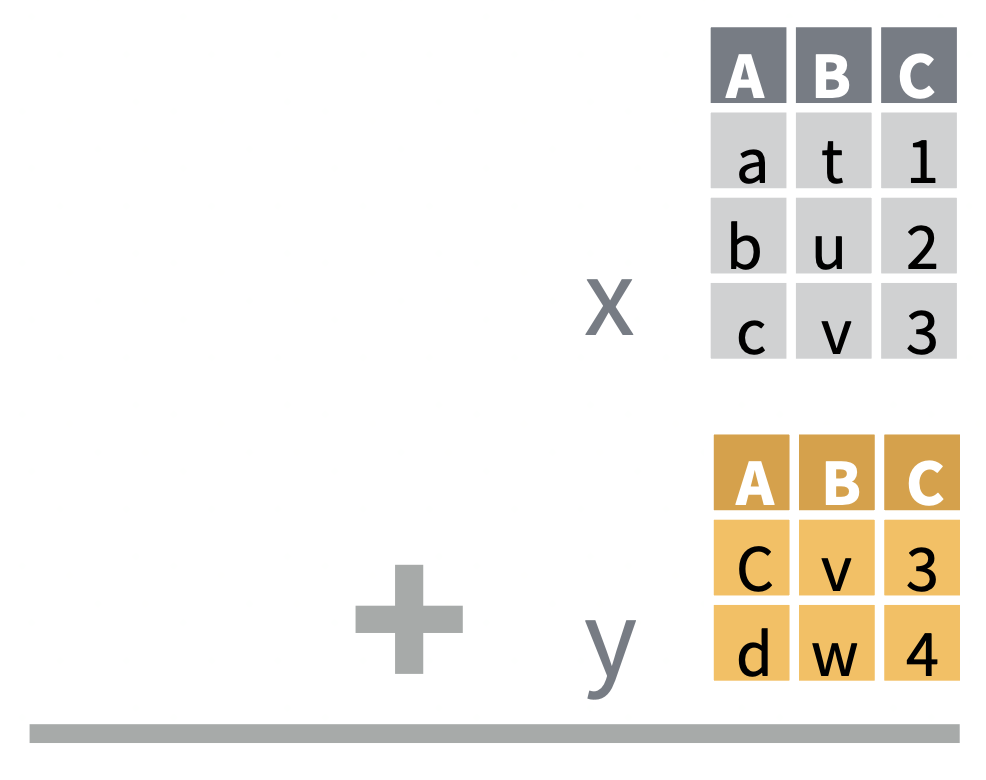
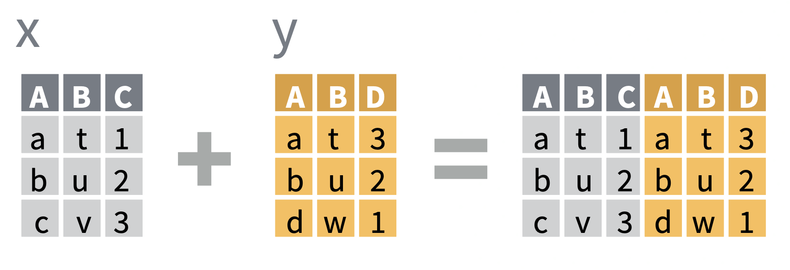
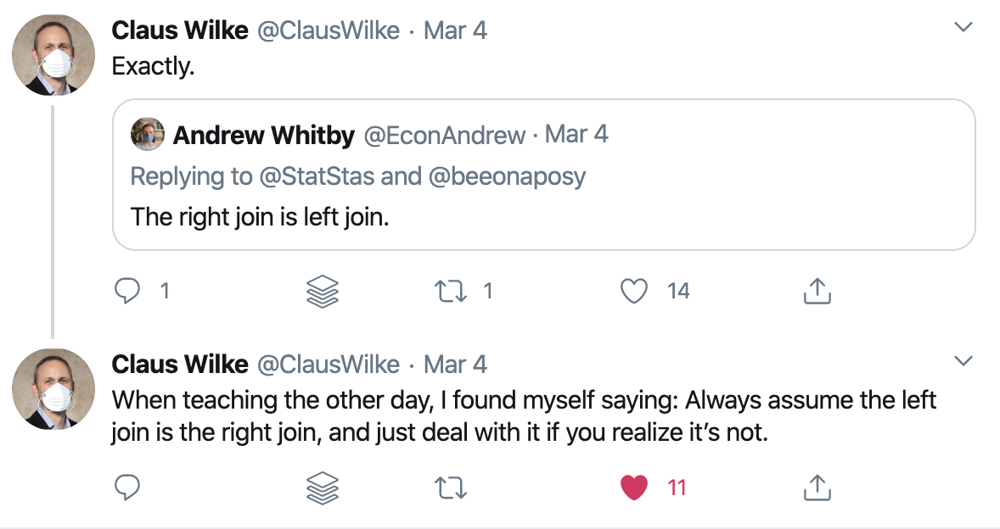

```{r child = "setup.Rmd"}
```

```{r, include=FALSE, eval=TRUE}
library("sf")
library("tidyverse")
library("rnaturalearthdata")
library("mapview")
library("patchwork")
library("leaflet")
library("leaflet.extras")
library("readxl")
library("janitor")
library("stars")
library("emo")
```

class: center, middle, dk-section-title
background-image:url("images/rows-of-sweets.jpeg")
background-size: 100%

# Joining Geospatial Datasets

???

In this video we're going to look at how we can combine geospatial datasets with auxillary information from other tables and how to bind multiple sf objects together.

---

## Bind or join?

There are two different ways to combine datasets using the `{dplyr}` package.

.pull-left[

**Binding** datasets combines tables by the **position** of rows.

<!-- `bind_rows(data_x, data_y)` appends the rows from `data_y` to the bottom of `data_x`. -->

<!-- `bind_cols(data_x, data_y)` apeands the columns from `data_y` to the right of `data_x`. -->
<center>

</center>

]

.pull-right[

**Joining** datasets combines tables by the **values** in rows.
<center>

</center>
]

???

There are two different methods for combining rectangular datasets together - binding and joining. Both of these tools come from within the tidyverse, and specifically the dplyr package.

Binding and joinng are required for different situations and solve different problems and we're going to cover a few examples of each in this video.

Binding datasets combines tables by the position of rows, for instance bind_rows() which appeends the rows from table y onto the bottom of table x.

Joining is more complex and combines tables by the values found in the rows of each table - let's take a look at how these functions work.

---

## "Mutating joins"

.pull-left[

The `{dplyr}` documentation includes one page called "mutate-joins" that covers four **different kinds of join**:

- `left_join()`
- `right_join()`
- `inner_join()`
- `full_join()`


]

--

.pull-right[

`{tidyexplain}` contains GIF that [explain each of these graphically](https://www.garrickadenbuie.com/project/tidyexplain/):

<center>

</center>
]

???

The {dplyr} package contains a documentation page called "mutating joins" that covers four different types of join:

- left, right, inner and full_join

Let me show you what I mean by nipping over the RStudio:

I'll type left_join into the console and press F1 to bring up the docs page. The page is called mutating joins and tries to cover all four of these at once. Which is a lot!!

Fortunately, the `{tidyexplain}` package contains GIF that explain each of these joins graphically!

This slide has the left_join() GIF and demonstrates how data moves between the x and y tables.

We use this kind of join all of the time when working with geospatial datasets, usually combining a .csv or Excel data file with shapefiles.

---

## More about mutating joins...

.pull-left[

`left_join()` is the most common (and usually correct) join.


]

.pull-right[
Learn more about the mechanics of joining on R for the Rest of Us.


]

???

There are two more things I want to say about mutating joins:

Firstly,  the vast majority of the time the left_join() function is the one you want... the alternatives are much rarer in day to day usage. This is nicely highlighted with Claus Wilke's tweet about the right join being a left join.

The second thing is that David Keyes Going Deeper with R goes much more deeply into the mechanics of joins. You might consider checking this course out if this video doesn't cover situations you know you'll face.

---

## Joining sf objects

Always place the {sf} dataset in the first argument of the join functions:

```{r}
uk_sf <- read_sf("data/shapefiles")
uk_population <- read_csv("data/uk_population.csv")
```


| Example Join | Keeps geometery? |
| :-- | :--: |
| `left_join(uk_sf, uk_population)` | `r emo::ji("white_check_mark")` |
| `left_join(uk_population, uk_sf)` | `r emo::ji("x")` |
| `right_join(uk_sf, uk_population)` | `r emo::ji("white_check_mark")` |
| `right_join(uk_population, uk_sf)` | `r emo::ji("x")` |


???

There's one very important thing to keep in mind when joining an sf object with a non-sf object - you must always put the sf object in the first argument of the join!

If you don't have an "sf" object in the first argument the resulting output will not have the geometry component.

---

## One last thing...

.pull-left[
In the documentation the two arguments of all the joins and binding functions are named `x` and `y`:

- `left_join(x, y)`
- `right_join(x, y)`
- `full_join(x, y)`
- `inner_join(x, y)`
- `bind_cols(x, y)`
- `bind_rows(x, y)`


]

.pull-right[
You might prefer to think of them as the **left-hand side** and **right-hand side** of the joins.
]

???

One last thing, all of the joining and binding functions have the same argument naming conventions - the first argument is called "x" and the second is "y"... you might prefer to think of them as the left-hand side and right-hand side of the joins.

---

class: my-turn

## My Turn

I'm going to show how to use `left_join()` to combine datasets from the `{gapminder}` and `{rnaturalearthdata}` datasets.

I'll then show you how to bind multiple `{sf}` objects together.

???

For my turn I'm going to start by showing you a how to combine data from the {gapminder} and {rnaturalearthdata} package. After that you'll be working with shapefiles for the UK.

---

## Worked Example

Please open the "uk-choropleth" project in the worked-exercises folder.

```{yaml}
mapping-with-r
└── worked-exercises
  └── brexit-maps
      ├── abrexit-maps.Rproj
      └── data
```

???

Let's open up the uk-choropleth project to get ready to work

---

## (RStudio Coding Slide)

???

[Already have these packages loaded:

library("tidyverse")
library("sf")
library("mapview")
library("gapminder")
library("rnaturalearthdata")

countries_sf <- countries110 %>%
  st_as_sf()

]

So I've already got my packages loaded and converted the countries110 dataset into a "sf" object.

Let's use the View() function to see where the names of the country live...

(there are two columns, name and name_long)

Great. So we're going to combine this with the gapminder dataset which comes from Hans Rosling's Gapminder foundation... the dataset contains life expectancy, population and GDP per capita for multiple years for many countries.

Let's focus on the most recent year, 2007:

gapminder_2007 <- gapminder %>%
  filter(year == 2007)
  
If we take a peek we can see there are many fewer countries in this dataset than countries_sf - that's going to affect how our joins work!

Okay. I've said left_join is the best default choice for joining datasets:

countries_sf %>%
  left_join(gapminder_2007,
            by = c("name" = "country"))
            
In the printed output I want to point out rows 6 - 8 have NA values for the measures from the {gampminder} dataset! This is because these rows don't exist in the gapminder dataset.

Let's use mapview to understand this join a little bit more:

countries_sf %>%
  left_join(gapminder_2007,
            by = c("name" = "country")) %>% 
  mapview(zcol = "lifeExp")
  
Several of the countries are grey coloured - but that's surprising for many of these countries, surely the gapminder dataset would have information about Yemen?

Let's check with a filter:

gapminder_2007 %>%
  filter(str_detect(country, "Yemen"))
  
countries_sf %>%
  filter(str_detect(name, "Yemen"))
  
This is a really common issue - there's a lot of variation in country names, some of which is due to political disputes. In the next video we'll look at how the countrycode package can be used for disambiguation.

I've said a few tiems that left_join is a good default for most use cases, but it's worthwhile showing what happens if we swap it for a right_join()

countries_sf %>%
  right_join(gapminder_2007,
            by = c("name" = "country")) %>% 
  mapview(zcol = "lifeExp")

Now any countries that are missing from the gapminder dataset are dropped from the sf object - the most obvious impact of this is the hole in the middle of Africa.

Okay. So that's how we join an sf object with a data.frame.

Now I'd like to show you how to use bind_rows() to combine "sf" datasets.

First, let's take another look at the uk_local_authorities folder - it contains a separate layer for England, Scotland and Wales. Remember that we use read_sf() to import shapefiles:

scotland_sf <- read_sf("data/uk_local_authorities",
                      layer = "local_authorities_scotland")

wales_sf <- read_sf("data/uk_local_authorities",
                      layer = "local_authorities_wales")
                      
And now we can combine these together with bind_rows()

scotland_sf %>%
  bind_rows(wales_sf) %>%
  mapview()
  
---

class: inverse

## Your Turn

Use mapview() to demonstrate how each constituency voted in the Brexit referendum.

- Import the data from `data/brexit-referendum-results.csv`

- Use `mutate()` to add a column that contains “Remain” or “Leave” depending on which received more votes

- Bind together the shapefiles for England, Scotland and Wales

- Join these two dataset together and visualise with `mapview()`


