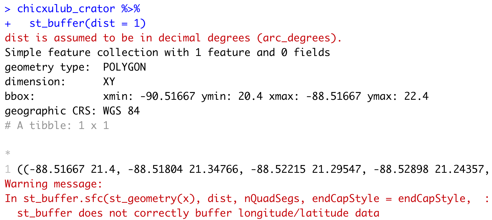
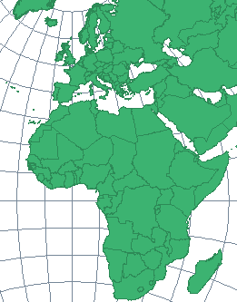

```{r child = "setup.Rmd"}
```

```{r, include=FALSE, eval=TRUE}
library("sf")
library("tidyverse")
library("rnaturalearthdata")
library("mapview")
library("patchwork")
library("leaflet")
library("leaflet.extras")
library("readxl")
library("janitor")
library("stars")
library("emo")
library("tigris")
library("tidycensus")
library("raster")
library("rmapshaper")
library("patchwork")
```

class: center, middle, dk-section-title, contain
background-image:url("images/impossible-shapes.png")
background-size: 80%

# Projecting maps and CRS

???

At the beginning of this course I covered four ways in which making maps is complex, one of which was map projectsions - let's go into more detail about what these are and how to work with them

---

## All maps are wrong...

.pull-left[
<iframe width="675" height="406" src="https://www.youtube.com/embed/kIID5FDi2JQ" frameborder="0" allow="accelerometer; autoplay; encrypted-media; gyroscope; picture-in-picture" allowfullscreen></iframe>
]

.pull-right[

To squash the surface of the Earth onto a map we need to **project** from a sphere's surface to a 2D flat map.

]

???

When we create a map of the Earth's 3D surface as a 2D data visualisaiton we need to a perform a mathematical operation to project the 3D surface to a 2D surface. There are an almost limitless number of possible projections - but they all have advantages and disadvantages.

If you didn't watch the Vox Media video I recommended previously I highly recommend watching it at the end of this video...

---

## Geospatial data needs a projection

.pull-left[

```{r, eval=TRUE, echo=TRUE, out.height='250px'}
quakes_no_crs <- quakes %>% 
  st_as_sf(coords = c("long", "lat"))
quakes_no_crs %>% mapview()
```

]

.pull-right[

```{r, eval=FALSE, echo=TRUE, out.height='250px'}
quakes_4326_crs <- quakes %>% 
  st_as_sf(coords = c("long", "lat"), 
*           crs = 4326)
quakes_4326_crs %>% mapview()
```

```{r, eval=TRUE, echo=FALSE, out.height='250px'}
quakes_4326_crs <- quakes %>% 
  st_as_sf(coords = c("long", "lat"), 
           crs = 4326)
quakes_4326_crs %>% mapview()
```

]

Note: We can pretty much use projection and CRS interchangeably.

???

So before we can do any geospatail computations or data visualisation on a geospatial dataset we have to pick a projection - otherwise things just don't work.

The easiest way to demonstrate that is to compare what happens if we turn the quakes dataset into an sf object with and without specifying a projection... in general we can pretty much always use projection and CRS interchangably, so on the highlighted line of code we're specifying the projection with the crs argument.

With the CRS the mapview object shows the location of the earthquakes with respect to Fiji - because the points have been projected onto the Earth's surface. Whereas without providing that information the map shows the points in the middle of space.

... I mentioned in the first video that 4326 should be our default CRS choice - but let's go into why!

---

## CRS 4326: A CRS for the whole world

CRS 4326 is an example of a **geographic CRS** - and the most widely used.

It's known by two different designations:

- 4326 is the **EPSG** (**E**uropean **P**etroleum **S**urvey **G**roup) code for the projection.

  - [epsg.io](https://epsg.io/) is the best place to search for projections.

- **WGS84** stands for the 1984 revision of the **W**orld **G**eodetic **S**ystem. 

???

CRS 4326 is an example of a geographic CRS - and the most widely used.

It's known by two different designations:

- 4326 is a code from the European Petroleum Survey Group - or EPSG. This is a fairly standard way to refer to CRSs, and I highly recommend the epsg.io website if you need to find a particular projection... let me click through and let's search for CRSs for Mexico... there are lots of different options, and we'll get into why in a little bit...

... but first let's finish up talking about 4326...

we also call this projection WGS84 - which standard for the 1984 revision of the World Geodetic System. It's the underpinnings of modern cartography and satellite navigation systems (including GPS).

Not all CRS have a projection name, some are solely refered to by their EPSG number.
  
---

## Why not always use CRS 4326?

.pull-left[

**Geographic projections** are not compatible with many types of geospatial computations.

The `{sf}` package (and others) will very loudly warn you that about **longitude/latitude data**.

For these applications we need a **projected CRS**.

]

.pull-right[



]

???

So, if CRS 4326 is so wonderful and magic - why can't we use it all of the time.

It's because it's a geographic projection and these are not compatible with many types geospatial computation.

Thankfully, the {sf} package and others in the R GIS toolkit will very loudly warn you about working with "longitude/latitude data".

I've included a screenshot of the warning produced by st_buffer() as a demonstration.

In these situations we need a projected CRS.

---

## Geographic CRS vs Projected CRS

.pull-left[

**Geographic CRS**

- Locations are specified as longitudes and latitudes.

- Distances are measured in non-physical units: degrees.

Used for directly mapping geospatial data.

]

.pull-right[

**Projected CRS**

- Locations are specified as (x, y) coordinates.

- Distances are measured in **physical units**, e.g. metres. 

Used for **geometric calculations** 

]

???

In geographic CRS locations are stored as pairs of longitudes and latitudes and distances are measured in degrees - which is a non-physical unit. So we can't do things like measure the size of areas or draw accurate circles of influence around shopping centres (for instance).

Therefore, geographic CRS like 4326 are only really useful for directly mapping geospatial datasets.

This is in direct contrast to projected CRS where locations are specified as (x, y) coordinates and distances within in the projections are measured in physical units - usually metres.

This means we can use projected CRS for geometric calculations - particularly when we care about calculating distances or calculating the sizes of things.

---

## st_buffer()

`st_buffer(points, distance = x)` computes a circle enclosing each point with a radius of x units. 

--

.pull-left[

This is a `{leaflet}` map comparing a 100km circle of influence around Casablanca in EPSG:4326 and [EPSG:32637](https://epsg.io/32637).

Our default CRS 4326 shows an ellipse instead of a circle **because it is a geographic projection**.

]

.pull-right[

```{r, eval=TRUE, echo=FALSE, out.height='270px'}

casablanca <- tibble(lng = -7.583333, lat = 33.533333) %>% 
  st_as_sf(coords = c("lng", "lat"), crs = 4326)

circle_crs_4326 <- casablanca %>% 
  st_buffer(dist = 100000 / 111320) %>% 
  mutate(label = "Geographic projection (4326)")

circle_crs_32637 <- casablanca %>% 
  st_transform(crs = 32637) %>% 
  st_buffer(dist = 100000) %>% 
  st_transform(4326) %>% 
  mutate(label = "Projected CRS (32637)")

circles_casablance <- circle_crs_4326 %>% 
  bind_rows(circle_crs_32637)

pal_circles <- colorFactor("Dark2", circles_casablance$label)

leaflet() %>% 
  addTiles() %>% 
  addPolygons(data = circles_casablance,
              fillColor = ~pal_circles(label),
              fillOpacity = 0.5,
              weight = 1,
              color = "black") %>% 
  addMarkers(data = casablanca) %>% 
  addLegend(data = circles_casablance,
            pal = pal_circles,
            values = ~label)

```


]

Note: EPSG:32629 is a projected version of WGS 84 specifically designed for this region of the world.

???

One of the most direct ways to compare the differences between geographic projections and projected CRS is with the function st_buffer() which will compute circles enclosing each point in a dataset with a radius of x units.

I've used {leaflet} to visualise a 100km circle of influence around the city of Casablanca using our default CRS - 4326 and EPSG - 32637 ... a projected CRS specifically designed for this region of the world... let's click through to epsg.io and see that indeed the areas of use specifically include Morocco.

Now let's visually compare the circles. 4326's circle is distored, it's much more of an ellipse than it is a circle - and that's because it's a geographic projection whereas the projected CRS 

---

## (RStudio Coding Slide)

???

Okay, I'm now going to go through the process of creating this visualisation with mapview.

I've already setup an RStudio project and have pre-written some of the code:

library("tidyverse")
library("sf")
library("rnaturalearthdata")
library("mapview")

casablanca <- tibble(lng = -7.583333, lat = 33.533333) %>% 
  st_as_sf(coords = c("lng", "lat"), crs = 4326)

So I've converted the coordinates of Casablanca into an sf object with our default CRS of 4326.

We're going to use st_buffer to calculate a 100km circle around our point, which does unfortunately mean I need to use another magic number

circle_4326 <- casablanca %>% 
  st_buffer(dist = 100000 / 113200)
  
This number 113200 will make a little more sense in a minute, and there's an explanation in the learn more section for this video.

Now we can visualise this with mapview:

mapview(circle_4326)

In my slide I had used leaflet so the map looks slightly different, but the important thing here is that the circle is elongated - because 4326 is a geographic coordinate system.

A good question to ask is - how can I tell if my CRS is geographic? That's what the st_is_longtlat() function is for:

circle_4326 %>% 
  st_is_longlat()

Okay! Now let's go and find an appropriate CRS for Egypt...

---

### Choosing a projected CRS

> “There exist no all-purpose projections, all involve distortion when far from the center of the specified frame” (Bivand, Pebesma, and Gómez-Rubio 2013)

--

.pull-left[
- Your region may have an "official CRS".
]

.pull-right[


The British National Grid CRS is also known as EPSG:27700.
]


.footnote[There will more than likely be multiple CRS that *could* fit your needs.]

???

In all honesty, choosing a projected CRS is a bit of a faff... or a less British description might be... frustrating

There are no all purpose projections in existence, either for specific regions or for specific types of analysis.

And in pretty much every situation you'll find yourself in there are going to be multiple CRS that *could* fit your needs.

... you might find that the region you're mapping has an "official CRS", which might come from your own subject domain knowledge or asking a subject matter expert - potentially in the #rspatial community. My home country is a good example of an official CRS, the Ordance Survey is the British mapping agency and they publish the British National Grid CRS which has EPSG code 27700 and I'll use that when working with UK data in this course.


---

### Choosing a projected CRS

> “There exist no all-purpose projections, all involve distortion when far from the center of the specified frame” (Bivand, Pebesma, and Gómez-Rubio 2013)

.pull-left[
- Your region may have an "official CRS".

- If your region fits in this map search [epsg.io](https://epsg.io) for COUNTRY UTM.

]

.pull-right[
<center>

</center>
]

.footnote[There will more than likely be multiple CRS that *could* fit your needs.]

???

... if the region you're interested in appears in the map on this slide then you're in luck - there'll be a UTM CRS for your country that is specifically designed for that geographic area... if you want to understand more about why this is only true for this portion of the globe then please see the Learn More section for this video..

... we're currently working with data for Egypt which nicely fits into this sliver of the world, so let's go to over to epsg.io and search Egypt UTM, and we can see there are multiple options.. let's click on the first one, which 

---

### Choosing a projected CRS

> “There exist no all-purpose projections, all involve distortion when far from the center of the specified frame” (Bivand, Pebesma, and Gómez-Rubio 2013)

.pull-left[
- Your region may have an "official CRS".

- If your region fits in this map search [epsg.io](https://epsg.io) for COUNTRY UTM.

- Otherwise search [epsg.io](https://epsg.io) for a projection that covers your region.

]

.pull-right[
<center>

</center>
]

.footnote[There will more than likely be multiple CRS that *could* fit your needs.]

???

In all honesty, choosing a projected CRS is a bit of a faff... or a less British description might be... annoying.

There are no all purpose projections in existence, either for specific regions or for specific types of analysis.


---

### UTM CRS for regions close to the centrla meridian

.pull-left[

There's a general rule that UTM projections are good for regions *close* to the central meridian.

Technically, that's within +/- 6 degrees of the meridian.

A thorough explanation of this is provided by [manifold.net](http://www.manifold.net/doc/mfd9/universal_transverse_mercator_projection.htm) - see the **learn more** section for details.

]

.pull-right[
<center>

</center>
]

???

Choosing a projection is a bit of a faff. 

---


```{r, eval=TRUE}
quakes_4326_crs %>%
  st_is_longlat()
```

```{r, eval=TRUE}
quakes_4326_crs %>%
  st_transform(3142) %>%
  st_is_longlat()
```


