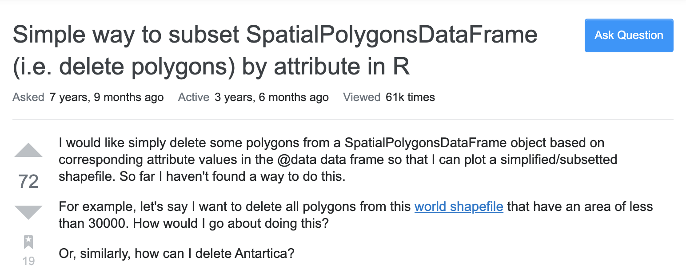

```{r child = "setup.Rmd"}
```

```{r, include=FALSE, eval=TRUE}
library("sf")
library("tidyverse")
library("rnaturalearthdata")
library("mapview")
library("patchwork")
library("leaflet")
library("leaflet.extras")
library("readxl")
library("janitor")
library("stars")

journeys_to_sf <- function(journeys_data,
                           start_long = start.long,
                           start_lat = start.lat,
                           end_long = end.long,
                           end_lat = end.lat) {
  quo_start_long <- enquo(start_long)
  quo_start_lat <- enquo(start_lat)
  quo_end_long <- enquo(end_long)
  quo_end_lat <- enquo(end_lat)

  journeys_data %>%
    select(
      !! quo_start_long,
      !! quo_start_lat,
      !! quo_end_long,
      !! quo_end_lat
    ) %>%
    transpose() %>%
    map(~ matrix(flatten_dbl(.), nrow = 2, byrow = TRUE)) %>%
    map(st_linestring) %>%
    st_sfc(crs = 4326) %>%
    st_sf(geometry = .) %>%
    bind_cols(journeys_data) %>%
    select(everything(), geometry)
}

air_routes_seat_kms <- read_excel("data/air-routes.xlsx",
                                    sheet = "seat-kilometers") %>%
  clean_names()

air_routes_seat_kms <- air_routes_seat_kms %>%
  mutate(across(contains("long"), ~as.numeric(str_trim(.x))))

```

class: center, middle, dk-section-title
background-image:url("images/sf-logo.gif")
background-size: 400px

# {sf} for simple features

???

The {sf} package is going to be the backbone of almost all the geospatial data manipulation and data visualisation that we're going to cover in this course, so it's important that we understand what it is and how it's used.

Let's start off by explaining what simple features are. 

---

## Most maps contain simple features

.pull-left[
This map shows the **5 busiest passenger routes** in 2015<br>(by total seat kilometres).

It contains three types of feature:

- LINESTRING for the flight routes

- POINT for the airport location

- POLYGON for the country borders
]

.pull-right[

```{r, eval=TRUE, echo=FALSE}
sf_lines_air_routes_seat_kms <- air_routes_seat_kms %>%
  filter(rank <= 5) %>%
  journeys_to_sf(airport_1_long,
                 airport_1_lat,
                 airport_2_long,
                 airport_2_lat) %>%
  st_segmentize(units::set_units(400, km)) %>%
  st_wrap_dateline(options = c("WRAPDATELINE=YES", "DATELINEOFFSET=180"))


part_1 <- air_routes_seat_kms %>%
  filter(rank <= 5) %>%
  select(starts_with("airport_1")) %>%
  rename_with(~str_remove(.x, "airport_1_"))

part_2 <- air_routes_seat_kms %>%
  filter(rank <= 5) %>%
  select(starts_with("airport_2")) %>%
  rename_with(~str_remove(.x, "airport_2_"))

sf_points_air_routes_seat_kms <- part_1 %>%
  bind_rows(part_2) %>%
  unique() %>%
  st_as_sf(coords = c("long", "lat"), crs = 4326)

library("htmltools")
tag.map.title <- tags$style(HTML("
  .leaflet-control.map-title { 
    transform: translate(-50%,20%);
    position: fixed !important;
    left: 50%;
    text-align: center;
    padding-left: 10px; 
    padding-right: 10px; 
    background: rgba(255,255,255,0.75);
    font-weight: bold;
    font-size: 28px;
  }
"))

title <- tags$div(
  tag.map.title, HTML("Top 5 busiest passenger routes in 2015<br>(by total seat kilometres)")
) 

countries_sf <- countries110 %>%
  st_as_sf()

leaflet() %>%
  # addProviderTiles(providers$Esri.WorldStreetMap) %>%
  addPolygons(data = countries_sf %>%
                filter(!name == "Antarctica"),
              fillOpacity = 1,
              fillColor = "tan",
              weight = 1,
              color = "black") %>%
  addPolylines(data = sf_lines_air_routes_seat_kms,
               weight = 2,
               color = "black") %>%
  addCircleMarkers(data = sf_points_air_routes_seat_kms,
                   fillColor = "black",
                   stroke = FALSE,
                   fillOpacity = 1,
                   radius = 5,
                   popup = ~airport) %>%
  # addControl(title, position = "topleft", className="map-title") %>%
  setMapWidgetStyle(list(background= "lightblue"))
```
]

???

Most maps that you see (and that we'll create) contain simple features. Here's a map showing the 5 busiest air passengers routes in 2015.

To construct this map we require three different types of features:

- the flight routes are LINESTRINGs

- the airport locations are POINTs

- the country borders themselves are POLYGONs

By combining these different features (and others) we can create a wide range of different types of map.

---

## {sf} implements simple features for R

- Simple features is a formal standard for organising and processing GIS data.

- The `{sf}` package fully implements the simple features standards in R 

- The `{sf}` package ultimately provides us with a `data.frame()` like object that we can manipulate with the tidyverse. 

```{r, eval=TRUE, echo=FALSE, df_print="default"}

countries_tib <- countries_sf %>%
  st_drop_geometry() %>%
  as_tibble()

st_geometry(countries_tib) <- countries_sf$geometry

countries_tib %>%
  select(name, continent)
```

???

This concept of "simple features" is a formal standard that's widely implemented in the GIS community. 

and the {sf} package fully implements the simple features standard in R and this ultimately means we get an easy to use data structure that behaves like a data.frame that we can manipulate with the tidyverse.

I've included a snapshot of an sf object in this slide but let's delve into that a little bit more in RStudio in a minute.

---

## What can't {sf} do

.pull-left[

The simple features standard does not include cover raster datasets.

This might include:

- air pollution data
- meteorological data
- satellite data

The `{stars}` package is responsible for working with raster data.

]

.pull-right[
```{r, eval=TRUE, echo=FALSE}
satellite_image <- system.file("tif/L7_ETMs.tif", package = "stars")
satellite_image %>%
  read_stars() %>%
  mapview()
```
]

???

It's also important to define what the {sf} package is not for. The simple features model of geospatial datasets explicitly does not cover raster datasets.

Common examples include meteorological datasets and air pollution data.

If you're dealing with raster datasets you need to use the {stars} package which we'll cover in the next section of the course.

Okay! Now let's take a proper look at the {sf} package.

---

## (RStudio Coding Slide)

???

[Switch to RStudio with the following packages loaded]

```{r}
library("albersusa")
library("mapview")
library("tidyverse")
```

Okay, here's an R script I've pre-prepared. And we've got 3 packages we'll be using

The {alberusa} package contains an sf object we're going to experiment with, you've already seen that this contains manipulated shapefiles for the United States.

{mapview} is our mapping visualisation package and we're loading the tidyverse because it contains the pipe and we're going to see how we can manipulate sf objects.

So, there's a function `counties_sf()` that returns us shapefiles for the counties of USA, and when we print them to the console we're told that we've got a simple feature collection - which means an sf object!

It's a little confusing using a function to return a dataset each time, so let's store this as the variable `usa_counties`

usa_counties <- counties_sf()

Okay! So how do we figure out if this thing is definitely an sf object? That's what the class() function is for:

class(usa_counties)

So we can see that the "sf" class is a data.frame with additional geospatial data thrown in. This data is all contained within the geometry column of the object:

usa_counties$geometry

Here we can see we've got a set of multipolygons for each county, but I also want to highlight that the column tells us about the projection of the dataset - and it's using the WGS 84 CRS that I mentioned in the previous video, most times we'll see this as the magic number 4326  but you must also be able to recognise it by this code too.

Okay! So let's take another look at the dataset:

usa_counties

I'm interested in this `lsad` column which contains "County" for the first 10 rows... I kind of expect that every polygon in this dataset should be a county, so let's try and confirm that with the count() function. 

In case you've not seen it before, let me quickly demonstrate it for the `starwars` dataset from dplyr:

starwars

It contains information about 87 different characters from the Star Wars universe, and if I wanted to count how many different species the data contained I'd use count:

starwars %>%
  count(species)

So, let's throw our {sf} object into count() and see what happens:

usa_counties %>%
  count(lsad)
  
I get back a new {sf} object that now contains 8 features instead of the 3000+ from before, and checking the lsad column I can see that my assumption everything was a county was kind of faulty, only most of them were. Now, an interesting question to ask is - what has the {sf} package done to the polygons if I only 8? Well, {mapview} is our friend so let's check it out:

usa_counties %>%
  count(lsad) %>%
  mapview()
  
So the {sf} object has combined together all of each type of lsad polygon and removed their internal boundaries. I can see that most of the contiguous USA is full of counties, but there's a small region which is a "Parish". There's probably some interesting history behind this, but it's not interesting for us right now.

It's worthwhile mentioning that the technical thing that's happened here is that {sf} and used the st_union() function to combine these polygons.

It takes a decent amount of computing power for {sf} to do this union stuff, how about if we genuinely only wanted to use the count() function on the lsad column? To do that we ask the {sf} package to remove the "sf" class with the st_drop_geometry() function.

BUT! We haven't loaded the {sf} package! I recommend that everytime you're working with geospatial dataset that you load the package by default, in the same way that we often load the tidyverse package by instinct.

Okay, now the package is loaded we can use our function:

usa_counties %>%
  st_drop_geometry()
  
And now it's just a friendy, plain data.frame that we can pass into count()

usa_counties %>%
  st_drop_geometry() %>%
  count(lsad)
  
There are two more things I want to demonstrate with our {sf} object - selecting columns and filtering rows.

The select() verb from dplyr gives us a very flexible way to extract columns, which I can also do with our sf object:

usa_counties %>%
  select(name)
  
Notice that the {sf} object keeps hold of its geometry column, it always hangs around unless we explicitly try to remove it. Now, I already know I'm interested in all the columns from name through to state so we can use this nifty shorthand

usa_counties %>%
  select(name:state)

We can use any of {dplyr} verbs with {sf} objects, including filter:

usa_counties %>%
  select(name:state) %>%
  filter(lsad == "city")


---

## {sf} replaces {sp}

.pull-left[
`{sf}` is still a fairly new package, first appearing in 2016.

It is designed to completely replace the older `{sp}` package.

Thankfully, it's very easy to convert `{sp}` objecs to `{sf}`.
]

.pull-right[

`{sp}` is responsible for the Spatial*DataFrame data sructure, eg:

- SpatialPolygonsDataFrame
- SpatialPointsDataFrame

]

???

There's one last thing I need to talk about with repect to the {sf} package and that's that it is still a fairly new package in the R ecosytem... development of it first started in 2016.

{sf} is designed to completely replace the older {sp} package.

Thankfully, it's very easy to convert `{sp}` objects to `{sf}` - and I'll show you how in a minute.

... but how do we know if we're dealing with sp objects? They're all Spatial - Something - DataFra,es

---

## Working with {sp} blogposts/tutorials 

.pull-left[

You have a two choices:

- Use the existing `{sp}` code and convert the final output to an `{sf}` object.

]

.pull-right[

]

???

When you're Googling for how to do geospatial thing with R you're many likely going to come across blogposts, tutorials or StackOverflow questions that refer to the {sp} package and not sf.

It's important to understand that the {sp} package still exists and won't be pulled from beneath our feet, so it's okay to copy the {sp} code from the web and when the final data structure is generated convert it into an {sf} object and then carry on from there. 

This is the simplest solution, and probably how you'll approach problem solving as you first become confident with using R to create maps.

---

## Working with {sp} blogposts/tutorials 

.pull-left[

You have a two choices:

- Use the existing `{sp}` code and convert the final output to an `{sf}` object.

- Re-write the code to use `{sf}` throughout. **If you figure it out add a solution or write a blogpost!**

]

.pull-right[

]

???

The second option you have is to fully re-write the code in {sf}. Absolutely everything that can be done with {sp} objects can be done within the {sf} package, but it will require effort on your part.

However! If you do put in this effort, please share your work with the R community! Add a solution to the Stackoverflow question or write a blogpost and tweet about it using the #rstats hashtag.

This can be an extremely rewarding part of using R and being part of the R community - we're generally a very positive bunch of people.

It's also worthwhile thinking specifically about the example in the slide: how to subset a SpatialPolygonsDatFrame? Using {sp} this is a bit frustrating - but you've just seen how we'd solve this with {sf} - we would use the filter() function from the tidyverse!

... so, now I need to show you how to convert an {sp} object to sf!

---

## (RStudio Coding Slide)

???

We've got quite a lot of code in this script file, so to keep things tidy I'll create a new script.

This time we're going to work with the world shapefiles from the rnaturalearthdata package, so let's load the package

library("rnaturalearthdata")

we'll also load the mapview package

library("mapview")

Okay, so our package has loaded up `countries110`

If we print it to the console we're told its class very matter of factly - so I won't bother to use the class() function! ... now, unlike the {sf} objects we saw before, it's not so easy to understand exactly what the data is.

But we can wrap it in mapview() and see that we do indeed have country outlines for the whole world.

Let's now convert it to an sf object, for which I'll load the sf and tidyverse packages

library("sf")
library("tidyverse")

Now, no matter what type of SpatialDataFrame we have we always use the st_as_sf() function

countries110 %>%
  st_as_sf()

Let's finish this video off by visualising this dataset except for Antartica - it often gets in the way of dataviz:

countries110 %>%
  st_as_sf() %>%
  filter(!name == "Antarctica") %>%
  mapview()


---

class: inverse, my-turn

### My turn

I'll do a thing

```{r echo=TRUE, eval = TRUE}
ggplot()
```

---

class: inverse

### Your turn

You do a thing