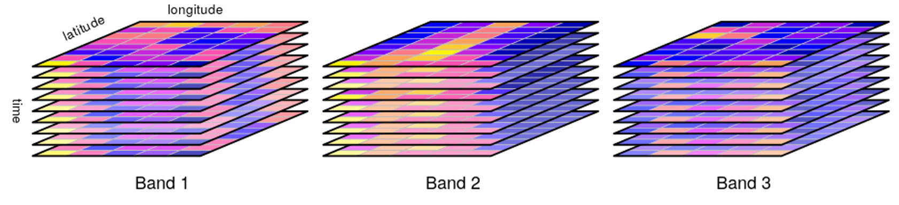

```{r child = "setup.Rmd"}
```

```{r, include=FALSE, eval=TRUE}
library("sf")
library("stars")
library("raster")
library("rnaturalearthdata")
library("mapview")
library("patchwork")
library("leaflet")
library("leaflet.extras")
library("readxl")
library("janitor")
library("emo")
library("tigris")
library("tidycensus")
library("rmapshaper")
library("patchwork")
library("tidyverse")
```

class: center, middle, dk-section-title
background-image:url("https://images.pexels.com/photos/347143/pexels-photo-347143.jpeg?auto=compress&cs=tinysrgb&dpr=2&h=750&w=1260")

# {stars} for raster data

???

So far we've exclusively been looking at geospatial datasets that exist within the context of simple features - and therefore manipulated with the {sf} package. We're going to finish this introduction to getting map data into R by looking at raster datasets.

---

### Raster or simple features?

.pull-left[

Simple features are smooth and clean<sup>1</sup>.

```{r, eval=TRUE, echo=FALSE, out.height="250px"}
journeys_to_sf <- function(journeys_data,
                           start_long = start.long,
                           start_lat = start.lat,
                           end_long = end.long,
                           end_lat = end.lat) {
  quo_start_long <- enquo(start_long)
  quo_start_lat <- enquo(start_lat)
  quo_end_long <- enquo(end_long)
  quo_end_lat <- enquo(end_lat)

  journeys_data %>%
    select(
      !! quo_start_long,
      !! quo_start_lat,
      !! quo_end_long,
      !! quo_end_lat
    ) %>%
    transpose() %>%
    map(~ matrix(flatten_dbl(.), nrow = 2, byrow = TRUE)) %>%
    map(st_linestring) %>%
    st_sfc(crs = 4326) %>%
    st_sf(geometry = .) %>%
    bind_cols(journeys_data) %>%
    select(everything(), geometry)
}

air_routes_seat_kms <- read_excel("data/air-routes.xlsx",
                                    sheet = "seat-kilometers") %>%
  clean_names()

air_routes_seat_kms <- air_routes_seat_kms %>%
  mutate(across(contains("long"), ~as.numeric(str_trim(.x))))

sf_lines_air_routes_seat_kms <- air_routes_seat_kms %>%
  filter(rank <= 5) %>%
  journeys_to_sf(airport_1_long,
                 airport_1_lat,
                 airport_2_long,
                 airport_2_lat) %>%
  st_segmentize(units::set_units(400, km)) %>%
  st_wrap_dateline(options = c("WRAPDATELINE=YES", "DATELINEOFFSET=180"))


part_1 <- air_routes_seat_kms %>%
  filter(rank <= 5) %>%
  select(starts_with("airport_1")) %>%
  rename_with(~str_remove(.x, "airport_1_"))

part_2 <- air_routes_seat_kms %>%
  filter(rank <= 5) %>%
  select(starts_with("airport_2")) %>%
  rename_with(~str_remove(.x, "airport_2_"))

sf_points_air_routes_seat_kms <- part_1 %>%
  bind_rows(part_2) %>%
  unique() %>%
  st_as_sf(coords = c("long", "lat"), crs = 4326)

library("htmltools")
tag.map.title <- tags$style(HTML("
  .leaflet-control.map-title { 
    transform: translate(-50%,20%);
    position: fixed !important;
    left: 50%;
    text-align: center;
    padding-left: 10px; 
    padding-right: 10px; 
    background: rgba(255,255,255,0.75);
    font-weight: bold;
    font-size: 28px;
  }
"))

title <- tags$div(
  tag.map.title, HTML("Top 5 busiest passenger routes in 2015<br>(by total seat kilometres)")
) 

countries_sf <- countries110 %>%
  st_as_sf()

leaflet() %>%
  # addProviderTiles(providers$Esri.WorldStreetMap) %>%
  addPolygons(data = countries_sf %>%
                filter(!name == "Antarctica"),
              fillOpacity = 1,
              fillColor = "tan",
              weight = 1,
              color = "black") %>%
  addPolylines(data = sf_lines_air_routes_seat_kms,
               weight = 2,
               color = "black") %>%
  addCircleMarkers(data = sf_points_air_routes_seat_kms,
                   fillColor = "black",
                   stroke = FALSE,
                   fillOpacity = 1,
                   radius = 5,
                   popup = ~airport) %>%
  # addControl(title, position = "topleft", className="map-title") %>%
  setMapWidgetStyle(list(background= "lightblue"))
```


]

.pull-right[

Raster data is divided across a grid.<sup>2</sup>

```{r, eval=TRUE, echo=FALSE, out.height="250px"}
# rasters_world_clim <- getData('worldclim', var='bio', res=10)
# stars_world_clim <- rasters_world_clim %>% 
#   st_as_stars()
# 
# write_stars(stars_world_clim,
#                    "slides/getting-map-data-into-r/data/stars_world_clim.tiff")
stars_world_clim <- read_stars("data/stars_world_clim.tiff")

stars_world_clim_bio1 <- stars_world_clim %>% 
  filter(band == 1)

uk_sf <- countries_sf %>% 
  filter(name == "United Kingdom")

stars_world_clim_bio1[uk_sf] %>% 
  mapview()
```

]

.footnote[
[1] - Limited by the scale factor of the data.

[2] - Not all grids are regular or rectangular.
]

???

An obvious first question is - am I working with simple features or raster data?

If you're lucky enough to be accessing data that's already been visualised the visual difference between the two is striking:

simple features are smooth and clean - although if you're working with data with a small scale factor your region borders may be fairly jagged.

Raster data - on the other hand - is divided across a grid and a single value is assigned to each grid section.

If I zoom in on this mapview visualistion you can see this particular raster dataset is stored in a regular rectangular grid, but it's important to note that there are several different grids available.

---

## Example raster datasets

Most raster GIS datasets contain physical data which can come from many different *sources*:

- Road size air quality measurments

- Satellite imagery

- Weather stations

- Climate and weather **simulations**

???

When we worked with the {sf} package we were largely working with sociopolitical datasets, whereas in general most raster GIS datasets contain physical data which can come from a wide variety of different sources, including:

- fixed road side air quality measurement stations 

- Satellite imagery

- Land and sea-based weather stations

... and - importantly - simulations for both weather and climate forecasting.

---

## What files am I looking for?

.pull-left[
**{sf} data formats**

Shapefiles are available in either ESRI or GeoJSON format.

You need to look for these extensions:

- .shp, .shx and .dbf (ESRI shapefiles)
- .geojson

]

.pull-right[
**{stars} at formats**

There are **many** different varieties of raster geospatial formats - [ArcGIS lists 70+](https://pro.arcgis.com/en/pro-app/help/data/imagery/supported-raster-dataset-file-formats.htm). Most of these are extremely specialised. 

In general, you will find one of two formats:

- GeoTiff (file extension: .tiff)
- NetCDF (file extension: .nc)


]

???

Now we have an idea when raster datasets might have been collected, the next question to ask is  - what files should we look for when searching for raster datasets?

For simple features we only needed a special data format when searching for shapefiles, and we only had two choices:

ESRI shapefiles which contain at least an .shp, .shx and .dbf files

or files with a GeoJSON extension.

The situation is more complex for raster GIS datasets - there are easily over 70 formats in active use today. Fortunately, most of these are extremely specialised and it's unlikely you'll come across them accidentally. In the learn more section for this video I've provided an explanation for why there's such a large family of formats available and some further background information.

But! In general, you will mostly come across either GeoTIFF datasets (which have the file extension .tiff) or NetCDF files which have the extension .nc... and I'll show you how we can work with both in R.

---

## Raster data cubes

Raster datasets almost always comes in *date cubes* because...

.pull-left[

- ...data is collected across a grid **over time**

> A satellite capturing images of the same site over a year.

- ... data is collected across a grid **for multiple variables**.

> A climate forecast including both maximum rainfall and temperature per grid unit

]


.pull-right[


]

???

It's important to understand that raster GIS datasets almost always come in data cubes instead of data tables.

In a data table we have only x and y coordinates - i.e. the location of an earthquakes's epicentre... but with raster datasets we have a third variable.

This might be because data is collected across a grid over a period of time - for instance a satellite capturing images of the same location over a year

or it might be because data is collected across a grid for multiple variables - for instance a climate forecast might include both maximum rainfall and temperature per grid unit.

---

## {stars} replaces {raster}

.pull-left[
`{sf}` is still a fairly new package, first appearing in 2016.

It is designed to completely replace the older `{sp}` package.

Thankfully, it's very easy to convert `{sp}` objecs to `{sf}`.
]

.pull-right[

`{sp}` is responsible for the Spatial*DataFrame data sructure, eg:

- SpatialPolygonsDataFrame
- SpatialPointsDataFrame

]

---

## Aside: Raster hypercubes

When a raster dataset includes multiple variables measured over time this is called a four-dimensional cube - or 
**hypercube**.

--

.pull-left[

In raster GIS these **variables** are always refered to as **dimensions**. This dataset therefore has 4 dimensions:

- x:
- y:
- band: 
- time:


]

.pull-right[

]

???

Of course, if a satellite is equipped to measure multiple variables at a single point in time we'll also want to study how these vary over time - this ends up creating a four dimensional data cube... which is more often called a hypercube.

In raster GIS we always call these variables dimensions - and that's going to become 


---

## {stars} data structure

They have multiple dimensions, almost always including:

- x: longitude
- y: latitude

A third dimension is usually included:

- bands: 

  - used for satellite data of different wavelengths or variables (as in climate data where max/min temperatures are stored)
  - the names for these are accessible with st_get_dimension_values() 
  - these seemingly can't be manipulated together very easily...
    - one solution is to create two objects, st_join() and then create new columns with base R subsetting.
    
```{r}
# We've got the "bio" var as it includes all 19 climate variables, which I believe are documented here: https://developers.google.com/earth-engine/datasets/catalog/WORLDCLIM_V1_BIO#bands
# Borrowed librarelly from https://bedatablog.netlify.app/post/download-and-illustrate-current-and-projected-climate-in-r/
rasters_world_clim <- getData('worldclim', var='bio', res=10)
stars_world_clim <- rasters_world_clim %>% 
  st_as_stars()

bio13 <- stars_world_clim %>% 
  filter(band == "bio13") 

bio14 <- stars_world_clim %>% 
  filter(band == "bio14") 

combined_wet_months <- st_join(bio13, bio14)

combined_wet_months$diff <- combined_wet_months$bio1 - combined_wet_months$bio14
```

    - a second solution is to st_apply() to operate on the x and y columns with st_apply() but this does reduce the dataset!!
    
```{r}
wet_month_diff = function(x) diff(c(x[14], x[13]))
stars_wet_diff <- st_apply(stars_world_clim, c("x", "y"), wet_month_diff)
```

  - There's a really nice example of calculating NDVI here http://132.72.155.230:3838/r/raster-processing.html but it uses Israel
  - There's a really nice climate example here https://bedatablog.netlify.app/post/download-and-illustrate-current-and-projected-climate-in-r/
  
- time

  - used for weather data
  - use the hurricane example from the docs page here https://r-spatial.github.io/stars/


---

## Important notes!

- Load {tidyverse} last!!
- Need to install {cubelyr} to work


---

## Trying to find real examples


```{r}
download.file(url = "https://eoimages.gsfc.nasa.gov/images/imagerecords/144000/144898/BlackMarble_2016_3km_geo.tif",
              destfile = here::here("data/BlackMarble_2016_3km_geo.tif"))
```


---

## Downsampling!!!

This is a  good example from https://keen-swartz-3146c4.netlify.app/ggplot2.html#geom_stars

```{r}
#> Loading required package: viridisLite
system.file("tif/L7_ETMs.tif", package = "stars") %>% read_stars() -> x
g = ggplot() + 
    coord_equal() + 
    scale_fill_viridis() + 
    theme_void() +
    scale_x_discrete(expand=c(0,0)) +
    scale_y_discrete(expand=c(0,0))
g + geom_stars(data = x) + 
    facet_wrap(~band)
```

```{r}
g + geom_stars(data = x, downsample = c(10,10,1)) + 
    facet_wrap(~band)
```


