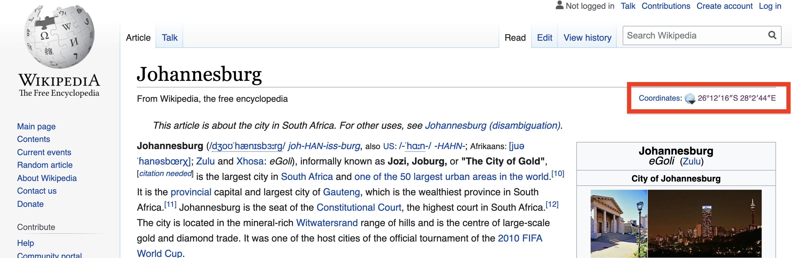
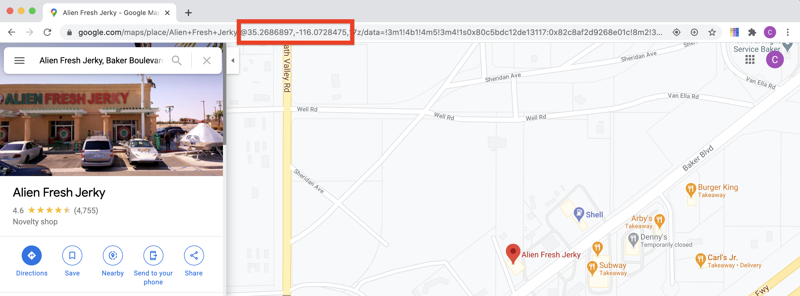

```{r child = "setup.Rmd"}
```

```{r, include=FALSE, eval=TRUE}
library("sf")
library("tidyverse")
library("rnaturalearthdata")
library("mapview")
library("patchwork")
library("leaflet")
library("leaflet.extras")
library("readxl")
library("janitor")
library("stars")
```

class: center, middle, dk-section-title
background-image:url("images/tables-background-image.jpg")
background-size: 100%

# Turning data.frame into {sf} Objects

???

In this video we're going to look at how we can take a table of coordinates and convert them from a data.frame into an "sf" object that we can visualise with mapview - and later in the course {ggplot2} and {leaflet}
---

# Worked Example

Download the course materials from the [link in the course page](http://google.com) XXX ADD LINK.

Please open the "airport-locations" project in the worked-exercises folder.

```{yaml}
mapping-with-r
└── worked-exercises
    └── airport-locations
        ├── airport-locations.Rproj
        └── data
```

???

We're going to work with a dataset I've prepared for us in this video. As this is the first time we're working in this way I'll take you through all of the steps.

If you take a look at the course page beneath this video you'll find a link to download the course materials. Please click on this and it will download you a .zip... I've added the same download link to my slide and so I'll click on that now.

It'll just take a moment to finish the download and now it's finished I'm going to extract it into my downloads. I'd recommend you put it somewhere more permanent either now or later.

Great! Okay, so where are we going in this myriad of folders? We're looking for the worked-examples folder. In future videos when I refer to this video you'll know where I mean.

And finally, let's open up the airport-locations folder and double click on the .Rproj file! Now we're all set.

Next time we do this I'll give you the name of the project to find.

---

## City coordinates

If you're looking for city coordinates you're in luck:

```{r, eval=TRUE, echo=TRUE}
maps::world.cities
```

???

Okay! So, before we take a look at the dataset I've prepared for you let's think generally - from where can we obtain coordinates for the places that we're interested in?

You're very much in luck if you need coordinates for cities, as the {maps} package contains a data.frame which has the coordinates for over 40,000 cities and towns from all over the world.

---

## Wikipedia pages

Most Wikipedia pages for places contain their coordinates in the summary information.

<a href='https://en.wikipedia.org/wiki/Johannesburg'></a>

???

That likely doesn't cover all of the places you're interested in. So Wikipedia is the next source I want to highlight.

Most good Wikipedia pages for places contain verified coordinates for the place.

Let's setup an R script ready to store these coordinates.

---

## (RSTUDIO CODE SLIDE)

???

We're going to create a new script file and call it "wiki-and-google-coords" ... which gives you a good idea of the third place I'm going to recommend for obtaining coordinates.

Let's load the packages we'll need:

library("tidyverse") for data manipulation

library("sf") for creating the "sf" object
 
and finally library("mapview") for visualising our data

Now we're going to create a tibble for containing our places. You might not be that familiar with tibbles, they're tidyverse's augmented data.frame and this video will explain everything you need to know about them!

Let's call our dataset 

interesting_places <- 

and we're going to use the function tribble() that allows us to create tibbles in rows:

interesting_places <- tribble(

)

now we'll add our column names

interesting_places <- tribble(
  ~place, ~longitude, ~latitude
)

The tilde are necessary to make this function work.

Okay, now let's start adding our data for Johannesburg

interesting_places <- tribble(
  ~place, ~longitude, ~latitude,
  "Johannesburg", 
)

Now let's go over to the slide so I can click through to the wikipedia page!

The coordinates are shown in Northings & Eastings and a format called Degrees, Minutes and Seconds... this is a really arcane format and not very useful to us. Fortunately, we can click on this link and it takes us to the GeoHack page 

... and in the top right we can see the coordinates are also given in decimal format - which is exactly what we want!

Now, they are in reverse order. The first part of the DMS coordinate has "S" in it which tells us that's a latitude and the second part is the longitude. So we need to copy these over in reverse order!

interesting_places <- tribble(
  ~place, ~longitude, ~latitude,
  "Johannesburg", 28.045556, -26.204444
)

Okay! That's as far as I want to go for right now. I'm going to go back to the lecture slides

---

## Google Maps coordinates

Coordinates can be extracted from Google Maps results via the URL.

They're formatted as: @latitude,longitude,zoom

<a href='https://www.google.com/maps/place/Alien+Fresh+Jerky/@35.2686897,-116.0728475,17z/data=!3m1!4b1!4m5!3m4!1s0x80c5bdc12de13117:0x82c8af2d9268e01c!8m2!3d35.2686897!4d-116.0706588'></a>

???

Wikipedia doesn't have a page for everything, and even if a place does have a page it doesn't necessarily contain coordinates. So let's see how we can extract coordinates from Google Maps pages.

Once you've found the place you're interested in - or dropped the map pin - the coordinates can be found in the URL. You want to look for the @ first and after that you'll find the latitude then longitude and the third number is the map zoom level.

Again - these are in reverse order so we need to be careful copying them across

---

## (RSTUDIO Coding Slide)

???

The image in my slide links to this google maps results page, if you search for Alien Jerky you'll find the correct place. Almost all of the locations I've included in this course are places I've visited or have some connection to. This Alien Jerky place has a huge alien outside of it and I've visited it a few times

I'll copy the longitude and then the latitude over into my R script.

interesting_places <- tribble(
  ~place, ~longitude, ~latitude,
  "Johannesburg", 28.045556, -26.204444,
  "Alien Jerky", -116.0728475, 35.2686897
)

Okay! We're going to restrict ourselves to just these two places for demonstrations sake.

---

## Converting address to coordinates

If you've got street addresses you can programmatically convert these to coordinates.

That's covered in the next video.

???

I've just shown you how to manually access coordinates from Google Maps, but it's likely that your own datasets contain street addresses. And the good news is you don't need to manually search each and copy data from URLs into your R code. This is something called geocoding and I'll show you how to do it in the very next video in this course.

---

## st_as_sf() makes {sf} objects

The `st_as_sf()` function is used to convert all "foreign" objects into `{sf}` objects, including:

- `{sp}` objects
- data.frames (and tibbles)
- lower level geometry objects

--

For data.frame we need to tell the function which columns contain the coordinates:

```{r}
interesting_places %>%
  st_as_sf(coords = c("long", "lat"))
```


???

Okay! So {sf} contains one function that does all of the work of converting what we call "forgeign" objects into "sf" objects.

This includes data.frames and tibbles.

When we're converting data.frame to sf objects we need to tell it explicitly which columns contain our longitude and latitude coordinates - IN THAT ORDER.

---

## (RSTUDIO CODING SLIDE)

???

Let's go over to RStudio and convert our tibble to an sf object:

interesting_places %>%
  st_as_sf(coords = c("longitude", "latitude"))
  
Note that we've just used two different ways to refer to column names. In tribble() we used tilde - or formulae - and in st_as_sf() we used strings. This is a common feature of R packages, there are multiple solutions for referring to column names. Reading the documentation page will usually show the correct approach in the list of examples.

Okay! And so we've got spat out to the console something that looks very promising - it's an sf object containing points!

But - notice that the CRS part of the object is currently NA. That'll make more sense when we use mapview:

interesting_places %>%
  st_as_sf(coords = c("longitude", "latitude")) %>%
  mapview()
  
Our map looks really weird!! All we can see are our two points.

That's because of the missing CRS. mapview doesn't know how to project these points onto the Earth.

In the introduction to this course I mentioned the magic number 4326 - the default CRS for geospatial datasets. Let's add that argument to the st_as_sf() function and we'll get the output we expect:

interesting_places %>%
  st_as_sf(coords = c("longitude", "latitude"), crs = 4326) %>%
  mapview::mapview()

Now our locations are shown in South Africa and California.

---
class: inverse

## Your turn

Visualise the locations of the airports in the `airports-with-most-seat-kilometers_2015.xlsx` file

- Import the file with `read_excel()`

- Use the `separate()` function from `{tidyr}` to split the coordinates column into:
  - longitude
  - latitude
  
- Convert these new columns into numeric data
  
- Use `st_as_sf()` to convert the tibble into an sf object

- Use `{mapview}` to show the airport locations

???

For your turn it's time to look at a realistic dataset which I've compiled in the data folder.

I'm going to take you through the start of this process, so let's head back over to RStudio:

To import Excel files we need to load the {readxl} package

library("readxl")

Now we'll create a variable called `busiest_airports` and read in the data file.

busiest_airports <- read_excel("data/airports-with-most-seat-kilometers_2015.xlsx")

Let's print this to the console and check what we have:

It's a tibble! I said earlier in this video there were a few things you need to know about these things, the first was the function tribble() for easily creating datasets in R and the second thing is that all of the {tidyverse} data reading functions create tibbles. And that's pretty much all you need to know. In the "Learn more" section I have provided a little bit more information for anyone who's interested.

Okay! So the final thing to say about this dataset is our coordinates are currently stored in one column - coordinates. This is a surprisingly common situation with coordinates, which is why I've asked you to learn to use the separate function in this video.


