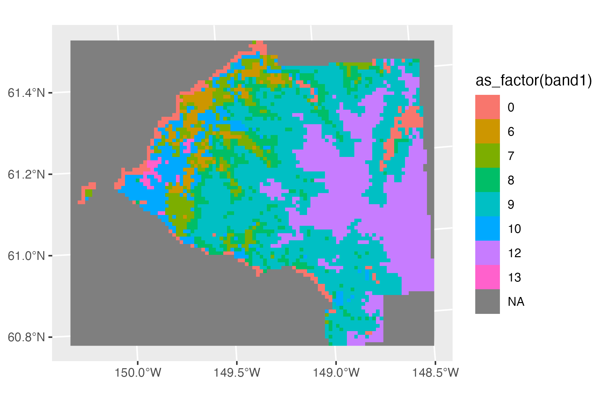

```{r child = "setup.Rmd"}
```

```{r, include=FALSE, eval=TRUE}
library("raster")
library("tidyverse")
library("sf")
library("lubridate")
library("patchwork")
library("fivethirtyeight")
library("rnaturalearthdata")
library("maps")
library("here")
library("ggspatial")
library("stars")
```


class: center, middle, dk-section-title
background-image:url("images/pexels-photo-5282585.jpeg")
background-size: cover

# So, ggplot2 can do maps?

---

### `{ggplot2}` fundamentals

`{ggplot2}` implements a *grammar of graphics* for building charts.

We can use it to consistently build **any**<sup>1</sup> chart.

```{r, eval=TRUE, echo=FALSE, fig.height=3, fig.width=10, message=FALSE, warning=FALSE, dpi=150, cache=TRUE}
gg_iris_scatter <- iris %>%
  ggplot(aes(x = Petal.Length,
             y = Sepal.Length)) +
  geom_point() +
  labs(x = "", y = "") +
  theme_bw()

gg_economics_line <- economics_long %>%
  ggplot() +
  geom_line(aes(date, value01, colour = variable), show.legend = FALSE) +
  labs(x = "", y = "") +
  theme_bw()


gg_marital_bar <- gss_cat %>%
  count(marital) %>%
  mutate(
    marital = fct_anon(marital, prefix = "type "),
    marital = fct_reorder(marital, n)) %>%
  ggplot() +
  geom_col(aes(x = marital, y = n)) +
  coord_flip() +
  labs(x = "", y = "") +
  theme_bw()

mtlong <- reshape2::melt(mtcars)


gg_quakes_histogram <- ggplot(quakes) +
  geom_histogram(aes(x = mag)) +
  labs(x = "", y = "") +
  theme_bw()

gg_bechden_violin <- bechdel %>%
  filter(domgross_2013 < 1e9) %>%
  # filter(domgross_2013 >= 1e6) %>%
  ggplot() +
  geom_violin(aes(x = clean_test,
                  y = domgross_2013),
              fill = "orange") +
  coord_flip() +
  labs(x = "", y = "") +
  theme_bw()

gg_diamonds_histogram <- ggplot(mtlong, aes(value)) + facet_wrap(~variable, scales = 'free_x') +
  geom_histogram(binwidth = function(x) 2 * IQR(x) / (length(x)^(1/3))) +
  labs(x = "", y = "") +
  theme_bw()
# ggsave("gg-saves/gg-iris-scatter.png",
#        gg_iris_scatter)
# ggsave("gg-saves/gg-economics-line.png",
#        gg_economics_line)

bump_data <- tribble(
  ~response, ~year, ~within_year_rank,
  "Yes", 2019, 1,
  "Maybe", 2019, 2,
  "No", 2019, 3,
  "Unsure", 2019, 4,
  "Unsure", 2016, 1,
  "No", 2016, 2,
  "Maybe", 2016, 3,
  "Yes", 2016, 4,
  "Yes", 2017, 3,
  "No", 2017, 2,
  "Unsure", 2017, 1,
  "Maybe", 2017, 4,
  "No", 2018, 1,
  "Yes", 2018, 2,
  "Maybe", 2018, 4,
  "Unsure", 2018, 3
)
gg_bump <- bump_data %>%
  ggplot(aes(x = year, y = within_year_rank, group = response)) +
    geom_line(aes(color = response), size = 2) +
    geom_point(aes(color = response), size = 4) +
    geom_point(color = "#FFFFFF", size = 1) +
    scale_y_reverse(breaks = 1:nrow(bump_data)) +
    scale_x_continuous(breaks = unique(bump_data$year), minor_breaks = unique(bump_data$year)) +
  coord_cartesian(ylim = c(1, length(unique(bump_data$response)))) +
  theme_bw() +
  theme(axis.ticks.y = element_blank(),
        axis.text.y = element_blank()) +
  labs(x = "", y = "") 


gg_iris_scatter + gg_economics_line + gg_marital_bar + plot_layout(ncol = 3) + 
  gg_quakes_histogram + gg_bechden_violin + gg_bump

```


.footnote[
[1] - Dual y-axis charts must be transformations of one another ([for good reasons](https://stackoverflow.com/a/3101876/1659890))
]

---

## {ggplot2} fundamentals

It's also possible to build any kind of map (or GIS) data visualisation with `{ggplot2}`.

<h1>!!!! ADD CHARTS BUILT LATER !!!!!</h1>

---

## `{ggplot2}` fundamentals

`{ggplot2}` is a fundamental component of the tidyverse. 

It's one of the packages loaded when we run


---

## `{ggplot2}` fundamentals

We supply `ggplot()` with a data set (`data.frame` or `tibble`) that contains all the information necessary to translate the data into a chart.

--

- We map columns in our dataset to aesthetics in our chart with `aes()`.

--

- We use `+` to add `geom_()`s to the chart that use `aes()` to draw geometric objects on top of our chart.

--

- We control the **order** of things in `ggplot2` via R's categorical variable - the factor.

> It's fairly cumbersome to manipulate factors with base R, the `{forcats}` package simplifies this process significantly.

---

## `{ggplot2}` fundamentals

We supply `ggplot()` with a data set (`data.frame` or `tibble`) that contains all the information necessary to translate the data into a chart.

- We map columns in our dataset to aesthetics in our chart with `aes()`.

- We use `+` to add `geom_()`s to the chart that use `aes()` to draw geometric objects on top of our chart.

- We control the **order** of things in `ggplot2` via R's categorical variable - the factor.

- We change the colors of **geoms** with `scale_color_*()` and `scale_fill_*()`

--

- We control the **look and feel** of the chart by manipulating the `theme()`

- We control the **appearance of legends** with `guides()`

---

### What's different for maps with `{ggplot2}`?

.pull-left[

If your GIS datasets are `{sf}` objects **don't** pipe them into `ggplot()`:

```{r}
your_sf_data %>% 
  ggplot() + 
  ...
```

Instead use the `data` argument of `geom_sf()`:

```{r}
ggplot() +
  geom_sf(data = country_borders) +
  geom_sf(data = city_data)
```


]


.pull-right[
<br>
<br>
<br>
<br>
<br>


]

---

### What's different for maps with `{ggplot2}`?

Raster GIS datasets imported with `{raster}` cannot be directly visualised with `{ggplot2}`.

```{r, eval=TRUE, echo=FALSE}
alaska_landcover <- raster(here("data", "alaska_landcover.img"))
alaska_sf <- read_sf(here("data", "shapefiles_alaksa"))

anchorage <- alaska_sf %>% 
  filter(NAME_2 == "Anchorage")

cropped_anchorage <- crop(alaska_landcover, anchorage)

mask_anchorage <- rasterize(anchorage, cropped_anchorage)

anchorage_landuse <- mask(cropped_anchorage, mask_anchorage)

gg_anchorage <- ggplot() +
  layer_spatial(
    anchorage_landuse,
    aes(fill = as_factor(stat(band1)))
  ) 

ggsave("images/gg_anchorage.png",
       gg_anchorage,
       width = 6,
       height = 4)
```


.pull-left[

You must use `layer_spatial()` from the `{ggspatial}` package:

```{r, eval=FALSE}
library("ggspatial")
anchorage_landuse <-
  raster("data/anchorage_landuse.img")

ggplot() +
  layer_spatial(
    anchorage_landuse,
    aes(fill = as_factor(stat(band1)))
  ) 
```

]

.pull-right[

]

---

### What's different for maps with `{ggplot2}`?

The `{stars}` package has it's own built-in `geom_stars()` for working with `{ggplot2}` charts.

```{r, eval=TRUE}
satellite_image <- read_stars(system.file("tif/L7_ETMs.tif", package = "stars"))
```

.pull-left[
As with `{sf}` objects use the `data` argument of `geom_stars()`
```{r}
ggplot() + 
  geom_stars(data = satellite_image) +
  facet_wrap(~ band)
```
]

.pull-right[
```{r, echo=FALSE, eval=TRUE}
gg_geom_stars <- ggplot() + 
  geom_stars(data = satellite_image) +
  facet_wrap(~ band) +
  theme_void() +
  coord_sf()
ggsave("images/gg_geom_stars.png",
       gg_geom_stars,
       width = 6,
       height = 4)
```

]

---

## ggpspatial::annotation_map_tile()


