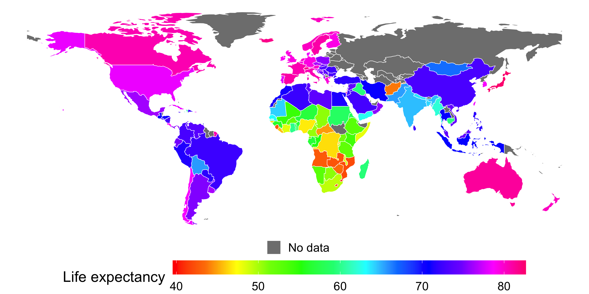
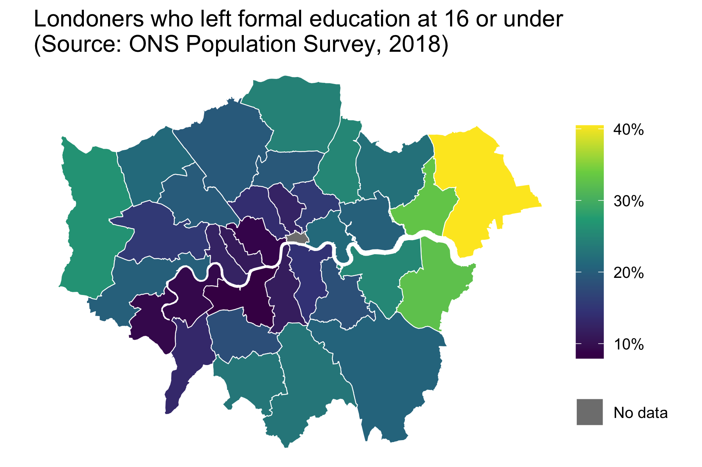
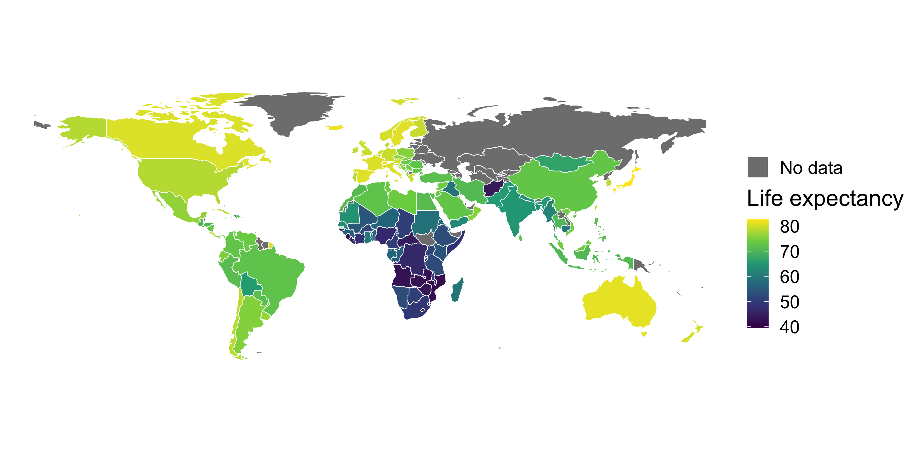

```{r child = "setup.Rmd"}
```

```{r, eval=TRUE, include=FALSE}
library("tidyverse")
library("sf")
library("here")
library("janitor")
library("gapminder")
library("rnaturalearthdata")
library("countrycode")
library("viridis")
library("scales")
library("colorspace")
library("dichromat")
```

class: center, middle, dk-section-title
background-image:url("images/pexels-photo-6985119.jpeg")
background-size: cover

# Choropleth with continuous variables

---

### Choose your palettes carefully

```{r, include=FALSE}

gapminder_2007 <- gapminder %>% 
  filter(year == 2007)

gapminder_2007 <- gapminder_2007 %>% 
  mutate(country_code = countrycode(country, "country.name", "iso3c"))

countries_sf <- countries110 %>% 
  st_as_sf() %>% 
  filter(name != "Antarctica") %>% 
  st_wrap_dateline()

gapminder_sf <- countries_sf %>% 
  left_join(gapminder_2007,
            by = c("iso_a3" = "country_code"))

gapminder_sf %>% 
  mutate(area = st_area(geometry)) %>% 
  select(name, area) %>% 
  arrange(area)

gg_gapminder_rainbow <- ggplot() +
  geom_sf(data = gapminder_sf,
          aes(fill = lifeExp,
              colour = "No data"),
          size = 0.25
          ) +
  scale_fill_gradientn(colours = rainbow(12),
                       name = "Life expectancy") +
  scale_colour_manual(values = "white") +
  theme_void(base_size = 18) +
  theme(legend.position = "bottom", legend.direction = "horizontal", legend.box = "vertical") +
  guides(fill = guide_colorbar(barwidth = 30),
         colour = guide_legend(title = "",
                               override.aes = list(
                                 fill = "gray50",
                                 colour = "white"))) 
  # coord_sf(crs = "+proj=robin +lon_0=0 +x_0=0 +y_0=0 +datum=WGS84 +units=m +no_defs")

ggsave(here("slides", "static-maps-with-ggplot2", "images", "gg_gapminder_rainbow.png"),
       gg_gapminder_rainbow,
       width = 10,
       height = 5)
```

<center></center>

---
<br>
> Which country has the highest life expectancy in each continent?

.pull-left[
```{r, eval=TRUE, echo=FALSE}
life_exp_range <- gapminder_sf %>% 
  pull(lifeExp) %>% 
  sort() %>% 
  .[c(1, length(.))]

south_america_exc_guiana <- gapminder_sf %>% 
  select(name, contains("continent"), lifeExp) %>% 
  filter(continent.x == "South America")

bbox_south_america <- south_america_exc_guiana %>% 
  st_bbox() %>% 
  as.list()

south_america_exc_guiana %>% 
  bind_rows(gapminder_sf %>% filter(name == "France")) %>% 
  ggplot() +
  geom_sf(aes(fill = lifeExp,
              colour = "No data"),
          size = 0.25
  ) +
  scale_fill_gradientn(colours = rainbow(12),
                       name = "Life expectancy",
                       limits = life_exp_range) +
  scale_colour_manual(values = "white") +
  theme_void(base_size = 18) +
  theme(legend.position = "bottom", legend.direction = "horizontal", legend.box = "vertical") +
  guides(fill = guide_none(),
         colour = guide_none())  +
  coord_sf(xlim = c(bbox_south_america$xmin, bbox_south_america$xmax),
           ylim = c(bbox_south_america$ymin, bbox_south_america$ymax))
```
]

.pull-right[
```{r, eval=TRUE,echo=FALSE}
gapminder_sf %>% 
  select(name, contains("continent"), lifeExp) %>% 
  filter(continent.x == "Africa") %>% 
  ggplot() +
  geom_sf(aes(fill = lifeExp,
              colour = "No data"),
          size = 0.25
  ) +
  scale_fill_gradientn(colours = rainbow(12),
                       name = "Life expectancy",
                       limits = life_exp_range) +
  scale_colour_manual(values = "white") +
  theme_void(base_size = 18) +
  theme(legend.position = "bottom", legend.direction = "horizontal", legend.box = "vertical") +
  guides(fill = guide_none(),
         colour = guide_none())
```

]

---

### viridis is the best perceptual colour palette

.pull-left[
The *viridis* colour palette has been designed specifically to aid perceptual understanding.
]

.pull-right[
```{r, eval=TRUE, echo=FALSE, dpi=150, fig.width=3}
n_col <- 128
img <- function(obj, nam) {
  image(1:length(obj), 1, as.matrix(1:length(obj)), col=obj, 
        main = nam, ylab = "", xaxt = "n", yaxt = "n",  bty = "n")
}
par(mfrow=c(8, 1), mar=rep(1, 4))
img(rev(rainbow(n_col)), "rainbow")
img(rev(viridis(n_col)), "viridis")
```
]

---

### Colour blindness is not rare!

It affects around 4.5% of the population.

.pull-left[
```{r, eval=TRUE, echo=FALSE, dpi=150, fig.width=3, fig.height=5}
par(mfrow=c(8, 1), mar=rep(1, 4))
img(rev(rainbow(n_col)), "rainbow")
img(dichromat(rev(rainbow(n_col)), "deutan"), "Green-Blind")
img(dichromat(rev(rainbow(n_col)), "protan"), "Red-Blind")
img(dichromat(rev(rainbow(n_col)), "tritan"), "Blue-Blind")
```
]

.pull-right[
```{r, eval=TRUE, echo=FALSE, dpi=150, fig.width=3, fig.height=5}
par(mfrow=c(8, 1), mar=rep(1, 4))
img(rev(viridis(n_col)), "viridis")
img(dichromat(rev(viridis(n_col)), "deutan"), "Deuteranopia")
img(dichromat(rev(viridis(n_col)), "protan"), "Protanopia")
img(dichromat(rev(viridis(n_col)), "tritan"), "Tritanopia")
```
]

---

class: my-turn

## My turn

Use the data in `worked-exercises/population-density-maps` to create a choropleth of when Londoners left education.

```{r, eval=FALSE, echo=FALSE}
age_finished_education <- read_csv(here("data", "age-when-completed-education.csv"))

london_sf <- read_sf(here("data", "london_boroughs"))

age_finished_education <- age_finished_education %>% 
  group_by(area) %>% 
  mutate(value = 100 * value / sum(value))

london_education_sf <- london_sf %>%
  left_join(age_finished_education,
            by = c("lad11nm" = "area")
  )

left_edu_at_16 <- london_education_sf %>% 
  filter(age_group == "16 or under")

gg_left_edu_at_16 <- ggplot() +
  geom_sf(data = left_edu_at_16,
          aes(fill = value,
              colour = "No data"),
          size = 0.25) +
  scale_fill_viridis_c(name = "",
                       labels = scales::percent_format(scale = 1)) +
  scale_colour_manual(values = "white") +
  guides(colour = guide_legend(title = "",
                               override.aes = list(
                                 fill = "gray50",
                                 colour = "white")),
         fill = guide_colorbar(barheight = 10)) +
  theme_void(base_size = 12)+
  labs(title = "Londoners who left formal education at 16 or under\n(Source: ONS Population Survey, 2018)")

ggsave(here("slides", "static-maps-with-ggplot2", "images", "gg_left_edu_at_16.png"),
       gg_left_edu_at_16,
       width = 6,
       height = 4)
```

.pull-left[
1. Use the viridis scale

1. Add a legend item for missing data

1. Beautify the map and legend
]

.pull-right[

]

---

class: inverse

# Your turn

Use `worked-examples/gapminder-choropleth` to create this choropleth of life expectancy from the {gapminder} package.

.pull-left[
1. Join `gapminder_2007` and `countries_sf`

1. Create a choropleth using the viridis colour palette

1. Add a "No data" legend item

1. **Advanced:** Use the {countrycode} package to improve the visualisation.
]

.pull-right[
```{r, eval=FALSE, echo=FALSE}
gg_gapminder_viridis <- ggplot() +
  geom_sf(data = gapminder_sf,
          aes(fill = lifeExp,
              colour = "No data"),
          size = 0.25) +
  scale_fill_viridis_c(name = "Life expectancy") +
  scale_colour_manual(values = "white") +
  theme_void(base_size = 18) +
  theme() +
  guides(colour = guide_legend(
    title = "",
    override.aes = list(fill = "gray50",
                        colour = "white")
  )) 
ggsave(here("slides", "static-maps-with-ggplot2", "images", "gg_gapminder_viridis.png"),
       gg_gapminder_viridis,
       width = 10,
       height = 5)
```


]


