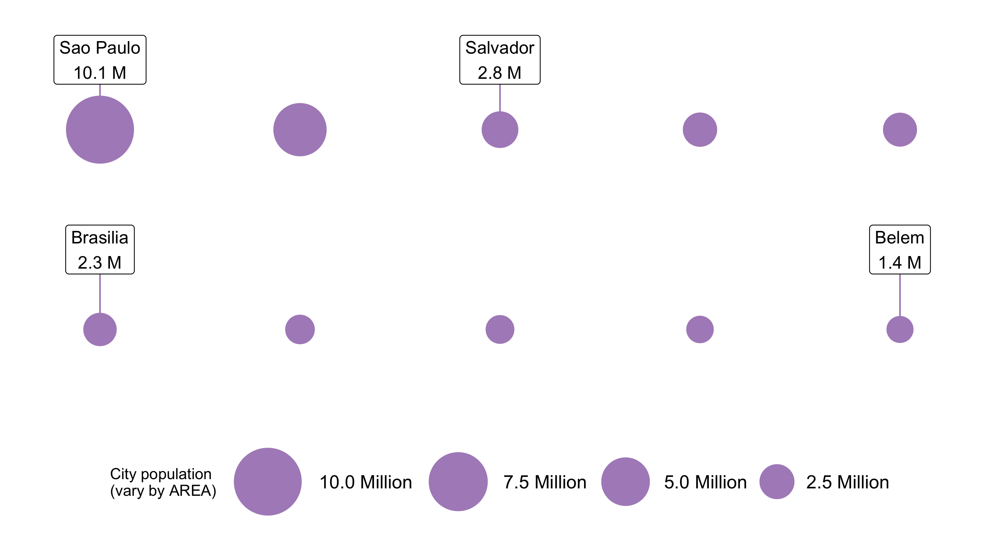

```{r child = "setup.Rmd"}
```

```{r, include=FALSE, eval=TRUE}
library("tidyverse")
library("sf")
library("rnaturalearthdata")
library("maps")
library("here")
library("ggspatial")
library("janitor")
library("readxl")
library("tidygeocoder")
library("ggspatial")
library("leaflet")
library("ggrepel")
library("scales")
options(htmltools.preserve.raw = FALSE)

# uk_addresses <- read_excel(here("slides", "static-maps-with-ggplot2", "data", "street-addresses.xlsx"),
#                            sheet = "UK Addresses") %>% 
#   clean_names()
# 
# uk_addresses <- uk_addresses %>% 
#   mutate(across(business_name:country, ~str_replace_na(., ""))) %>% 
#   mutate(full_street_address = paste(business_name, street, sep = ", "))
# 
# uk_addresses <- uk_addresses %>% 
#   geocode(street = full_street_address,
#           city = city,
#           postalcode = post_code,
#           country = country,
#           method = "iq")
# 
# uk_addresses_sf <- uk_addresses %>% 
#   st_as_sf(coords = c("long", "lat"), crs = 4326)
# 
# uk_addresses_sf %>% 
#   saveRDS(here("slides", "static-maps-with-ggplot2", "data", "street-addresses.rds"))
uk_addresses_sf <- readRDS(here("slides", "static-maps-with-ggplot2", "data", "street-addresses.rds"))

uk_sf <- countries50 %>% 
  st_as_sf() %>% 
  filter(name == "United Kingdom")
```

class: center, middle, dk-section-title
background-image:url("https://images.pexels.com/photos/2853937/pexels-photo-2853937.jpeg?auto=compress&cs=tinysrgb&dpr=2&h=750&w=1260")
background-size: cover

# Compare locations/events with geobubble charts

---

## Geoscatter plots are fairly limited

.pull-left[
In a geoscatter plot we can only use two aesthetics to communicate information:

- location

- colour

In practice this limits us to communicating a single categorical variable to the reader.


]

.pull-right[
```{r, eval=TRUE, echo=FALSE, out.width='450px', dpi=300}
uk_top_5_cities <- world.cities %>% 
  filter(country.etc == "UK") %>% 
  slice_max(pop, n = 5) %>% 
  mutate(capital = ifelse(name == "London", TRUE, FALSE))

uk_cities_sf <- uk_top_5_cities %>% 
  st_as_sf(coords = c("long", "lat"), crs = 4326)

uk_sf <- countries50 %>% 
  st_as_sf() %>% 
  filter(name == "United Kingdom") %>% 
  st_transform(4326)

gg_uk_top_5_cities <- ggplot() +
  geom_sf(data = uk_sf) +
  geom_label_repel(data = uk_top_5_cities,
                   aes(x = long,
                       y = lat,
                       label = name),
                   min.segment.length = 0,
                   size = 6) +
  geom_sf(data = uk_cities_sf,
          aes(colour = capital),
          size = 2) +
  scale_colour_discrete(labels = c("FALSE" = "City",
                                 "TRUE" = "Capital City")) +
  theme_void(base_size = 18) +
  theme(legend.title = element_blank()) +
  guides(colour = guide_legend(override.aes = list(size = 3)))

gg_uk_top_5_cities
```
]

---

## Geoscatter plots are fairly limited

.pull-left[
In theory we could use shape to in addition/instead of colour.

However these charts are notoriously difficult to read and sensitive to data density.

```{r}
... +
  geom_sf(data = uk_cities_sf,
          aes(shape = capital),
          size = 3) +
  ...
```

]


.pull-right[
```{r, eval=TRUE, echo=FALSE, out.width='450px', dpi=300}
uk_top_5_cities <- world.cities %>% 
  filter(country.etc == "UK") %>% 
  slice_max(pop, n = 5) %>% 
  mutate(capital = as.logical(capital))

uk_cities_sf <- uk_top_5_cities %>% 
  st_as_sf(coords = c("long", "lat"), crs = 4326)

uk_sf <- countries50 %>% 
  st_as_sf() %>% 
  filter(name == "United Kingdom") %>% 
  st_transform(4326)

gg_uk_top_5_cities <- ggplot() +
  geom_sf(data = uk_sf) +
  geom_label_repel(data = uk_top_5_cities,
                   aes(x = long,
                       y = lat,
                       label = name),
                   min.segment.length = 0,
                   size = 6) +
  geom_sf(data = uk_cities_sf,
          aes(shape = capital),
          size = 3) +
  scale_shape_manual(labels = c("FALSE" = "City",
                                "TRUE" = "Capital City"),
                     values = c(16, 17)) +
  theme_void(base_size = 18) +
  theme(legend.title = element_blank()) +
  guides(shape = guide_legend(override.aes = list(size = 5)))

gg_uk_top_5_cities
```
]

---

# Geobubble charts

```{r, echo=FALSE, eval=FALSE}
brazil_cities <- world.cities %>% 
  filter(country.etc == "Brazil",
         pop > 1e6) %>% 
  mutate(capital = as.logical(capital)) %>% 
  arrange(desc(pop))

brazil_cities_sf <- brazil_cities %>% 
  st_as_sf(coords = c("long", "lat"), crs = 4326)

brazil_sf <- countries50 %>% 
  st_as_sf() %>% 
  filter(name == "Brazil")

gg_brazil_cities <- ggplot() +
  geom_sf(data = brazil_sf) +
  geom_sf(data = brazil_cities_sf,
          aes(fill = capital,
              size = pop),
          shape = 21) +
  # geom_label_repel(
  #   data = biggest_smallest_city,
  #   aes(x = long,
  #       y = lat,
  #       label = name),
  #   point.size = scales::rescale(biggest_smallest_city$pop, c(1, 20)),
  #   size = 6
  # ) +
  scale_fill_manual(
    labels = c("TRUE" = "Capital City",
               "FALSE" = "City"),
    values = c("TRUE" = "#ffa600",
               "FALSE" = "#bc5090"),
    name = ""
  ) +
  scale_size_area(
    max_size = 20,
    labels = scales::number_format(suffix = " Million",
                                   scale = 1e-6),
    name = "City size"
  ) +
  theme_void(base_size = 18) +
  theme(legend.text = element_text(size = 28),
        legend.title = element_text(size = 28),
        legend.spacing.y = unit(1, "cm"), title = element_text(size = 28)) +
  guides(size = guide_legend(override.aes = list(fill = "#bc5090")),
         fill = guide_legend(override.aes = list(size = 10))) +
  labs(title = "Cities in Brazil with more than 1 Million residents")

gg_brazil_cities %>%
  ggsave(here("slides", "static-maps-with-ggplot2", "images", "gg_brazil_cities.png"),
         .)
```

<center></center>

---

## Don't use scale_radius()

```{r, eval=FALSE, echo=FALSE}
brazil_top_10 <- world.cities %>% 
  as_tibble() %>% 
  filter(country.etc == "Brazil") %>%
  slice_max(pop, n = 10) %>% 
  st_as_sf(coords = c("long", "lat"), crs = 4326) %>% 
  mutate(capital = as.logical(capital)) %>% 
  arrange(desc(pop)) %>% 
  mutate(city = name)


label_city_shape <- function(city, pop = NA){
  
  paste0(city, "\n", number(pop, suffix = " M", scale = 1e-6, accuracy = 0.1))
  
}

oblong_horiz_city_positions <- brazil_top_10 %>%
  mutate(x = c(1, 3, 5, 7, 9, 1, 3, 5, 7, 9),
         y = c(5, 5, 5, 5, 5, 3, 3, 3, 3, 3))

labelled_cities <- oblong_horiz_city_positions %>% 
  st_drop_geometry() %>% 
  filter(city %in% c("Sao Paulo", "Salvador", "Brasilia", "Belem"))
  

gg_bubble_size_by_radius <- oblong_horiz_city_positions %>%
  ggplot(aes(x, y, size = pop)) +
  coord_fixed(xlim = c(0, 10),
              ylim = c(2, 6),
              expand = FALSE) +
  geom_point(color = "#af8dc3")  +
  scale_radius(range = c(1, 30),
               name = "City population\n(vary by RADIUS)",
               labels = number_format(suffix = " Million",
                                      scale = 1e-6)) +
  geom_label_repel(data = labelled_cities,
                   aes(x, y, label = label_city_shape(city, pop)),
                   nudge_y = 0.8,
                   nudge_x = c(0.9, rep(0, 3)),
                   size = 4,
                   segment.color = '#af8dc3',
                   show.legend = F) +
  guides(size = guide_legend(reverse=TRUE)) +
  theme_void(base_size = 10) +
  theme(legend.position = "bottom", legend.direction = "horizontal", 
        plot.title = element_text(size = 15,
                                  hjust = 0.5),
        legend.text=element_text(size=12))

gg_bubble_size_by_radius %>% 
  ggsave(here("slides", "static-maps-with-ggplot2", "images", "gg_bubble_size_by_radius.png"),
         .,
         width = 9,
         height = 5)
```

<center><center>


---

## Use scale_area()

```{r, eval=FALSE, echo=FALSE}
gg_bubble_size_by_area <- oblong_horiz_city_positions %>%
  ggplot(aes(x, y, size = pop)) +
  coord_fixed(xlim = c(0, 10),
              ylim = c(2, 6),
              expand = FALSE) +
  geom_point(color = "#af8dc3")  +
  scale_size_area(max_size = 20,
                  name = "City population\n(vary by AREA)",
                  position = "bottom",
                  labels = number_format(suffix = " Million",
                                         scale = 1e-6)) +
  guides(size = guide_legend(reverse = TRUE)) +
  geom_label_repel(data = labelled_cities,
                   aes(x, y, label = label_city_shape(city, pop)),
                   nudge_y = 0.8,
                   nudge_x = 0,
                   size = 4,
                   segment.color = '#af8dc3',
                   show.legend = F) +
  theme_void(base_size = 10) +
  theme(legend.position = "bottom", legend.direction = "horizontal", 
        plot.title = element_text(size = 15,
                                  hjust = 0.5),
        legend.text=element_text(size=12))

gg_bubble_size_by_area %>% 
  ggsave(here("slides", "static-maps-with-ggplot2", "images", "gg_bubble_size_by_area.png"),
         .,
         width = 9,
         height = 5)
```


<center><center>

---

## {ggplot2} shape codes

Shape is controlled with the `pch` argument - which stands for *plotting character*.

<br>

```{r, eval=FALSE, echo=FALSE}
df_shapes <- tibble(shape = 0:24) %>% 
  mutate(type = c(rep("hollow", 15), rep("solid", 6), rep("bordered", 4)),
         type = as_factor(type))

gg_shape_types <- ggplot(df_shapes, aes(0, 0, shape = shape)) +
  geom_point(aes(shape = shape), size = 5, fill = 'red') +
  scale_shape_identity() +
  facet_grid(type ~ shape,
             switch = "y") +
  theme_void(base_size = 18) +
  theme(strip.text.y.left = element_text(angle = 0),
        strip.background = element_rect(fill = "grey85"))

ggsave(here("slides", "static-maps-with-ggplot2", "images", "gg_shape_types.png"),
       gg_shape_types,
       width = 10,
       height = 2)
```


---

class: inverse

## Your turn

1. Recreate (or load the script) the geoscatter plot you made in the previous video:

  - Filter out the top 5 largest cities in a country of interest from `maps::world.cities`

  - Convert the city locations into an `sf` object

  - Visualise these locations as a scatter plot with appropriate shapes from `countries50`
  
  - Use `geom_label_repel()` to label the cities
  
1. Use the `pop` column to convert the geoscatter plot into a geobubble chart.


