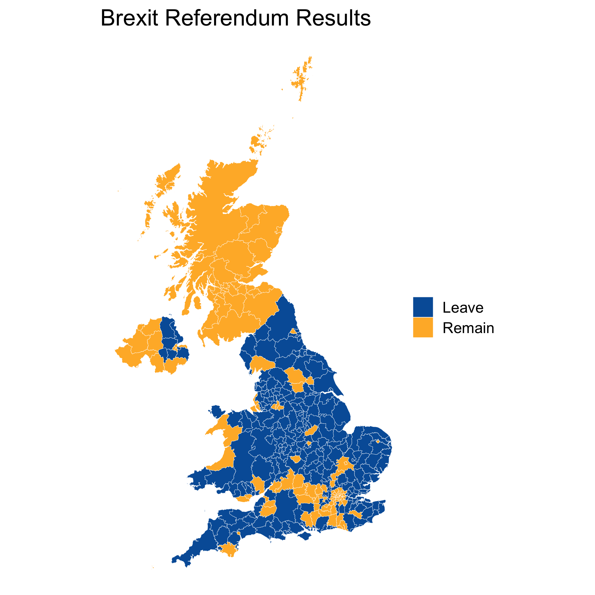
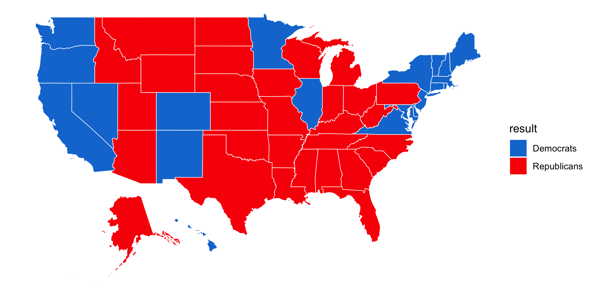

```{r child = "setup.Rmd"}
```

```{r, eval=TRUE, include=FALSE}
library("tidyverse")
library("sf")
library("here")
library("janitor")
# remotes::install_github("hrbrmstr/albersusa")
library("albersusa")
library("politicaldata")
```

class: center, middle, dk-section-title
background-image:url("images/pexels-photo-3737703.jpeg")
background-size: cover

# Compare regions using choropleth with a manual colour scale

---

# Comparing regions with choropleth

.pull-left[
Choropleth are often the <u>**simplest**</u> choice for comparing a categorical variable across geographic regions.

They're very popular for visualising election results.
]

.pull-right[
```{r, eval=TRUE, echo=FALSE}
uk_constituencies <- read_sf(here("data", "uk_constituencies_2016"))

brexit_results <- read_csv(here("data", "brexit-referendum-results.csv"))

brexit_sf <- uk_constituencies %>% 
  left_join(brexit_results)

gg_brexit_map <- brexit_sf %>%
  ggplot() +
  geom_sf(aes(fill = result),
          colour = "white",
          lwd = 0.1) +
  scale_fill_manual(values = c("Leave" = "#005ea7", "Remain" = "#ffb632")) +
  theme_void(base_size = 16) +
  labs(title = "Brexit Referendum Results") +
  theme(legend.title = element_blank())

gg_brexit_map %>% 
  ggsave(here("slides", "static-maps-with-ggplot2", "images", "gg_brexit_by_authority.png"),
         .)
```



]
---

class: my-turn

# My turn

.pull-left[
1. Use the data in `worked-exercises/choropleth_manual-scales` to create a choropleth of 2016's Brexit referendum results.

1. Use `scale_colour_manual()` to set our own colours.
]

.pull-right[

]

---

class: inverse

# Your turn

Use `usa-2016-pres-election.R` script to create a choropleth of the 2016 US Presidential elections.

.pull-left[
1. Join `usa_sf` and `pres_results`

1. Create a choropleth from the combined datasets

1. Use the `party_colours` to manually set the choropleth colours.
]

```{r, eval=TRUE, include=FALSE}
data(pres_results)

usa_sf <- usa_sf()

pres_results <- pres_results %>% 
  filter(year == 2016) %>% 
  mutate(result = ifelse(dem > rep, "Democrats", "Republicans"))

party_colours <- c("Republicans" = "#F80007", "Democrats" = "#117AD4")

pres_results_sf <- usa_sf %>% 
  left_join(pres_results,
            by = c("iso_3166_2" = "state"))

gg_pres_election_2016 <- ggplot() +
  geom_sf(data = pres_results_sf,
          aes(fill = result),
          colour = "white",
          size = 0.25) +
  scale_fill_manual(values = party_colours) +
  theme_void()

ggsave(here("slides", "static-maps-with-ggplot2", "images", "gg_pres_election_2016.png"),
       gg_pres_election_2016,
       width = 8,
       height = 4)
```


.pull-right[

]


