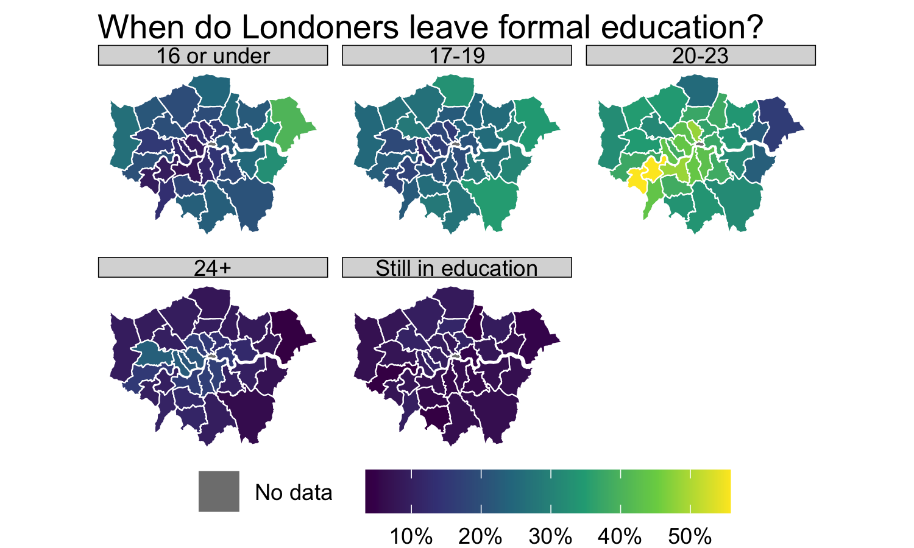

```{r child = "setup.Rmd"}
```

```{r, eval=TRUE, include=FALSE}
library("tidyverse")
library("sf")
library("here")
library("janitor")
library("gapminder")
library("rnaturalearthdata")
library("countrycode")
library("viridis")
library("scales")
library("colorspace")
library("dichromat")
library("future")
```

class: center, middle, dk-section-title
background-image:url("images/pexels-photo-1193742.jpeg")
background-size: cover

# Compare population distributions with dot density maps

```{r, echo=FALSE, eval=TRUE}
## ==== load data ====

age_finished_education <- read_csv(here("data", "age-when-completed-education.csv"))

london_sf <- read_sf(here("data", "london_boroughs"))

london_education_sf <- london_sf %>%
  left_join(age_finished_education,
            by = c("lad11nm" = "area")
  )
```

```{r, eval=FALSE, echo=FALSE}
gg_london_edu_faceted <- ggplot() +
  geom_sf(data = london_education_sf,
          aes(fill = value,
              colour = "No data"),
          size = 0.25) +
  scale_fill_viridis_c(name = "",
                       labels = scales::percent_format(scale = 1)) +
  scale_colour_manual(values = "white") +
  facet_wrap(~ age_group) +
  guides(colour = guide_legend(title = "",
                               override.aes = list(
                                 fill = "gray50",
                                 colour = "white")),
         fill = guide_colorbar(barwidth = 10)) +
  theme_void() +
  theme(strip.background = element_rect(fill = "grey85"),
        legend.position = "bottom", legend.direction = "horizontal") +
  labs(title = "When do Londoners leave formal education?")
ggsave(here("slides", "static-maps-with-ggplot2", "images", "gg_london_edu_faceted.png"),
       gg_london_edu_faceted,
       width = 5,
       height = 3)
```

```{r, eval=TRUE, echo=FALSE}
## ==== sf_dot_density ====
plan(multiprocess)
sf_dot_density <-
  function(x,
           group_var,
           scale = 100) {
    group_var <- enquo(group_var)
    
    group_var_values <- x %>%
      pull(!!group_var) %>%
      unique()
    
    st_dots_list <- map(group_var_values, ~ future(
      {
        grouped_x <- x %>%
          select(!!group_var, value) %>%
          filter(!!group_var == .x,
                 !is.na(value)) %>%
          mutate(
            value = round(value / scale),
            value > 0
          )
        
        sampled_x <- suppressMessages(st_sample(grouped_x,
                                                size = grouped_x$value
        ))
        
        sampled_x %>%
          st_sf() %>%
          mutate(!!group_var := .x)
      },
      seed = TRUE
    ))
    
    map(st_dots_list, ~ value(.x)) %>%
      bind_rows()
  }
```


```{r}
## ==== dot density map ====

dots_finished_edu <- london_education_sf %>%
  filter(!age_group == "Still in education") %>%
  sf_dot_density(age_group, scale = 25)

```

```{r, eval=FALSE, echo=FALSE}
gg_london_edu_dot_density <- ggplot() +
  geom_sf(data = dots_finished_edu,
          aes(colour = age_group),
          size = 0.001) +
  geom_sf(
    data = london_sf,
    aes(fill = "No data",
        alpha = ifelse(lad11nm == "City of London", 1, 0)),
  ) +
  scale_colour_brewer(palette = "Set3", name = "One dot = 25 people") +
  scale_fill_manual(values = c("City of London" = "grey50", "white")) +
  # scale_colour_viridis_d() +
  labs(title = "When do Londoners leave formal education?\n(Source: ONS Population Survey, 2018)") +
  guides(
    colour = guide_legend(override.aes = list(size = 5)),
    fill = guide_legend(
      title = "",
      override.aes = list(
        fill = "gray50",
        colour = "white"
      )
    ),
    alpha = guide_none()
  ) +
  theme_void(base_size = 26)
    
ggsave(here(here("slides", "static-maps-with-ggplot2", "images", "gg_london_edu_dot_density.png")),
       gg_london_edu_dot_density,
       width = 10 * 1.5,
       height = 7 * 1.5)
```

---

## Choropleth only work so well...

.pull-left[
- Choropleth can only reliably communicate one variable at a time.

- Small multiples improve this - but can be difficult to read.

- Choropleth **can't** communicate how many people live in each region - i.e. population densities.
]

.pull-right[

]

---

<center></center>

---

## Dot density criticisms

.pull-left[
- Dots (people) are **randomly** distributed within each region.

- Densities are skewed by large differences in region area.

- It takes time to generate both the data for the chart and to draw the chart.
]

.pull-right[
<center></center>
]

---

## Dot density code

```{css, echo = FALSE, eval=TRUE}
.tiny .remark-code { /*Change made here*/
  font-size: 40% !important;
}
```

.pull-left[
This code randomly places dots in each polygon in an `{sf}` object.

To speed up the random sampling the code makes use of **parallel computation**.

> If you have a "quad core" computer it will take 1/2 as long to run as on a "dual core" machine.
]

.pull-right[

.tiny[
```{r}
sf_dot_density <-
  function(x,
           group_var,
           scale = 100) {
    group_var_values <- x %>%
      pull({{ group_var }}) %>%
      unique()

    st_dots_list <- map(group_var_values, ~ future(
      {
        grouped_x <- x %>%
          select({{ group_var }}, value) %>%
          filter(
            {{ group_var }} == .x,
            !is.na(value)
          ) %>%
          mutate(
            value = round(value / scale),
            value > 0
          )

        sampled_x <- suppressMessages(st_sample(grouped_x,
          size = grouped_x$value
        ))

        sampled_x %>%
          st_sf() %>%
          mutate({{ group_var }} := .x)
      },
      seed = TRUE
    ))

    map(st_dots_list, ~ value(.x)) %>%
      bind_rows()
  }
```
]
]

---

## Dot density code

.pull-left[
The code uses the `{future}` package to do parallel computation.

For the code to work you must follow these steps:

- Load the package

- Tell the package to prepare for parellel computation with <br>
`plan(multiprocess)`
]


.pull-right[
```{r}
library("future")

plan(multiprocess)

sf_dot_density <- function(){
  samping_code
}

data %>% 
  sf_dot_density()
```

]

---

class: my-turn

## My turn

.pull-left[
Generate a dot density map from education data for London boroughs.

The skeleton for this code is provided in `worked-examples/population-density-maps`
]

.pull-right[
<center></center>
]


